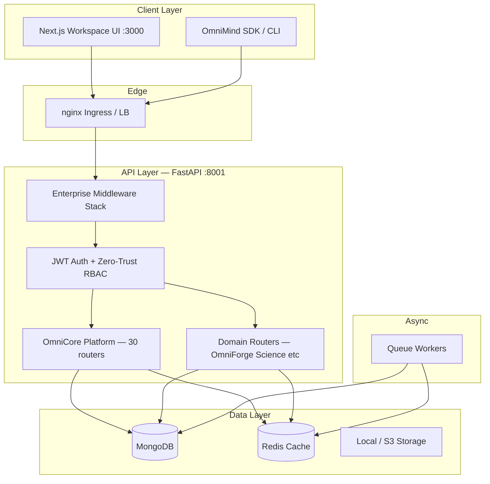
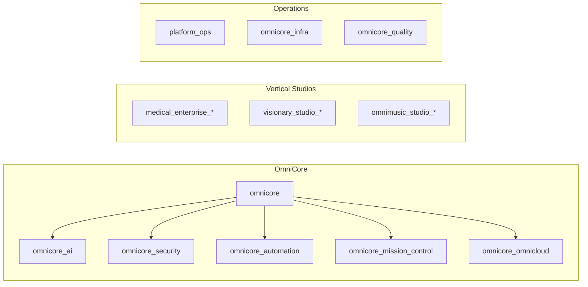
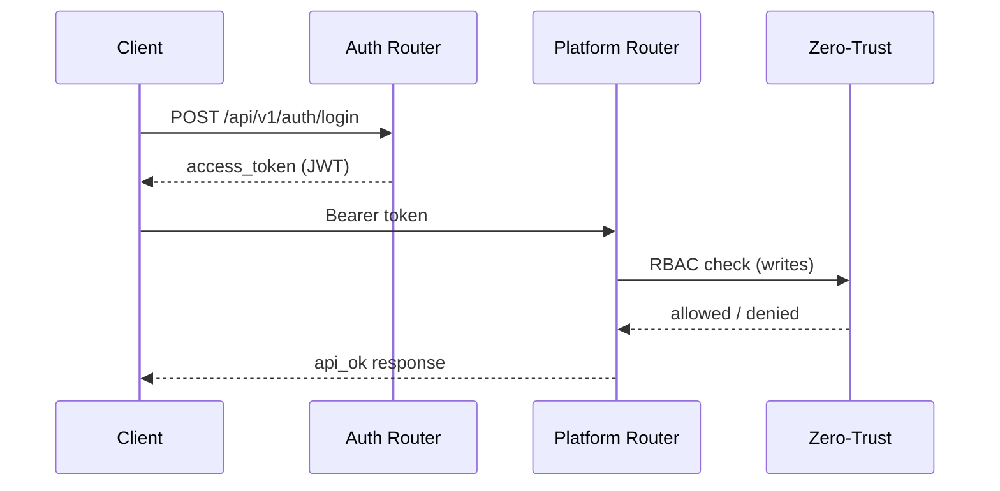
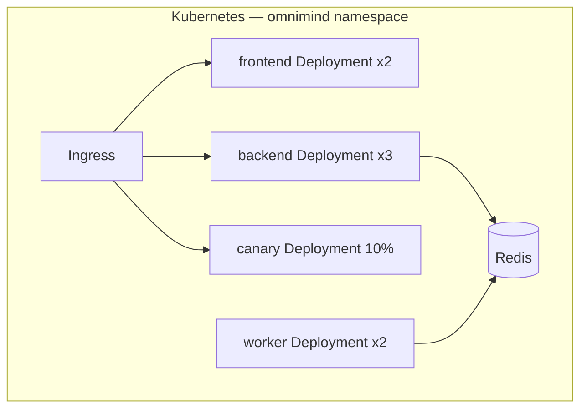

# Architecture

OmniMind OS V12 enterprise architecture — presentation shell, OmniCore platform, and domain backends.

---

## High-level system

---

## OmniCore platform modules

| Module | Prefix | Endpoints | Purpose |
|--------|--------|-----------|---------|
| OmniCore | `/api/v1/omnicore` | 13+ | Projects, workspace, settings |
| OmniCore AI | `/api/v1/omnicore/ai` | 16 | Text completion gateway |
| Security | `/api/v1/omnicore/security` | 8 | Zero-trust, compliance |
| Automation | `/api/v1/omnicore/automation` | 14 | Workflows, templates |
| Mission Control | `/api/v1/omnicore/mission-control` | 9 | Dashboard, logs, analytics |
| OmniCloud | `/api/v1/omnicore/omnicloud` | 15 | Sync, devices, remote jobs |
| Medical Enterprise | `/api/v1/medical/enterprise/*` | 66 | HIS, imaging, lab, governance |
| Visionary Studio | `/api/v1/visionary/*` | 56 | Creative production pipeline |
| OmniMusic Studio | `/api/v1/omnimusic/studio/*` | 42 | Music production |
| Platform Ops | `/api/v1/platform` | 3 | Health, ready, live probes |

Full endpoint list: [API_REFERENCE.md](API_REFERENCE.md)

---

## Enterprise middleware stack

Request flow (outer → inner):

1. **RequestContext** — correlation ID, request metadata
2. **MetricsMiddleware** — Prometheus-compatible timing
3. **AuditMiddleware** — security audit trail
4. **ResponseEnvelope** — standardized JSON envelope
5. **SlowAPIMiddleware** — global + platform write rate limits

Implementation: `backend/middleware/`, `backend/lib/enterprise/`

---

## Authentication model

- **Public paths:** `/api/v1/platform/{health,live,ready}` only
- **Reads:** authenticated bearer token
- **Writes:** `operator`, `root_operator`, or `owner` role

---

## Deployment topology

See [DEPLOYMENT.md](DEPLOYMENT.md) and [KUBERNETES_GUIDE.md](KUBERNETES_GUIDE.md).

---

## Protected systems

The following must not be redesigned without principal architect approval:

| System | Location |
|--------|----------|
| OmniForge Engine | `frontend/components/omniforge/` |
| OmniForge Code Generation | `frontend/lib/omniforge-*` |
| Architectural Designer Core | `frontend/app/api/architect/` |

---

## Related documents

- [SYSTEM_ARCHITECTURE.md](SYSTEM_ARCHITECTURE.md) — V1.0 layered view
- [OMNICLOUD_ARCHITECTURE.md](OMNICLOUD_ARCHITECTURE.md) — sync and remote execution
- [AUTOMATION_ENGINE.md](AUTOMATION_ENGINE.md) — workflow runtime
- [security/ENTERPRISE_SECURITY.md](security/ENTERPRISE_SECURITY.md) — security architecture
