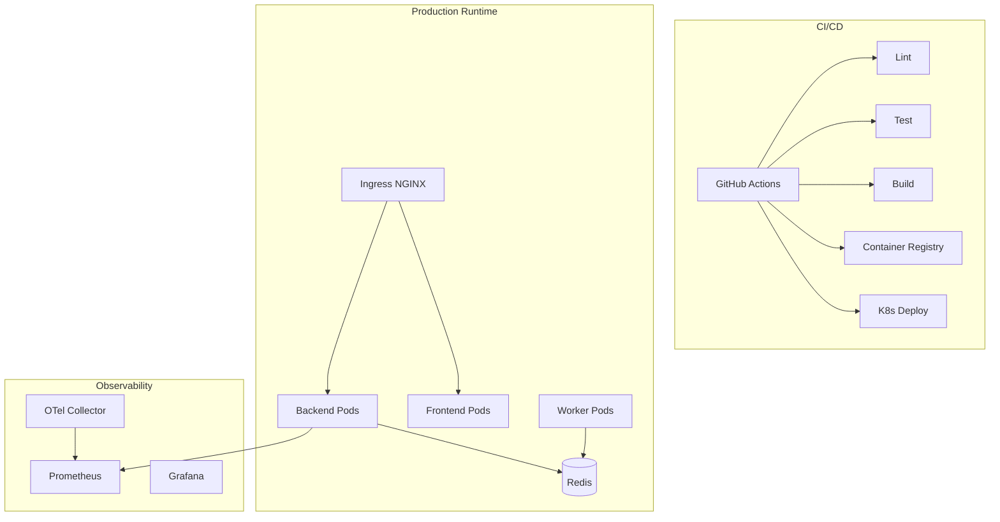

# OmniMind Production Sprint 5 — DevOps Guide

**Date:** 2026-06-17

---

## DevOps Architecture



---

## Repository Layout

```
infra/
├── env/                    # Environment templates (dev → production)
├── k8s/                    # Kubernetes manifests
│   ├── production.yaml     # Core stack + HPA + Ingress
│   ├── canary.yaml         # 10% canary routing
│   └── blue-green.yaml     # Blue/green switch pattern
├── nginx/                  # Production ingress config
├── observability/          # Prometheus, Grafana, OTel, Alertmanager
└── backup/                 # MongoDB + Redis backup scripts

.github/workflows/
├── ci.yml                  # Full CI pipeline
├── docker-publish.yml      # Image publish + release notes
└── deploy-staging.yml      # Deploy + rollback

backend/
├── lib/infra/              # Cache layers, storage, workers, metrics
├── worker_main.py          # Background worker entrypoint
└── routers/omnicore_infra.py

frontend/
└── Dockerfile              # Multi-stage Next.js standalone
```

---

## Environment Separation

`OMNIMIND_ENV` drives configuration via `backend/lib/infra/environment.py`:

| Value | Behavior |
|-------|----------|
| `development` | Local defaults, relaxed security |
| `testing` | Redis disabled in CI |
| `qa` / `staging` | Full Redis, OTel, staging URLs |
| `production` | Strict CORS, JWT middleware optional |
| `preview` | Per-branch preview deploys |

Frontend uses `NEXT_PUBLIC_BACKEND_URL` — set per environment at build time for Docker, or via Vercel env for PaaS.

---

## Cache Architecture

Named Redis layers (`backend/lib/infra/cache_layers.py`):

| Layer | TTL | Use Case |
|-------|-----|----------|
| `api` | 60s | API response cache |
| `prompt` | 1h | AI prompt render cache |
| `session` | 24h | User session data |
| `file` | 2h | File metadata |
| `image` | 12h | Image generation cache |
| `dist` | 5m | Distributed coordination |

Falls back to in-memory when Redis unavailable (existing `redis_cache.py` behavior preserved).

---

## Background Services

| Queue | Redis Key | Worker |
|-------|-----------|--------|
| AI processing | `omni:queue:ai` | `omnimind-worker` |
| Video | `omni:queue:video` | `omnimind-worker` |
| Email | `omni:queue:email` | `omnimind-worker` |
| Notification | `omni:queue:notification` | `omnimind-worker` |
| Retry | `omni:queue:retry` | Cron / worker drain |

Existing in-process `async_job_queue` for heavy tools is **unchanged** — workers add distributed processing capacity.

---

## Storage

`backend/lib/infra/storage_backend.py`:

| Mode | When | Public URL |
|------|------|------------|
| Local | No `S3_BUCKET` | `/storage/{key}` |
| S3 | `S3_BUCKET` set | `s3://bucket/key` |
| CDN | `CDN_BASE_URL` set | `https://cdn.../key` |

---

## CI Pipeline Stages

1. **lint-and-typecheck** — TypeScript + Python compile + compose validate
2. **test** — Vitest (12) + pytest (10+)
3. **security-scan** — pip-audit + npm audit (non-blocking)
4. **build** — Next.js build + Docker smoke
5. **k8s-validate** — `kubectl apply --dry-run=client`

---

## Operational Runbooks

### Scale backend

```bash
kubectl scale deployment omnimind-backend --replicas=10 -n omnimind
# Or rely on HPA (CPU 70%, memory 80%)
```

### View logs

```bash
kubectl logs -f deployment/omnimind-backend -n omnimind
docker compose -f docker-compose.prod.yml logs -f dynamic-core-service
```

### Restart worker pool

```bash
kubectl rollout restart deployment/omnimind-worker -n omnimind
```

---

## GitHub Secrets Required

| Secret | Used By |
|--------|---------|
| `KUBE_CONFIG_STAGING` | deploy-staging (base64 kubeconfig) |
| `GITHUB_TOKEN` | docker-publish (auto) |

## GitHub Variables

| Variable | Example |
|----------|---------|
| `STAGING_API_URL` | `https://api-staging.omnimind.app` |

---

## Local vs Cloud

| Concern | Local | Cloud |
|---------|-------|-------|
| Frontend | `npm run dev` | K8s Deployment / Vercel |
| Backend | `uvicorn` / Docker | K8s HPA |
| Redis | Docker compose | K8s Redis + PVC |
| MongoDB | Atlas / local | Atlas M10+ |
| TLS | None | cert-manager + Ingress |
