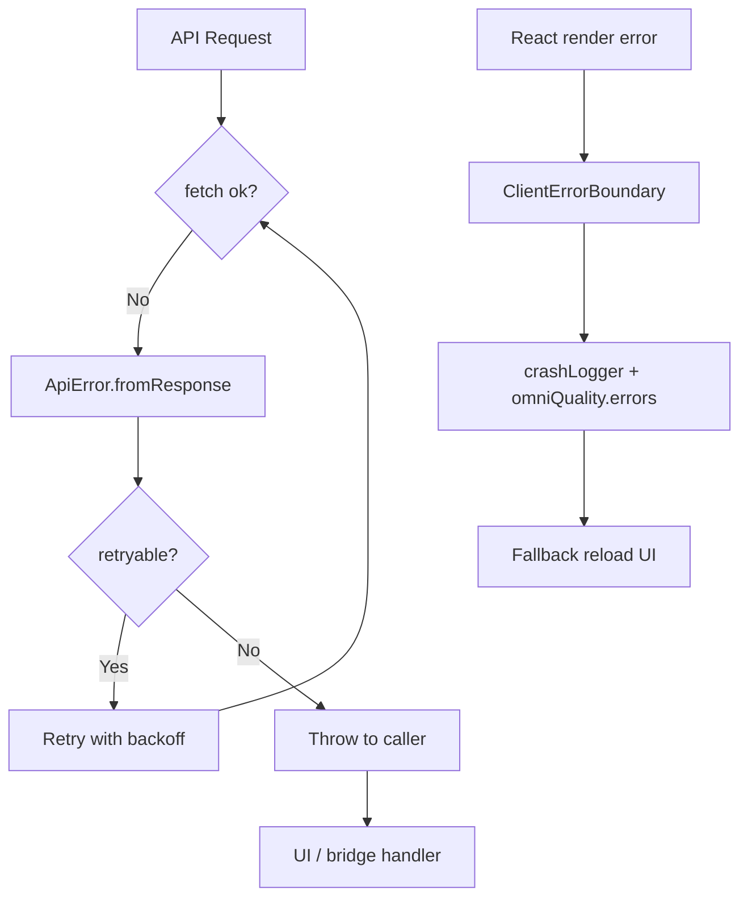

# OmniMind Production Sprint 4 — Error Report

**Date:** 2026-06-17  
**Purpose:** Document error taxonomy, handling paths, and issues found/fixed during Sprint 4.

---

## Error Taxonomy

### API Errors (`ApiError`)

| Code | HTTP | Retryable | Handler |
|------|------|-----------|---------|
| `unauthorized` | 401 | No | Auth refresh / redirect |
| `forbidden` | 403 | No | Permission UI (unchanged) |
| `not_found` | 404 | No | Empty state |
| `validation` | 400, 422 | No | Form feedback |
| `rate_limit` | 429 | Yes | Backoff retry |
| `server` | 5xx | Yes | Retry + degrade |
| `network` | — | Yes | Offline queue (scaffold) |
| `unknown` | — | No | Generic error surface |

**Source:** `frontend/lib/qa/api-error-handler.ts`

### UI / React Errors

| Layer | Capture | Storage | Recovery |
|-------|---------|---------|----------|
| React tree | `ClientErrorBoundary` | `crashLogger` + `omniQuality.errors` | Page reload button |
| Unhandled promise | Caller `try/catch` / `withApiErrorHandling` | — | Caller-defined |
| Console | `componentDidCatch` logs | DevTools | — |

### Security Denials

| Reason | Engine | User Impact |
|--------|--------|-------------|
| `rbac_denied` | `OmniAuthorizationEngine` | Action blocked (API/log only) |
| `device_trust` | `OmniABACEngine` | Zero-trust deny |
| `mfa_when_required` | ABAC | Step-up auth (placeholder) |

---

## Issues Found & Fixed (Sprint 4)

### BUG-001 — Vitest import path resolution

- **Severity:** High (CI blocker)
- **Symptom:** Integration, security, smoke tests failed module resolution
- **Cause:** Incorrect `../../../` depth from `tests/integration/`
- **Fix:** Corrected to `../../core/...`
- **Status:** ✅ Fixed

### BUG-002 — HTTP client unhandled rejection in tests

- **Severity:** Medium
- **Symptom:** Vitest reported unhandled `ApiError` despite passing assertions
- **Cause:** Inflight tracking on all GETs caused orphan rejection timing
- **Fix:** Inflight dedup only when `cacheTtlMs > 0`; explicit try/catch in test
- **Status:** ✅ Fixed

### BUG-003 — Zero-trust test false negative

- **Severity:** Low (test bug, not product bug)
- **Symptom:** Operator role test expected `allowed: true` but got `false`
- **Cause:** ABAC requires trusted device fingerprint; test omitted device registration
- **Fix:** Register device via `omniTrustedDeviceManager` in test
- **Status:** ✅ Fixed (validates correct security behavior)

### BUG-004 — Retry loop edge case on last attempt

- **Severity:** Low
- **Symptom:** Retryable errors with `retries: 0` could loop ambiguously
- **Fix:** Break when `attempt >= retries || !retryable`
- **Status:** ✅ Fixed

---

## Open Issues

### ERR-001 — Medical enterprise API contract mismatch

- **Severity:** High
- **Source:** `docs/TECH_DEBT_REPORT.md`
- **Impact:** Some medical production endpoints may 404 or return unexpected shapes
- **Mitigation:** Contract validator scaffold; tests not yet added
- **Owner:** Medical platform sprint

### ERR-002 — Crash logger has 0% test coverage

- **Severity:** Medium
- **Impact:** Regression risk on error boundary wiring
- **Mitigation:** Add jsdom test with `@testing-library/react`

### ERR-003 — Backend slowapi deprecation warning

- **Severity:** Low
- **Symptom:** Python 3.14 `asyncio.iscoroutinefunction` deprecation in pytest output
- **Impact:** None today; may break on Python 3.16
- **Mitigation:** Upgrade slowapi when fix available

### ERR-004 — External crash reporting not wired

- **Severity:** Medium
- **Impact:** Production crashes only in sessionStorage / memory
- **Mitigation:** Export endpoint or Sentry SDK (future sprint)

---

## Error Flow Diagram

---

## Monitoring Hooks

| Event | Recorder | Query |
|-------|----------|-------|
| UI crash | `omniQuality.errors.lastCrash()` | `omniCore.quality.snapshot()` |
| API error | Thrown `ApiError` | Caller logs / future metrics |
| Health degrade | `omniHealthMonitor.updateService` | `GET /quality/dashboard` |
