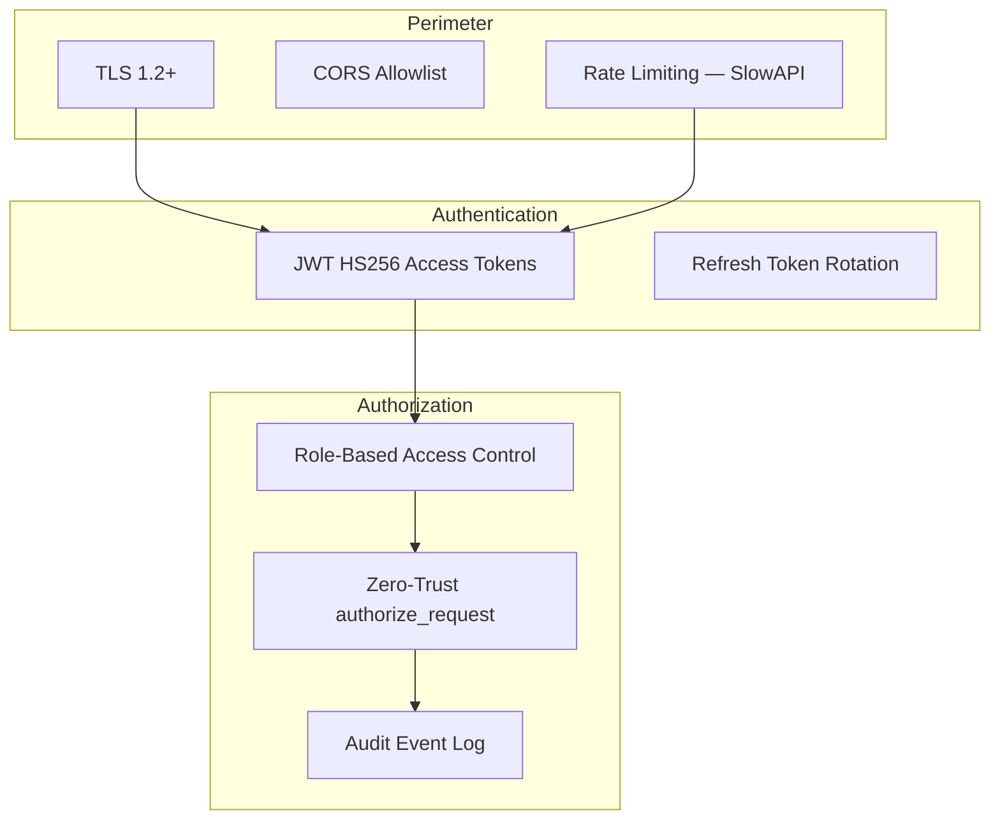

# Security

OmniMind OS V12 enterprise security model — authentication, authorization, rate limiting, and compliance readiness.

---

## Security architecture



---

## Authentication

| Endpoint | Method | Purpose |
|----------|--------|---------|
| `/api/v1/auth/login` | POST | Issue access + refresh tokens |
| `/api/v1/auth/refresh` | POST | Rotate access token |
| `/api/v1/auth/health` | GET | JWT service health |

Implementation: `backend/auth/`

### Platform API auth

All OmniCore platform routes require `Authorization: Bearer <token>` except:

- `GET /api/v1/platform/health`
- `GET /api/v1/platform/live`
- `GET /api/v1/platform/ready`

Development bypass is **disabled** when `JWT_SECRET_KEY` is set or `OMNIMIND_ENV=production`.

---

## Authorization (RBAC)

| Role | Permissions |
|------|-------------|
| `owner` / `root_operator` | Full platform write |
| `operator` | `tool:execute`, `project:read`, platform writes |
| `guest` | `project:read` only — **writes denied (403)** |

Zero-trust helper: `lib/security/zero_trust.py`  
Route guard: `lib/enterprise/dependencies.py` → `platform_router_dependencies()`

---

## Rate limiting

| Scope | Limit | Enforcement |
|-------|-------|-------------|
| Global default | `60/minute` per IP | SlowAPI middleware |
| Platform writes | `120/minute` per IP | `enforce_platform_rate_limit` |
| Selected main routes | `30/minute` | `@limiter.limit` decorators |

Configuration: `platform_write_rate_limit` in `backend/config.py`

---

## Audit & security events

| Endpoint | Purpose |
|----------|---------|
| `GET /api/v1/omnicore/security/events` | Security event stream |
| `POST /api/v1/omnicore/security/events/failed-login` | Log failed login |
| `GET /api/v1/omnicore/security/dashboard` | Threat dashboard |

Middleware: `backend/middleware/audit_middleware.py`

---

## Secrets management

| Rule | Detail |
|------|--------|
| Never commit secrets | `.env` gitignored |
| Server-only keys | See `lib/security/env_validation.py` → `SERVER_ONLY_KEYS` |
| Production validation | `validate_environment(production=True)` at lifespan + `/ready` |
| K8s secrets | `omnimind-secrets` — replace vault placeholders |

---

## Compliance readiness

| Framework | Status | Doc |
|-----------|--------|-----|
| SOC 2 | Partial controls | `GET /api/v1/omnicore/security/compliance` |
| ISO 27001 | Partial | [security/ENTERPRISE_SECURITY.md](security/ENTERPRISE_SECURITY.md) |
| HIPAA | Planned (medical module) | [security/PERMISSION_MATRIX.md](security/PERMISSION_MATRIX.md) |
| GDPR | Planned | [CLOUD_SECURITY.md](CLOUD_SECURITY.md) |

---

## Threat model

See [THREAT_MODEL.md](THREAT_MODEL.md) for STRIDE analysis and mitigations.

### Critical production rules

1. Always set `JWT_SECRET_KEY` (32+ chars) in production
2. Restrict `ALLOWED_ORIGINS` to known domains
3. Enable Redis for session/cache in production
4. Do not expose `/docs` OpenAPI in production
5. Review proxy routes (`frontend/app/api/execute/`) before public deploy

---

## Security testing

```bash
cd backend
pytest tests/test_auth_platform.py tests/test_security_platform.py -v
```

75 tests include auth, RBAC, and rate-limit verification.

---

## Related

- [security/RBAC.md](security/RBAC.md)
- [security/AUDIT_LOGS.md](security/AUDIT_LOGS.md)
- [security/SECRET_VAULT.md](security/SECRET_VAULT.md)
- [MASTER_SECURITY.md](MASTER_SECURITY.md)
