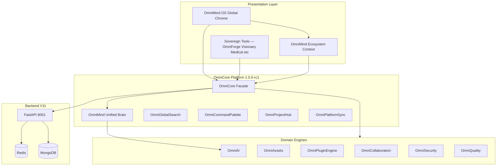

# OmniMind 1.0 — System Architecture

---

## Layered Architecture



---

## OmniCore Facade (`omniCore`)

| Property | Module |
|----------|--------|
| `brain` | Unified AI + memory + context |
| `ai` | AI gateway, agents, conversations |
| `assets` | Universal projects + media library |
| `plugins` | Extension marketplace |
| `collaboration` | Orgs, teams, permissions |
| `security` | RBAC, ABAC, zero trust |
| `quality` | Health, metrics, tests |
| `projectHub` | Intelligent project workspace |
| `platformSync` | Cloud sync |
| `search` | OS-level search |
| `commandPalette` | Command registry |
| `shortcuts` | Keyboard bindings |
| `projects` | Cross-tool projects |
| `workspace` | Layout presets |
| `windows` | Floating panels |
| `settings` | Universal settings |

---

## Data Flow — Cross-Tool AI

1. User invokes AI in any tool
2. Tool calls `omniCore.brain.complete()` or `omniCore.ai.complete()`
3. Unified Brain injects project, memory, permissions context
4. OmniAI routes to provider via `OmniModelRouter`
5. Response stored in `omniCore.ai.memory` + conversation history
6. `omniCore.eventBus` publishes `brain:sync`

---

## React Integration

```
app/providers.tsx
  ClientErrorBoundary
  ThemeProvider
  OmniMindEcosystemProvider
  OmniCoreProvider          ← useOmniCore()
  OmniMindMasterAgentProvider
  OmniMindBrainProvider
  ...
  OmniMindOSGlobalChrome
    OmniMindUnifiedSync     ← RC1 ecosystem ↔ OmniCore bridge
    OmniMindKeyboardBindings
    OmniMindCommandPalette
    OmniMindQuickSearch
```

---

## Backend Topology

See `docs/DEPLOYMENT_GUIDE.md` and `docs/KUBERNETES_GUIDE.md`.

---

## Design Principles

1. **Extend, don't replace** — sovereign tools keep their UI
2. **Opt-in composition** — `useOmniCore()` / `omniCore` facade
3. **Event bus coupling** — `OmniEventBus` for loose tool integration
4. **Stateless API** — horizontal scale via Kubernetes HPA
