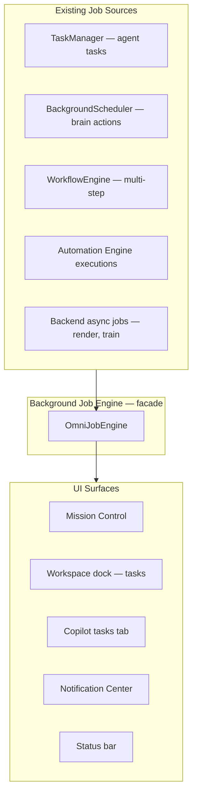

# Background Job Engine Architecture

**Version:** 1.0  
**Date:** 2026-06-17  
**Status:** Enterprise architecture specification  
**Extends:** [OmniPilot Background Task Engine](../omnipilot/BACKGROUND_TASK_ENGINE.md)

---

## 1. Purpose

Every long-running operation in OmniMind runs as a **background job** with unified lifecycle: pause, resume, retry, cancel, priority queue, progress, and notifications. Jobs survive tool navigation and surface in Mission Control, Copilot, Workspace dock, and Notification Center.

---

## 2. Job Systems Today (To Unify)



| System | Path | Pause | Resume | Retry | Cancel | Priority |
|--------|------|-------|--------|-------|--------|----------|
| `BackgroundScheduler` | `core/brain/scheduler/BackgroundScheduler.ts` | ✅ | partial | ✅ | ✅ | FIFO |
| `TaskManager` | `core/agent/TaskManager.ts` | planned | planned | ✅ | planned | FIFO |
| `WorkflowEngine` | `core/agent/WorkflowEngine.ts` | via scheduler | via scheduler | — | abort run | workflow order |
| Automation | `core/automation/` | ✅ events | ✅ events | ✅ | ✅ | rule-based |
| Backend | `/api/v1/*` async endpoints | server-dependent | — | API | API | queue |

---

## 3. Unified Job Model

```typescript
interface OmniJob {
  id: string;
  label: string;
  type: JobType;
  status: JobStatus;
  priority: JobPriority;       // 0 (low) – 100 (critical)
  progress: number;            // 0–100
  message?: string;

  sourceTool: string;
  targetTool?: string;
  agentId?: string;
  workflowId?: string;
  executionId?: string;        // automation

  createdAt: string;
  startedAt?: string;
  completedAt?: string;

  pausable: boolean;
  cancellable: boolean;
  retryCount: number;
  maxRetries: number;

  result?: unknown;
  error?: string;
}

type JobType =
  | "ai-generation"
  | "video-render"
  | "medical-analysis"
  | "project-build"
  | "deployment"
  | "training"
  | "analytics"
  | "music-render"
  | "cloud-sync"
  | "workflow"
  | "custom";

type JobStatus =
  | "queued"
  | "running"
  | "paused"
  | "completed"
  | "failed"
  | "cancelled"
  | "retrying";

type JobPriority = number; // 100 = user-blocking, 50 = normal, 10 = background sync
```

---

## 4. Job Categories (Platform)

| Category | Examples | Typical source | Priority |
|----------|----------|----------------|----------|
| AI Generation | LLM completion, image gen | OmniPilot, Visionary | 60 |
| Video Rendering | VFX export, Visionary render | `vfx-master`, backend | 50 |
| Medical Analysis | Imaging triage, lab batch | Medical Suite | 80 |
| Project Build | OmniForge scaffold, `npm run build` | OmniForge API | 70 |
| Deployment | Vercel/Netlify provision | WorkflowEngine | 90 |
| Training | Model fine-tune (future) | Backend | 30 |
| Analytics | Excel ingest, report gen | Business Analytics | 50 |
| Music Rendering | Stem export, mixdown | OmniMusic backend | 50 |
| Cloud Sync | OmniCloud domain sync | OmniPlatformSync | 10 |

---

## 5. Priority Queue

```
enqueue(job):
  insert sorted by priority DESC, then createdAt ASC
  cap queue at 200 jobs (evict lowest priority completed)

dequeue():
  next job where status = queued
  respect concurrency limit per type:
    ai-generation: 3 concurrent
    video-render: 1 concurrent
    deployment: 1 concurrent
    cloud-sync: 2 concurrent
```

**User boost:** Copilot "run now" sets `priority = 100` and re-sorts queue.

---

## 6. Lifecycle API (Facade Specification)

```typescript
interface OmniJobEngine {
  enqueue(spec: JobCreateSpec): OmniJob;
  pause(jobId: string): void;
  resume(jobId: string): void;
  retry(jobId: string): void;
  cancel(jobId: string): void;
  get(jobId: string): OmniJob | null;
  list(filter?: JobFilter): OmniJob[];
  subscribe(listener: (jobs: OmniJob[]) => void): () => void;
}
```

**Delegation:**

| Action | Delegates to |
|--------|--------------|
| Brain actions | `BackgroundScheduler.pause/resume/cancel/retry` |
| Agent tasks | `TaskManager` (+ pause extension) |
| Workflows | `WorkflowEngine` abort + step status |
| Automation | `omniEventBus.publish("automation:execution-control")` |
| Backend | Poll job status API; map to `OmniJob` |

---

## 7. Progress & Notifications

```
job progress update:
  1. OmniJobEngine.update(id, { progress, message })
  2. omniEventBus.publish("activity:new", { id, kind: "ai-task", progress })
  3. If progress === 100 → TaskCompleted event
  4. omniLiveNotifications.push(title, body, level, { progress })
  5. Mission Control dashboard refresh (subscribe, no poll)
```

| Outcome | Notification level | Category |
|---------|-------------------|----------|
| Completed | `success` | `tasks` |
| Failed | `error` | `tasks` |
| Paused | `info` | `tasks` |
| Deploy success | `success` | `deployment` |
| Security block | `warning` | `security` |

---

## 8. UI Integration

| Surface | Component | Behavior |
|---------|-----------|----------|
| Workspace dock | `OmniMindWorkspaceDock` tasks tab | List, pause, cancel |
| Copilot | `OmniMindMasterCopilot` | Active jobs + progress |
| Status bar | `OmniMindOSStatusBar` | `N jobs running` badge |
| Activity Center | `OmniMindActivityCenter` | Historical feed via `activity:new` |
| Mission Control | `/mission-control` | Agent + resource jobs |

**Keyboard:** `Ctrl+Shift+J` → focus tasks dock (planned).

---

## 9. Backend Async Jobs

Long server jobs (video render, medical batch, music export) register server-side IDs:

```
POST /api/v1/{tool}/jobs → { jobId }
GET  /api/v1/{tool}/jobs/{jobId} → { status, progress }

OmniJobEngine polls or SSE subscribes
Maps to unified OmniJob with type + sourceTool
```

Existing routers: `visionary_studio_*`, `omnimusic_studio_*`, `medical_enterprise_*`, `omnicore_mission_control`.

---

## 10. Persistence

| Layer | Storage |
|-------|---------|
| In-flight (client) | `BackgroundScheduler` in-memory + `omnimind:brain-actions` events |
| Session | Workspace engine session includes `activeJobIds[]` (planned) |
| Server | Mission Control + OmniCore workspace bundle |
| Completed history | Last 100 jobs in `omniCore.ecosystem.activity` |

On page refresh: rehydrate from scheduler snapshot + server poll for backend jobs.

---

## 11. Protected Tool Boundaries

| Tool | Job integration |
|------|-----------------|
| OmniForge Engine | Register build/deploy jobs via existing APIs; **do not** modify engine UI |
| Architectural Designer | Blueprint generation jobs via `/api/v1/spatial/*` |
| Code Generator | Scaffold jobs via `/api/v1/build-engine/omniforge/*` |

Cancel calls tool's public cancel endpoint only.

---

## 12. Implementation Phases

| Phase | Deliverable |
|-------|-------------|
| 1 | `core/jobs/OmniJobEngine.ts` facade over scheduler + TaskManager |
| 2 | Unified `omnimind:omnipilot-task` event (see OmniPilot doc) |
| 3 | Priority queue + concurrency limits |
| 4 | TaskManager pause/resume parity |
| 5 | Backend job polling adapter |
| 6 | Mission Control unified job view |

---

## Related Documents

- [EVENT_BUS.md](./EVENT_BUS.md)
- [CROSS_TOOL_WORKFLOWS.md](./CROSS_TOOL_WORKFLOWS.md)
- [../omnipilot/BACKGROUND_TASK_ENGINE.md](../omnipilot/BACKGROUND_TASK_ENGINE.md)
