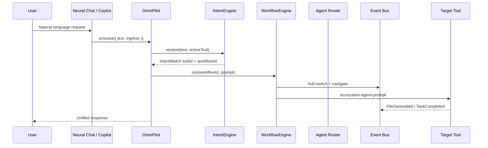

# Cross-Tool Workflows Architecture

**Version:** 1.0  
**Date:** 2026-06-17  
**Status:** Enterprise architecture specification  
**Orchestrator:** [OmniPilot](../omnipilot/OMNIPILOT_ARCHITECTURE.md)  
**Protected systems:** OmniForge Engine · Code Generation · Architectural Designer Core — **invoke via registry, never redesign**

---

## 1. Purpose

Any tool can call another tool. Users speak naturally in Neural Chat (or any surface); OmniPilot resolves intent, opens the right tool, and chains steps through the **Workflow Engine** without tight coupling.

---

## 2. Orchestration Stack



| Layer | Path |
|-------|------|
| Intent matching | `frontend/core/agent/IntentEngine.ts` |
| Workflow execution | `frontend/core/agent/WorkflowEngine.ts` |
| Tool definitions | `frontend/core/agent/ToolRegistry.ts` |
| Prompt injection | `frontend/core/agent/PromptRouter.ts` |
| Navigation | `AgentManager.config.onNavigate` |
| Cross-tool events | `omniEventBus` + `omnimind:ecosystem-*` |

---

## 3. Workflow Definition Model

**Source:** `AgentWorkflow` in `frontend/core/agent/types.ts`

```typescript
interface AgentWorkflow {
  id: string;
  name: string;
  description: string;
  steps: WorkflowStep[];
}

interface WorkflowStep {
  id: string;
  label: string;
  toolId: string;           // registry id or slug
  actionId?: string;
  promptTemplate?: string;
}
```

**Built-in workflows:** `MASTER_WORKFLOWS` in `IntentEngine.ts`:

- `full-stack-deploy` — OmniForge scaffold → deploy → docs → export
- `marketing-campaign` — Visionary creative → Marketing copy → launch

---

## 4. Canonical Cross-Tool Flows

### 4.1 Neural Chat → Build Website → OmniForge

```
User: "Build my website"
  IntentEngine: toolId=app-website-builder, workflow=full-stack-deploy, confidence≥0.9
  WorkflowEngine.run:
    Step 1: navigate /omniforge-engine?stack=web
    Step 2: dispatch omnimind:omniforge-start-wizard { description }
    Step 3–6: scaffold frontend, backend, DB via PromptRouter
    Step 7: deploy action → ecosystem-command deploy:one-click
  Events: AgentStarted → TaskCompleted → DeploymentFinished
  Files: FileGenerated (code assets) → Global File System
```

**Protected:** OmniForge layout unchanged; wizard triggered by existing event.

### 4.2 Neural Chat → Design House → Architectural Designer

```
User: "Design a house" / "Design villa"
  IntentEngine: toolId=architectural-designer, confidence≥0.9
  Agent Router: chief_architect + architectural_designer agents
  Navigate: /architectural-designer
  PromptRouter: "Create 6-bedroom villa design" → omnimind:ecosystem-agent-prompt
  API: GET /api/v1/spatial/blueprint (health + generation)
  Files: FileGenerated kind=blueprint
```

**Protected:** `SpatialStudioShell` untouched; prompts via event bus only.

### 4.3 Neural Chat → Edit Marketing Video → Visionary Studio

```
User: "Edit marketing video" / "cinematic video"
  Intent patterns: /video|marketing|edit/
  Resolve: visionary-studio (preferred) or vfx-master for timeline-heavy
  Navigate: /visionary-studio
  Agents: vfx_artist, video_editor, marketing_specialist
  Prompt: campaign context from Memory Engine if prior marketing session
  Jobs: video-render background job
```

### 4.4 Medical → Generate PDF Report → Business Analytics Export

```
User (in Medical Suite): "Generate PDF report"
  Active tool: medical-diagnostic-suite
  Cross-tool workflow: medical-report-export (planned id)
  Steps:
    1. medical: compile report (existing enterprise APIs)
    2. FileGenerated kind=report, metadata.sensitivity=phi
    3. navigate business-analytics with assetId reference
    4. analytics:export action → OmniImportExport PDF bundle
  PHI: report visible in Analytics only with clinical scope; default block cross-marketing
```

### 4.5 Visionary → Generate Brand Assets → Marketing Studio

```
User (in Visionary): "Generate brand assets for campaign"
  Workflow: visionary-to-marketing (planned)
  Steps:
    1. visionary-studio: generate image/video assets
    2. FileGenerated → shared project collection
    3. navigate digital-marketing-hub
    4. prompt: "Use attached brand assets" + asset IDs in context
  Uses: marketing-campaign workflow partial (creative step already exists)
```

### 4.6 Business Analytics → Create Dashboard → Visionary Charts

```
User: "Create dashboard with charts"
  Intent: business-analytics + dashboard keyword
  Steps:
    1. Run analysis on dataset (enterprise-analytics-dataset event)
    2. Export chart spec JSON as asset kind=dataset
    3. navigate visionary-studio
    4. prompt: "Build dashboard visualization from chart spec {assetId}"
```

### 4.7 OmniMusic → Generate Album Cover → Visionary Studio

```
User: "Generate album cover"
  Active: omnimusic
  Intent: music + image/cover patterns
  Steps:
    1. Register track context from OmniMusic session
    2. navigate visionary-studio (or creative-visionary for still image)
    3. prompt: "Album cover for track {title}, style {genre}"
    4. FileGenerated kind=image linked to music project
    5. OmniMusic imports cover via assetId (no file copy)
```

---

## 5. Workflow Catalog (Target)

Extend `MASTER_WORKFLOWS` — do not create parallel engines:

| Workflow ID | Trigger | Tool chain |
|-------------|---------|------------|
| `full-stack-deploy` | build website, deploy | omniforge × N |
| `marketing-campaign` | marketing campaign | visionary → marketing |
| `medical-report-export` | PDF report | medical → analytics export |
| `visionary-to-marketing` | brand assets | visionary → marketing |
| `analytics-to-visionary` | dashboard charts | analytics → visionary |
| `music-cover-art` | album cover | omnimusic → visionary |
| `medical-triage` | triage (existing intent) | medical only |
| `analytics-report` | excel analyze | analytics only |

---

## 6. Invocation Mechanisms

| Mechanism | When | Implementation |
|-----------|------|----------------|
| **Intent auto-route** | User message matches patterns | `IntentEngine.resolve` |
| **Workflow run** | Multi-step chain | `WorkflowEngine.run` |
| **Command** | Palette / explicit | `ecosystem-command` |
| **Agent plan** | Brain2 decomposition | `Brain2Coordinator` subtasks |
| **Tool action** | Button in tool UI | `PluginActionDefinition.command` |
| **SDK** | External automation | `OmniMindSDK` → OmniPilot |

All paths converge on:

1. `hub:switch` / navigate to target `href`
2. `omnimind:ecosystem-agent-prompt` with context bundle
3. Optional `WorkflowEngine` for sequencing

---

## 7. Context Handoff

Cross-tool steps pass context via **Context Engine**, not globals:

```
ContextBundle includes:
  - activeProjectId
  - prior step outputs (asset IDs, summaries)
  - conversation tail
  - source tool slug

PromptRouter.route(prompt, targetToolId, {
  workflowStepId,
  actionId,
  contextBundle,
})
```

Memory Engine stores workflow run summary on completion.

---

## 8. Error & Rollback

| Failure | Behavior |
|---------|----------|
| Step N fails | Mark job failed; prior assets remain in GFS |
| Tool offline | `apiProbe` fail → notify; offer retry |
| User cancel | `WorkflowEngine` abort; `BackgroundScheduler.cancel` |
| PHI leak risk | Block step if target tool lacks permission |

---

## 9. Loosely Coupled Tool Contract

Tools participating in cross-tool workflows must:

1. Be registered in [TOOL_REGISTRY.md](./TOOL_REGISTRY.md)
2. Listen for `omnimind:ecosystem-agent-prompt` (or tool-specific mapped event)
3. Emit `FileGenerated`, `TaskCompleted` on outputs
4. Expose `apiProbe` for health
5. **Not** import other tools' React trees or stores

---

## 10. UI Feedback

During cross-tool workflow:

| Surface | Shows |
|---------|-------|
| Copilot | Step progress ("Opening Visionary…") |
| Status bar | Active workflow name |
| Workspace Engine | Auto-open tab for each tool in chain |
| Activity Center | Step events |
| Notifications | Completion / failure |

`WorkflowEngine` callbacks: `onStepStart`, `onStepComplete`, `onNavigate` — wire to `OmniJobEngine` for unified progress.

---

## 11. Implementation Phases

| Phase | Work |
|-------|------|
| 1 | Document flows (this spec) |
| 2 | Add planned workflows to `MASTER_WORKFLOWS` |
| 3 | Intent rules for cover art, dashboard, PDF export |
| 4 | Context handoff with asset IDs in `PromptRouter` |
| 5 | Workspace Engine auto-tab on `onNavigate` |
| 6 | PHI guard on medical → analytics path |

---

## Related Documents

- [TOOL_REGISTRY.md](./TOOL_REGISTRY.md)
- [EVENT_BUS.md](./EVENT_BUS.md)
- [GLOBAL_FILE_SYSTEM.md](./GLOBAL_FILE_SYSTEM.md)
- [BACKGROUND_JOB_ENGINE.md](./BACKGROUND_JOB_ENGINE.md)
- [../omnipilot/COMMAND_SYSTEM.md](../omnipilot/COMMAND_SYSTEM.md)
- [../omnipilot/AGENT_ROUTER.md](../omnipilot/AGENT_ROUTER.md)
