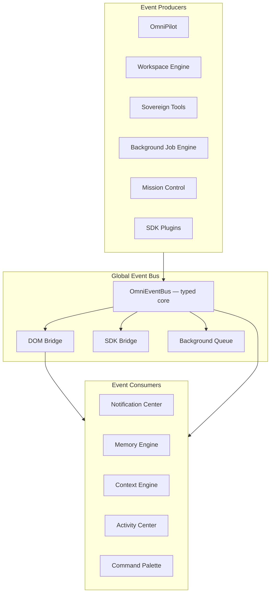

# Global Event Bus Architecture

**Version:** 1.0  
**Date:** 2026-06-17  
**Status:** Enterprise architecture specification  
**Principle:** Every module listens to events. Never tightly couple modules.

---

## 1. Problem

OmniMind today uses **three parallel event channels**:

| Channel | Mechanism | Path |
|---------|-----------|------|
| Typed OmniCore bus | `OmniEventBus.publish/subscribe` | `frontend/core/omnicore/OmniEventBus.ts` |
| DOM custom events | `omnimind:*` on `window` | Scattered across components |
| SDK bus | `omnimind:sdk:*` | `frontend/sdk/browser/events/SDKEventBus.ts` |

The **Global Event Bus** unifies these under one contract with typed names, guaranteed delivery semantics, and cross-surface bridging.

---

## 2. Architecture



**Rule:** Application code calls `omniEventBus.publish()`. The bus mirrors to DOM for legacy listeners. New code must **not** dispatch raw `window` events except through the bridge.

---

## 3. Canonical Event Catalog

### 3.1 OmniCore typed events (existing)

**Source:** `OmniCoreEventMap` in `frontend/core/omnicore/types.ts`

| Event | Payload | When fired |
|-------|---------|------------|
| `project:opened` | `{ projectId, toolSlug }` | User opens project |
| `project:closed` | `{ projectId }` | Project tab closed |
| `workspace:changed` | `{ presetId }` | Workspace profile switch |
| `layout:saved` | `{ layoutId }` | Layout persistence |
| `command:executed` | `{ commandId }` | Palette / command run |
| `search:query` | `{ query }` | Global search |
| `search:select` | `{ resultId, kind }` | Search result picked |
| `notification:show` | `{ id, title }` | Alert created |
| `notification:live` | `{ id, level }` | Live notification push |
| `settings:changed` | `{ scope, key }` | Setting updated |
| `session:started` | `{ sessionId }` | OS session boot |
| `theme:changed` | `{ themeId }` | Appearance change |
| `brain:context` | `{ toolSlug }` | Context sync |
| `brain:sync` | `{ source }` | Brain state refresh |
| `cloud:sync` | `{ domain }` | Cloud domain synced |
| `activity:new` | `{ id, kind }` | Activity feed item |
| `hub:switch` | `{ toolSlug }` | Tool navigation |
| `hub:tool-registered` | `{ toolSlug }` | New tool in registry |
| `automation:execution-started` | `{ executionId, workflowId }` | Automation run |
| `mission:agent-control` | `{ agentId, action }` | Mission Control agent ops |
| `mission:log` | `{ source, level }` | Mission Control log line |

### 3.2 Ecosystem events (DOM — to be bridged)

| DOM Event | Maps to | Purpose |
|-----------|---------|---------|
| `omnimind:ecosystem-command` | `command:executed` | Run, deploy, preview |
| `omnimind:ecosystem-agent-prompt` | `brain:context` + prompt route | Tool AI injection |
| `omnimind:ecosystem-notification` | `notification:show` | Tool-originated alerts |
| `omnimind:ecosystem-save` | `layout:saved` | Workspace save |
| `omnimind:workspace-saved` | `layout:saved` | Workspace engine session |
| `omnimind:navigate-tool` | `hub:switch` | Cross-tool navigation |
| `omnimind:brain-actions` | `activity:new` (kind: task) | Background tasks |
| `omnimind:brain2-live` | `activity:new` (kind: ai) | Live thinking |
| `omnimind:ecosystem-assets-dropped` | `activity:new` (kind: upload) | File drop |
| `omnimind:fill-prompt` | `command:executed` | Palette → copilot |
| `omnimind:marketplace-synced` | `cloud:sync` | Plugin sync |

### 3.3 New canonical events (specification)

These names unify scattered signals. Bridge layer emits them from existing DOM events during migration:

| Event | Payload | Replaces |
|-------|---------|----------|
| `ProjectCreated` | `{ projectId, name, toolSlug }` | ecosystem project:new |
| `WorkspaceChanged` | `{ workspaceId, tabs, activeTabId }` | workspace-saved detail |
| `AgentStarted` | `{ agentId, taskId, toolSlug }` | brain-actions queued |
| `TaskCompleted` | `{ taskId, status, result? }` | brain-actions completed |
| `FileGenerated` | `{ assetId, path, kind, sourceTool }` | per-tool file events |
| `DeploymentFinished` | `{ projectId, url?, success }` | deploy workflow end |
| `NotificationCreated` | `{ id, level, category, title, body }` | ecosystem-notification |

**Naming:** OmniCore uses `namespace:action` (lowercase). Canonical ecosystem events use PascalCase aliases published **in addition** during transition:

```typescript
omniEventBus.publish("activity:new", { id, kind: "FileGenerated" });
// Bridge also: window.dispatchEvent(new CustomEvent("omnimind:FileGenerated", { detail }))
```

---

## 4. Delivery Semantics

| Method | Behavior | Use |
|--------|----------|-----|
| `publish()` | Synchronous fan-out to subscribers + DOM mirror | User actions, state changes |
| `publishBackground()` | Queued; flushed on `flushBackground()` | High-frequency metrics |
| `subscribe()` | Persistent handler | Module integration |
| `once()` | Single-fire handler | Init hooks |

**Queue cap:** 500 events (`OmniEventBus.MAX_BACKGROUND_QUEUE`).

---

## 5. Subscription Patterns

### Correct (loose coupling)

```typescript
// Module init
const unsub = omniEventBus.subscribe("FileGenerated", (payload) => {
  omniAssetManager.register({ ...payload, toolSlug: payload.sourceTool });
});
// cleanup on unmount
return unsub;
```

### Forbidden (tight coupling)

```typescript
// BAD: direct import of another tool's store
import { visionaryStore } from "@/components/visionary/internal-store";
visionaryStore.addAsset(file);
```

### Protected tools

OmniForge, Architectural Designer: emit `FileGenerated`, `brain:context` — never import peer tool modules.

---

## 6. Cross-Bus Bridge

```
OmniEventBus.publish(event, payload)
  → typed handlers (in-process)
  → window.dispatchEvent(CustomEvent(`omnicore:${event}`))
  → legacy omnimind:* mapping table (migration)
  → SDK: SDKEventBus.emit(mappedName, payload)
```

**SDK bridge** already listens `omnimind:sdk:bridge` (`SDKEventBus.ts`). Global bus becomes the single write path.

---

## 7. Event → Consumer Map

| Event | Primary consumers |
|-------|-------------------|
| `ProjectCreated` | Memory Engine, Mission Control, Global File System |
| `WorkspaceChanged` | Context Engine, session restore, OmniCloud sync |
| `AgentStarted` | Mission Control, Copilot tasks, Status bar |
| `TaskCompleted` | Notification Center, Memory Engine, Activity Center |
| `FileGenerated` | OmniAssets indexer, Global Search, Cloud sync |
| `DeploymentFinished` | Notifications (deploy), Mission Control, Memory |
| `NotificationCreated` | OmniNotificationCenter, OmniLiveNotifications, Activity Center |
| `hub:switch` | Workspace Engine tab open, Context Engine refresh |
| `settings:changed` | ThemeProvider, OmniCloud, tool-specific overrides |

---

## 8. Automation & Mission Control

| Event | Source |
|-------|--------|
| `automation:workflow-created` | Automation Engine |
| `automation:execution-started` | Workflow run |
| `automation:execution-control` | Pause / resume / cancel |
| `mission:agent-control` | Mission Control UI |
| `mission:log` | Agent logs stream |

Mission Control subscribes to task and agent events; never polls tool internals.

---

## 9. Migration Plan

| Phase | Action |
|-------|--------|
| 1 | Document canonical catalog (this doc) |
| 2 | Add bridge: DOM `omnimind:*` → `omniEventBus.publish` in `OmniMindUnifiedSync` |
| 3 | Add PascalCase alias emissions for new events |
| 4 | Deprecate direct `window.dispatchEvent("omnimind:...")` in new code |
| 5 | ESLint rule: prefer `omniEventBus` over raw DOM events |

---

## Related Documents

- [CROSS_TOOL_WORKFLOWS.md](./CROSS_TOOL_WORKFLOWS.md)
- [BACKGROUND_JOB_ENGINE.md](./BACKGROUND_JOB_ENGINE.md)
- [GLOBAL_FILE_SYSTEM.md](./GLOBAL_FILE_SYSTEM.md)
- [../omnipilot/OMNIPILOT_ARCHITECTURE.md](../omnipilot/OMNIPILOT_ARCHITECTURE.md)
