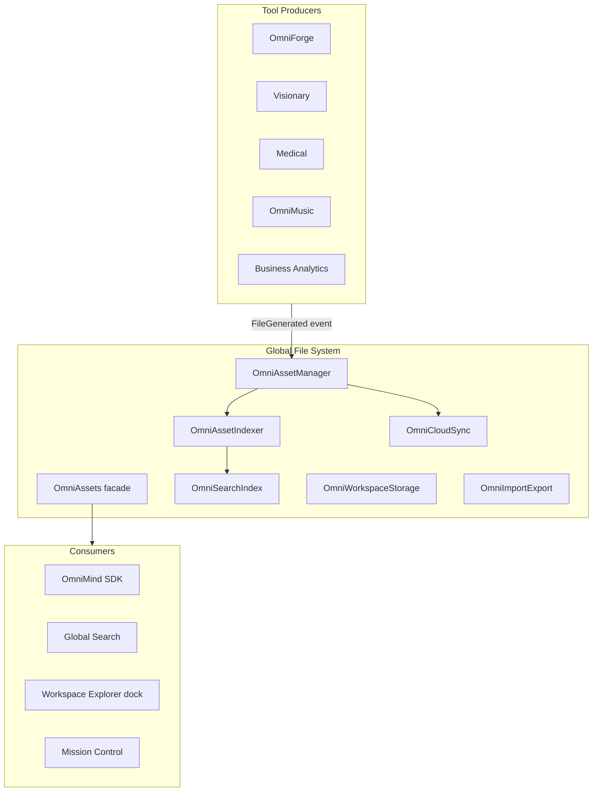

# Global File System Architecture

**Version:** 1.0  
**Date:** 2026-06-17  
**Status:** Enterprise architecture specification  
**Principle:** Every generated file is visible everywhere. No duplicated storage.

---

## 1. Vision

```
Generated by OmniForge
        ↓
Available in Visionary (import as asset)
        ↓
Available in Analytics (dataset link)
        ↓
Available in SDK (plugin access)
        ↓
Available in Cloud (OmniCloud sync)
        ↓
Available in Export (bundles, reports)
```

One **logical asset** — multiple tool views. Physical bytes stored once; metadata indexed globally.

---

## 2. Platform Stack (Existing)



**Entry facade:** `frontend/core/assets/OmniAssets.ts` — `omniAssets` singleton.

| Submodule | Path | Role |
|-----------|------|------|
| `OmniAssetManager` | `OmniAssetManager.ts` | Register, list, update assets |
| `OmniAssetIndexer` | `OmniAssetIndexer.ts` | Full-text + metadata index |
| `OmniSearchIndex` | `OmniSearchIndex.ts` | Query across assets |
| `OmniWorkspaceStorage` | `OmniWorkspaceStorage.ts` | `ws:{tool}:{projectId}` scoped blobs |
| `OmniProjectEngine` | `OmniProjectEngine.ts` | Project containers |
| `OmniCloudSync` | `OmniCloudSync.ts` | Cloud upload state |
| `OmniImportExport` | `OmniImportExport.ts` | Bundles, ZIP, reports |
| `OmniFileExplorer` | `OmniFileExplorer.ts` | Tree for explorer dock |
| `OmniMediaLibrary` | `OmniMediaLibrary.ts` | Media-specific views |
| `OmniVersionControl` | `OmniVersionControl.ts` | Asset versions |

---

## 3. Asset Model

**Source:** `frontend/core/assets/types.ts`

```typescript
type AssetKind =
  | "image" | "video" | "audio" | "document"
  | "code" | "dataset" | "blueprint" | "report"
  | "archive" | "other";

interface OmniAsset {
  id: string;
  name: string;
  kind: AssetKind;
  toolSlug: string;          // originating tool
  projectId: string | null;
  path: string;              // logical path in project
  mimeType: string;
  sizeBytes: number;
  tags: string[];
  collectionIds: string[];
  metadata: Record<string, unknown>;
  version: number;
  createdAt: string;
  modifiedAt: string;
  previewUrl: string | null;
  cloudUri: string | null;   // OmniCloud location after sync
}
```

---

## 4. Write Path (Register Once)

```
Tool generates file (local blob, server URL, or project path)
  ↓
omniEventBus.publish("FileGenerated", {
  name, kind, path, mimeType, sourceTool, projectId, blobRef?
})
  ↓
OmniAssetManager.register({ ... })
  ↓
OmniAssetIndexer.index(asset)
  ↓
OmniSearchIndex.add(asset)
  ↓
If cloud enabled → OmniCloudSync.enqueue(asset)
  ↓
omniLiveNotifications.push("File ready", name, "success")
```

**Protected tools** emit `FileGenerated` via public hooks — never write to another tool's storage.

### 4.1 OmniForge (protected)

- Scaffold output → register as `kind: "code"`, `toolSlug: "omniforge-engine"`
- Uses existing project workspace paths; GFS indexes metadata only
- **Do not** alter OmniForge file tree internals

### 4.2 Architectural Designer (protected)

- Blueprint exports → `kind: "blueprint"`
- API: `/api/v1/spatial/blueprint` — register response asset

### 4.3 Visionary / VFX / Marketing

- Renders → `kind: "image" | "video"`
- Backend routers: `visionary_studio_*`

### 4.4 Medical

- Reports, imaging exports → `kind: "report" | "document"`
- HIPAA: `metadata.sensitivity = "phi"` restricts cross-tool visibility

### 4.5 Business Analytics

- Datasets, exports → `kind: "dataset" | "report"`
- Event: `omnimind:enterprise-analytics-dataset` → register dataset asset

### 4.6 OmniMusic

- Audio stems, mixes → `kind: "audio"`

---

## 5. Read Path (Discover Anywhere)

```
Tool needs asset:
  1. omniAssets.searchAssets(query, { kind, toolSlug?, projectId? })
  2. Or browse omniAssets.media / collections / favorites
  3. Import: omniAssets.importExport.importToTool(assetId, targetTool)
  4. SDK: UniversalAPI.listAssets({ projectId })
```

**Global Search** (`OmniGlobalSearch`) returns assets with `kind: image | video | music | document`.

**Workspace Explorer dock (Phase 2b):** `omniAssets.explorer.buildTree()` filtered by active project.

---

## 6. Storage Layers (No Duplication)

| Layer | Stores | Key pattern |
|-------|--------|-------------|
| **Logical registry** | Metadata, index | `OmniAssetManager.assets[]` |
| **Workspace blob** | Tool-specific JSON state | `ws:{toolSlug}:{projectId}` |
| **Local files** | Browser FileSystem / download | Tool-managed; GFS holds pointer |
| **Server** | `/api/v1/omnicore/assets` | Canonical bytes for cloud tools |
| **OmniCloud** | Cross-device sync | Domain `assets` in `OmniCloudSyncEngine` |
| **Export bundles** | ZIP via `OmniImportExport` | Ephemeral; references asset IDs |

**Rule:** Content addressed by `assetId`. Tools hold references, not copies. `OmniVersionControl` tracks revisions of same `assetId`.

---

## 7. Project Scoping

```
Project P1
  ├── assets[] (all tools, filtered by projectId)
  ├── workspace blobs per tool
  └── cloud bundle

Active project from ecosystem context → default filter for all GFS queries
```

`OmniProjectEngine` links projects to asset collections. Switching project in Workspace Engine refreshes explorer + search scope.

---

## 8. Cross-Tool Asset Handoff

| From | To | Mechanism |
|------|-----|-----------|
| OmniForge | Visionary | Register logo/screenshot → Visionary imports `assetId` |
| Visionary | Marketing | Share render to campaign asset pool |
| Medical | Analytics | Export PDF report → `kind: report` → Analytics opens dataset link |
| OmniMusic | Visionary | Album cover `image` asset → Visionary project |
| Analytics | Visionary | Chart spec → Visionary chart renderer |
| Any | SDK | `UniversalAPI.getAsset(assetId)` |
| Any | Cloud | Auto-sync on register when `cloud.syncEnabled` |

**No copy:** Target tool receives `assetId` + signed URL or project-relative path.

---

## 9. Security & PHI

| Flag | Behavior |
|------|----------|
| `metadata.sensitivity: "phi"` | Only Medical + authorized agents see asset |
| `metadata.sensitivity: "internal"` | Project members only |
| Default | All tools in same project |

OmniPilot Context Engine excludes PHI assets from non-medical agent bundles.

---

## 10. Backend Integration

| API | Role |
|-----|------|
| `routers/omnicore_assets.py` | Server asset CRUD |
| `PUT /api/v1/omnicore/workspaces/{id}` | Project + asset manifest |
| Tool-specific upload endpoints | Return `assetId` for registration |

Client `OmniCoreApiClient` syncs asset manifest with workspace save.

---

## 11. SDK Access

**Source:** `frontend/sdk/browser/api/UniversalAPI.ts`

```typescript
// Existing patterns
dispatch notification on asset events
search-index terms on module registration

// Target
listAssets(projectId): OmniAsset[]
getAsset(assetId): OmniAsset
watchAssets(callback): unsubscribe
```

SDK plugins never read `localStorage` directly for peer tool files.

---

## 12. Implementation Phases

| Phase | Work |
|-------|------|
| 1 | `FileGenerated` event + bridge from tool outputs |
| 2 | Wire OmniForge/Visionary/Medical register on generate |
| 3 | Explorer dock reads `omniAssets.explorer` |
| 4 | OmniCloud assets domain sync |
| 5 | PHI metadata enforcement |
| 6 | Server asset API client in `OmniCoreApiClient` |

---

## Related Documents

- [EVENT_BUS.md](./EVENT_BUS.md)
- [CROSS_TOOL_WORKFLOWS.md](./CROSS_TOOL_WORKFLOWS.md)
- [TOOL_REGISTRY.md](./TOOL_REGISTRY.md)
