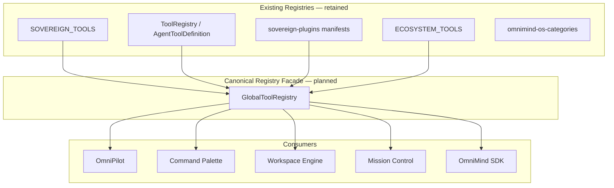

# Global Tool Registry Architecture

**Version:** 1.0  
**Date:** 2026-06-17  
**Status:** Enterprise architecture specification  
**Parent ecosystem:** [OmniPilot](../omnipilot/OMNIPILOT_ARCHITECTURE.md) · Mission Control · Workspace Engine  
**Protected systems (integration only):** OmniForge Engine · OmniForge Code Generation · Architectural Designer Core

---

## 1. Purpose

Every OmniMind tool must register with the **Global Tool Registry** so OmniPilot can discover capabilities dynamically. No tool behaves as an isolated application — each exposes a standard contract consumed by routing, search, workflows, and Mission Control.

---

## 2. Registry Layers (Existing)

OmniMind already has three registry layers that **converge** into one logical Global Tool Registry:



| Layer | Path | Role |
|-------|------|------|
| Sovereign definitions | `frontend/lib/sovereign-tool-registry.ts` | 16 tools: slug, href, layout, icon, `apiProbe` |
| Agent tool definitions | `frontend/core/agent/ToolRegistry.ts` | Capabilities, actions, permissions, aliases |
| Plugin manifests | `frontend/core/plugins/manifests/sovereign-plugins.ts` | AI skills, plugin permissions, SDK actions |
| Ecosystem routes | `frontend/lib/omnimind-ecosystem-registry.ts` | Breadcrumbs, palette items, shell routes |
| Sidebar categories | `frontend/lib/omnimind-os-categories.ts` | Grouped navigation in App Shell |

**Consolidation rule:** New tools register once via `GlobalToolRegistry.register()` which writes to all four layers. Existing tools are **imported** at boot, not rewritten.

---

## 3. Tool Registration Contract

Each registered tool exposes:

| Field | Type | Source today | Purpose |
|-------|------|--------------|---------|
| **Metadata** | `slug`, `name`, `tagline`, `description`, `href`, `icon`, `layout` | `SovereignToolDef` | Navigation, sidebar, search |
| **Commands** | `AgentToolAction[]` | `TOOL_ACTIONS` in `ToolRegistry` | Palette, copilot, SDK |
| **AI Skills** | `OmniCapability[]` | `CAPABILITIES_BY_SLUG` in plugins | Agent Router matching |
| **File Types** | `supportedInputs[]`, `supportedOutputs[]` | `AgentToolDefinition` | Global file system routing |
| **Supported Actions** | `PluginActionDefinition[]` | `ACTIONS_BY_SLUG` | Cross-tool invocation |
| **Background Tasks** | `taskTypes[]` | Per-tool job declarations (planned) | Background Job Engine |
| **Context Providers** | `provideContext(): ContextSlice` | Event-based today | Context Engine |
| **Shortcuts** | `shortcutId → handler` | `OmniMindKeyboardBindings` | Global keybindings |
| **Permissions** | `AgentPermission[]` + plugin scopes | `PERMISSIONS_BY_SLUG` | PermissionGate |

### 3.1 Canonical type (specification)

```typescript
interface GlobalToolRegistration {
  // Metadata
  slug: SovereignToolSlug | string;
  name: string;
  description: string;
  href: string;
  icon: LucideIcon;
  layout: SovereignLayoutKind;
  category: string;
  apiProbe?: string;

  // Capabilities
  commands: AgentToolAction[];
  aiSkills: OmniCapability[];
  supportedInputs: string[];
  supportedOutputs: string[];
  actions: PluginActionDefinition[];
  permissions: AgentPermission[];
  pluginPermissions: PluginPermissionScope[];

  // Integration
  contextProvider?: () => Promise<ContextSlice>;
  backgroundTaskTypes?: string[];
  shortcuts?: Record<string, () => void>;

  // Routing
  omniRouteId?: string;
  pluginId: string;
  keywords: string[];
}
```

---

## 4. Dynamic Discovery (OmniPilot)

OmniPilot discovers tools at runtime:

```
1. Boot: import SOVEREIGN_TOOLS + ToolRegistry.build() + plugin manifests
2. SDK: window.OmniMindSDK registration → omniEventBus.publish("hub:tool-registered")
3. Marketplace: MarketplaceManager.install() → append to registry
4. Query: GlobalToolRegistry.list({ capability?, permission?, category? })
5. Match: IntentEngine + Brain2 ToolRouter use registry keywords + capabilities
```

**Event:** `hub:tool-registered` — already defined in `OmniCoreEventMap` (`frontend/core/omnicore/types.ts`).

---

## 5. Sovereign Tool Catalog

| Slug | Name | AI Skills | Protected |
|------|------|-----------|-----------|
| `omniforge-engine` | OmniForge Engine | `generate-code`, `deploy` | **Yes** |
| `architectural-designer` | Architectural Designer | `create-architecture` | **Yes** |
| `interior-landscape` | Interior Design | `create-architecture` | Interface only |
| `medical-diagnostic` | Medical Diagnostic | `analyze-medical-image` | — |
| `medical-diagnostic-suite` | Medical Enterprise | `analyze-medical-image` | — |
| `quantum-trading` | Quantum Trading | `financial-analysis` | — |
| `creative-visionary` | Creative Visionary | `generate-video` | — |
| `visionary-studio` | Visionary Studio | `generate-video`, `edit-video` | — |
| `business-analytics` | Business Analytics | `analyze-data`, `financial-analysis` | — |
| `vfx-master` | VFX Master | `edit-video`, `generate-video` | — |
| `nasa-solver` | NASA Solver | `scientific-simulation` | — |
| `digital-marketing-hub` | Marketing Hub | `marketing-campaign` | — |
| `omnimusic` | OmniMusic | `generate-music` | — |
| `omnimap` | OmniMap | `navigation-maps` | — |
| `omnitv` / `omnimovies` | Entertainment | `entertainment-streaming` | — |
| `omnitranslator` | OmniTranslator | `translate`, `voice-processing` | — |

**Platform shell routes** (not sovereign tools but registered for discovery):

| Route | Label |
|-------|-------|
| `/` | Neural Chat / Home |
| `/mission-control` | Mission Control |
| `/automation-engine` | Automation Engine |
| `/marketplace` | Marketplace |
| `/omnicloud` | OmniCloud |

---

## 6. Tool Aliases (Logical Tools → Physical Routes)

`ToolRegistry` already maps logical tools to sovereign slugs:

| Alias ID | Routes to | Use case |
|----------|-----------|----------|
| `app-website-builder` | `omniforge-engine?stack=web` | "Build website" |
| `business-website-builder` | `omniforge-engine?stack=business` | E-commerce |
| `game-development` | `omniforge-engine?stack=game` | Game scaffold |

Aliases appear in search and intent resolution without duplicating tool UIs.

---

## 7. Context Providers (Event-Based)

Protected tools **do not** export internal stores. They emit context:

| Event | Producer | Consumer |
|-------|----------|----------|
| `omnimind:brain-workspace-context` | Brain / tools | Ecosystem, analytics |
| `omnimind:enterprise-analytics-dataset` | Business Analytics | Brain context |
| `omnimind:omniforge-architect` | OmniForge (interface) | Ecosystem routing |

**Planned:** Each tool registers `provideContext()` that responds to `omnimind:brain-request-context` (see [CONTEXT_ENGINE.md](../omnipilot/CONTEXT_ENGINE.md)).

---

## 8. Health & Probes

Each tool with `apiProbe` is checked by Mission Control and readiness dashboards:

```
GET {apiProbe} → 200 = online
```

Examples: `/api/v1/build-engine/omniforge/scaffold`, `/api/v1/spatial/blueprint`, `/api/agents/medical/triage`.

---

## 9. Registration Flow (New Tool)

```
1. Add SovereignToolDef OR plugin manifest (marketplace)
2. ToolRegistry.ingest(manifest) — capabilities + actions
3. omnimind-os-categories.assign(category)
4. Workspace Engine: optional default layout kind
5. omniEventBus.publish("hub:tool-registered", { toolSlug })
6. OmniPilot re-indexes search + intent keywords
```

**Forbidden:** Standalone route outside App Shell without `embeddedInAppShell` or registry entry.

---

## 10. Integration Matrix

| Consumer | Registry API |
|----------|--------------|
| OmniPilot Agent Router | `registry.get()`, `registry.getBySlug()`, capabilities |
| Command Palette | `COMMAND_PALETTE_ITEMS` + dynamic from registry |
| Workspace Engine tabs | `SOVEREIGN_TOOLS` href + slug |
| Global Search | `omniCore.search` indexes registry keywords |
| SDK AutoRegistration | `sdk/browser/registration/AutoRegistration.ts` |
| Mission Control | Tool health from `apiProbe` + agent registry |

---

## Related Documents

- [CROSS_TOOL_WORKFLOWS.md](./CROSS_TOOL_WORKFLOWS.md)
- [EVENT_BUS.md](./EVENT_BUS.md)
- [../omnipilot/AGENT_ROUTER.md](../omnipilot/AGENT_ROUTER.md)
