# Unified Settings Architecture

**Version:** 1.0  
**Date:** 2026-06-17  
**Status:** Enterprise architecture specification  
**Principle:** One centralized settings system — no separate settings pages per tool.

---

## 1. Problem

Settings are fragmented today:

| Location | What it controls |
|----------|------------------|
| `OmniSettings` | Platform keys (theme, AI, cloud, workspace) |
| `ThemeHub` | Appearance presets (per-component dropdown) |
| `/?settings=1` | Route flag (home settings — partial) |
| Tool headers | Duplicate theme controls in flagship shells |
| `GlobalMemory.preferences` | Brain-level user prefs |
| `omniMemory` user-prefs scope | AI inference prefs |
| Medical Enterprise | Isolated clinical settings panels |

**Unified Settings** consolidates into one system with scoped keys, one UI surface, and cloud sync.

---

## 2. Architecture

```mermaid
flowchart TB
  subgraph ui [Single Settings Surface]
    MOD[Settings Modal / Panel]
    PAL[Command Palette → Open Settings]
  end

  subgraph core [Unified Settings Core]
    US[OmniSettings]
    REG[SettingsRegistry — categories]
    SYNC[OmniPlatformSync + OmniCloud]
  end

  subgraph scopes [Scopes]
    G[global]
    W[workspace]
    T[tool]
    U[user-prefs / AI memory]
  end

  subgraph consumers [Consumers]
    THEME[ThemeProvider / Design System]
    OP[OmniPilot]
    WSE[Workspace Engine]
    TOOLS[Tools — read only]
    NC[Notifications]
  end

  ui --> US
  US --> scopes
  US --> SYNC
  US --> consumers
  REG --> ui
```



**Entry point:** `/?settings=1` opens global modal (existing route). Command palette: "Open settings". No tool-specific `/settings` routes for platform prefs.

---

## 3. Settings Core (Existing)

**Source:** `frontend/core/omnicore/OmniSettings.ts`

```typescript
type SettingsScope = "global" | "workspace" | "tool";

interface OmniSetting {
  key: string;           // dotted namespace: "ai.defaultAgent"
  scope: SettingsScope;
  toolSlug: OmniToolSlug | null;
  value: unknown;
  cloudSync: boolean;
}
```

**API:**

| Method | Purpose |
|--------|---------|
| `get(key, scope?, toolSlug?)` | Read setting |
| `value(key, fallback, ...)` | Typed read with default |
| `set(key, value, scope?, toolSlug?, cloudSync?)` | Write + optional sync |
| `list(scope?, toolSlug?)` | Enumerate |
| `export()` / `import()` | Backup |
| `reset(scope?)` | Clear scope |

**Singleton:** `omniSettings` — mounted via `OmniCore.settings`.

---

## 4. Settings Categories

One registry maps UI sections to keys:

### AI

| Key | Default | Scope |
|-----|---------|-------|
| `ai.defaultAgent` | `developer-agent` | global |
| `ai.rememberStyle` | `true` | global |
| `ai.modelPreference` | `gemini` | global |
| `ai.streamingEnabled` | `true` | global |
| `ai.contextTokenBudget` | `32000` | global |

**Consumer:** OmniPilot, `OmniAI`, Agent Router.

### Appearance

| Key | Default | Scope |
|-----|---------|-------|
| `theme.id` | `omnimind-dark` | global |
| `theme.enterprisePreset` | `omnimind-dark` | global |
| `theme.customAccent` | `null` | global |
| `editor.fontSize` | `13` | global |

**Consumer:** `ThemeProvider`, `applyDesignSystemTheme`, `ThemeHub` (becomes thin viewer).

**Migration:** `ThemeHub` writes to `omniSettings` + publishes `theme:changed` instead of local-only state.

### Language

| Key | Default | Scope |
|-----|---------|-------|
| `locale.id` | `en` | global |
| `locale.rtl` | `false` | global |

**Consumer:** i18n layer, OmniTranslator defaults.

### Workspace

| Key | Default | Scope |
|-----|---------|-------|
| `workspace.autoSave` | `true` | workspace |
| `workspace.autoRestore` | `true` | workspace |
| `workspace.defaultSplit` | `single` | workspace |
| `workspace.tabLimit` | `20` | workspace |

**Consumer:** Workspace Engine (`session.ts`), `OmniPlatformSync`.

### Shortcuts

| Key | Default | Scope |
|-----|---------|-------|
| `shortcuts.custom` | `{}` | global |

**Consumer:** `OmniMindKeyboardBindings`, workspace engine keymap.

**Pattern:** Shortcuts reference `shortcutId` from `OmniCoreEventMap` (`shortcut:triggered`).

### Cloud

| Key | Default | Scope |
|-----|---------|-------|
| `cloud.syncEnabled` | `true` | global |
| `cloud.domains` | `["ai-memory","assets","settings"]` | global |

**Consumer:** `OmniCloudSyncEngine`, `OmniPlatformSync`.

### Models

| Key | Default | Scope |
|-----|---------|-------|
| `models.provider` | `gemini` | global |
| `models.fallbackChain` | `["gemini","local"]` | global |

**Consumer:** `/api/v1/omnicore/ai/complete`, integration providers.

### Security

| Key | Default | Scope |
|-----|---------|-------|
| `security.zeroTrust` | `true` | global |
| `security.deployApproval` | `true` | global |
| `telemetry.enabled` | `false` | global |

**Consumer:** `PermissionGate`, deploy workflows.

### Plugins

| Key | Default | Scope |
|-----|---------|-------|
| `plugins.autoUpdate` | `true` | global |
| `plugins.sandbox` | `true` | global |

**Consumer:** `MarketplaceManager`, SDK sandbox.

### Billing

| Key | Default | Scope |
|-----|---------|-------|
| `billing.plan` | `founder` | global |

**Consumer:** OmniCharge utility, usage dashboards.

### Account

| Key | Default | Scope |
|-----|---------|-------|
| `account.profileId` | — | global |

**Consumer:** Auth (`AuthButton`), ecosystem profile.

### Notifications

| Key | Default | Scope |
|-----|---------|-------|
| `notifications.enabled` | `true` | global |
| `notifications.desktop` | `false` | global |
| `notifications.categories` | all enabled | global |

**Consumer:** `OmniNotificationCenter`, `OmniLiveNotifications`.

---

## 5. Tool-Scoped Overrides

Tools may override **only** keys namespaced under their slug:

```
tool: omniforge-engine
  key: editor.tabSize → 2

tool: medical-diagnostic-suite
  key: clinical.defaultUnit → metric
```

**Rule:** Platform keys (`theme.*`, `ai.*`) are global-only. Tools read via `omniSettings.value(key, fallback, "tool", toolSlug)`.

Medical clinical settings remain in Medical UI but **sync summary** to tool scope for OmniPilot context — not duplicate platform theme/settings.

---

## 6. Change Propagation

```
omniSettings.set(key, value):
  1. Update in-memory store
  2. omniEventBus.publish("settings:changed", { scope, key })
  3. If cloudSync → OmniPlatformSync.queue("settings")
  4. If key starts with "theme." → theme:changed + applyDesignSystemTheme
  5. Memory Engine: user-prefs scope update for AI keys
```

**Subscribers:** ThemeProvider, Workspace Engine, OmniPilot, Notification preferences.

---

## 7. Unified Settings UI

**Target:** Single `OmniMindSettingsPanel` in App Shell (not per-tool `ThemeHub` duplicates).

| Section | Replaces |
|---------|----------|
| AI | Scattered copilot prefs |
| Appearance | Multiple `ThemeHub` instances |
| Language | — |
| Workspace | Workspace engine local prefs |
| Shortcuts | Inline docs only today |
| Cloud | OmniCloud page partial |
| Models | Integration providers UI |
| Security | Permission prompts config |
| Plugins | Marketplace settings tab |
| Billing | OmniCharge |
| Account | Auth profile |
| Notifications | Activity center prefs |

**Access:**

- Header gear → `/?settings=1` or modal
- Command palette: "Open settings"
- Sidebar category: Settings (`omnimind-os-categories.ts` → `/?settings=1`)

**Flagship shells:** `embeddedInAppShell` tools hide duplicate `ThemeHub`; use App Shell header settings.

---

## 8. Cloud & Server Persistence

| Path | Bundle |
|------|--------|
| `PUT /api/v1/omnicore/workspaces/{projectId}` | settings slice in workspace JSON |
| OmniCloud domain `settings` | `omniSettings.export()` delta |
| Local | In-memory until sync (no separate localStorage key for core settings today) |

**Gap:** Persist `OmniSettings` store to localStorage `omnimind_settings_v1` on change (planned).

---

## 9. Search Integration

`OmniGlobalSearch` indexes settings keys:

```
kind: "setting"
title: "AI Default Agent"
actionId: "settings:ai.defaultAgent"
```

User can palette-search "font size" → jump to Appearance section.

---

## 10. Implementation Phases

| Phase | Work |
|-------|------|
| 1 | Settings registry with all categories + keys |
| 2 | `OmniMindSettingsPanel` modal at `/?settings=1` |
| 3 | ThemeHub → writes `omniSettings` + event |
| 4 | Remove duplicate ThemeHub from embedded shells |
| 5 | localStorage persistence + cloud sync hook |
| 6 | Tool-scoped clinical keys (Medical) as read-only export |

---

## Related Documents

- [EVENT_BUS.md](./EVENT_BUS.md)
- [TOOL_REGISTRY.md](./TOOL_REGISTRY.md)
- [../omnipilot/MEMORY_ENGINE.md](../omnipilot/MEMORY_ENGINE.md)
