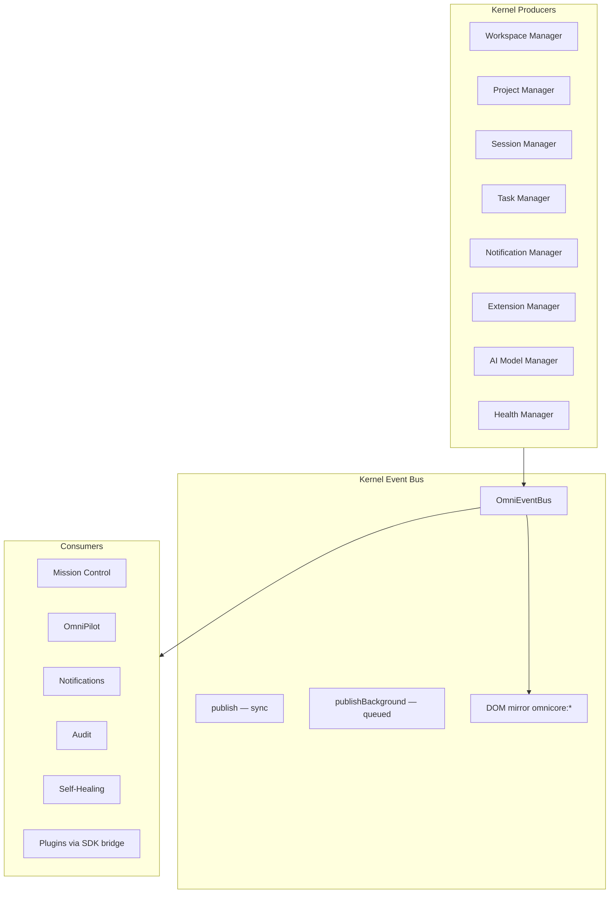

# OmniMind Kernel Event Bus Architecture

**Parent:** [SYSTEM_KERNEL.md](./SYSTEM_KERNEL.md)  
**See also:** [Global Event Bus (ecosystem)](../ecosystem/EVENT_BUS.md)

---

## 1. Principle

**Everything in the kernel communicates only through events.** No direct coupling between system services, platform layers, or user-space tools.

The **Kernel Event Bus** is the authoritative channel: `OmniEventBus` (`frontend/core/omnicore/OmniEventBus.ts`). DOM (`omnimind:*`) and SDK (`omnimind:sdk:*`) buses are **bridges**, not parallel sources of truth.

---

## 2. Kernel Bus Architecture



---

## 3. API (Existing)

```typescript
omniEventBus.publish(event, payload)       // synchronous fan-out
omniEventBus.publishBackground(event, payload)  // queued, max 500
omniEventBus.subscribe(event, handler)    // returns unsubscribe
omniEventBus.once(event, handler)
omniEventBus.flushBackground()
omniEventBus.clear(event?)
```

DOM mirror: `window.dispatchEvent(new CustomEvent('omnicore:' + event, { detail: payload }))`

---

## 4. Kernel Canonical Events

### 4.1 Typed events (`OmniCoreEventMap`)

**Source:** `frontend/core/omnicore/types.ts`

| Event | Payload | Emitter |
|-------|---------|---------|
| `project:opened` | `{ projectId, toolSlug }` | Project Manager |
| `project:closed` | `{ projectId }` | Project Manager |
| `workspace:changed` | `{ presetId }` | Workspace Manager |
| `layout:saved` | `{ layoutId }` | Layout / Workspace Engine |
| `session:started` | `{ sessionId }` | Session Manager |
| `command:executed` | `{ commandId }` | Command Palette |
| `settings:changed` | `{ scope, key }` | Settings Manager |
| `theme:changed` | `{ themeId }` | Theme Manager |
| `notification:show` | `{ id, title }` | Notification Manager |
| `notification:live` | `{ id, level }` | Live notifications |
| `activity:new` | `{ id, kind }` | Telemetry / tasks |
| `brain:context` | `{ toolSlug }` | Brain / OmniPilot |
| `brain:sync` | `{ source }` | Unified Brain |
| `cloud:sync` | `{ domain }` | Cloud / Upload Manager |
| `hub:switch` | `{ toolSlug }` | Navigation |
| `hub:tool-registered` | `{ toolSlug }` | Extension Manager |
| `automation:execution-started` | `{ executionId, workflowId }` | Automation |
| `mission:agent-control` | `{ agentId, action }` | Mission Control |
| `mission:log` | `{ source, level }` | Mission Control |

### 4.2 Kernel PascalCase aliases (specification)

User-facing names map to kernel events during migration:

| Canonical name | Kernel event(s) |
|----------------|-----------------|
| **WorkspaceOpened** | `workspace:changed` + `layout:saved` |
| **ProjectCreated** | `project:opened` (create path) |
| **TaskFinished** | `activity:new` kind `task` + brain-actions complete |
| **AgentStarted** | `mission:agent-control` action `start` |
| **PluginInstalled** | `hub:tool-registered` |
| **DeploymentCompleted** | `activity:new` kind `deploy` |
| **ModelLoaded** | `brain:sync` source `ai-model-manager` |
| **NotificationCreated** | `notification:show` |

Bridge layer may emit **both** forms during transition; new code uses `omniEventBus` typed names.

---

## 5. Service → Event Matrix

| Service | Publishes | Subscribes |
|---------|-----------|------------|
| Workspace Manager | `workspace:changed`, `layout:saved` | `session:started` |
| Project Manager | `project:opened`, `project:closed` | `hub:switch` |
| Session Manager | `session:started` | `settings:changed` |
| Task Manager | `activity:new` | `automation:execution-started` |
| Notification Manager | `notification:show`, `notification:live` | `activity:new` |
| Extension Manager | `hub:tool-registered` | `settings:changed` |
| AI Model Manager | `brain:sync` | `settings:changed` (model prefs) |
| Memory Manager | `brain:sync` | `project:opened` |
| Health Manager | `activity:new` (errors) | `mission:log` |
| Self-Healing | `mission:log` | service health degradation |

---

## 6. Delivery Semantics

| Mode | Use |
|------|-----|
| `publish` | User actions, state changes requiring immediate UI update |
| `publishBackground` | High-frequency metrics, non-critical telemetry |
| `once` | Boot hooks, one-time initialization |

**Queue cap:** 500 events — oldest dropped on overflow.

---

## 7. Forbidden Patterns

| Anti-pattern | Correct approach |
|--------------|------------------|
| `import { otherService } from '../other'` | `omniEventBus.subscribe` |
| Tool A imports Tool B store | Emit `FileGenerated`, subscribe in B |
| Kernel imports OmniForge layout | Event `omnimind:ecosystem-agent-prompt` |
| Duplicate state in copilot | Subscribe to `brain:context` |

---

## 8. Plugin & SDK Bridge

```
Plugin SDK emit:
  SDKEventBus.publish("PluginInstalled", payload)
    → bridge → omniEventBus.publish("hub:tool-registered", { toolSlug })

DOM legacy:
  window "omnimind:workspace-saved"
    → bridge → omniEventBus.publish("layout:saved", ...)
```

**Target:** `OmniMindUnifiedSync` owns bridge table (see ecosystem EVENT_BUS).

---

## 9. Audit & Security

Security-sensitive events also write to audit:

| Event | Audit action |
|-------|--------------|
| `settings:changed` | `settings.change` |
| `hub:tool-registered` | `plugin.install` |
| `mission:agent-control` | `ai.agent_start` |
| `project:closed` | `project.delete` (if destructive) |

---

## 10. Backward Compatibility

- All existing `omnimind:*` DOM listeners continue working via bridge
- `OmniSessionManager.start()` already uses `omniEventBus.publish`
- No removal of DOM events until bridge coverage 100%

---

## Related Documents

- [../ecosystem/EVENT_BUS.md](../ecosystem/EVENT_BUS.md)
- [SYSTEM_SERVICES.md](./SYSTEM_SERVICES.md)
- [SELF_HEALING.md](./SELF_HEALING.md)
