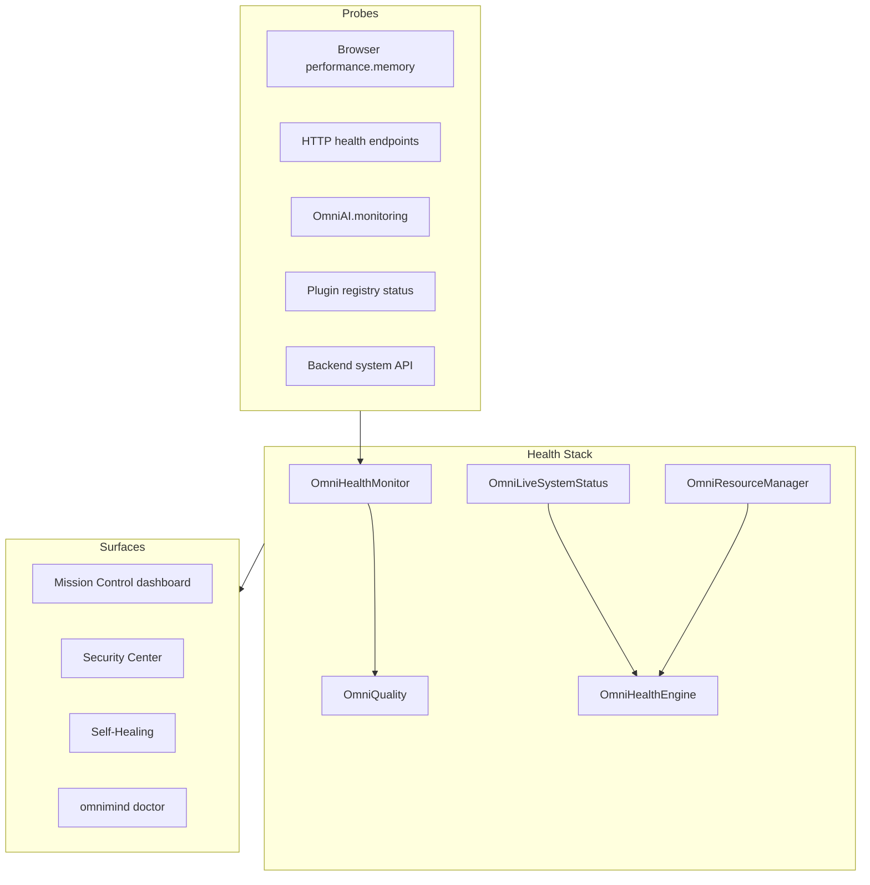

# OmniMind Health Monitor Architecture

**Parent:** [SYSTEM_KERNEL.md](./SYSTEM_KERNEL.md)

---

## 1. Purpose

The **Health Monitor** continuously assesses platform vitality — CPU, memory, GPU, network, storage, APIs, workers, AI models, and plugins — and feeds **Mission Control**, the **Security Dashboard**, and **self-healing** decisions.

---

## 2. Architecture



| Module | Path | Role |
|--------|------|------|
| `OmniHealthMonitor` | `core/quality/OmniHealthMonitor.ts` | Per-service health registry |
| `OmniQuality` | `core/quality/OmniQuality.ts` | Facade + `runHealthProbes()` |
| `OmniObservability` | `core/quality/OmniObservability.ts` | Metrics, latency histograms |
| `OmniLiveSystemStatus` | `core/mission-control/OmniLiveSystemStatus.ts` | Live snapshot |
| `OmniHealthEngine` | `core/mission-control/OmniHealthEngine.ts` | Composite scores |
| `OmniResourceManager` | `core/mission-control/OmniResourceManager.ts` | CPU/GPU/tokens/workers |
| `OmniSystemTaskManager` | `core/ecosystem/OmniSystemTaskManager.ts` | Resource snapshot |

---

## 3. Monitored Dimensions

### 3.1 CPU

| Source | Availability |
|--------|--------------|
| Backend `/api/v1/omnicore/mission-control/system` | Server CPU % |
| Browser | Not available (null) |
| Mission Control merge | `cpuPercent` in `LiveSystemSnapshot` |

### 3.2 Memory

| Source | Field |
|--------|-------|
| Browser | `performance.memory.usedJSHeapSize` → `ramUsedMb` |
| `OmniObservability.metrics()` | `memoryMb` |
| Backend remote | `ramTotalMb`, `ramUsedMb` |

**Leak detection:** Self-healing compares heap growth rate over 5-minute windows (see [SELF_HEALING.md](./SELF_HEALING.md)).

### 3.3 GPU

| Source | Field |
|--------|-------|
| Backend system API | `gpuPercent` |
| Video render queues | `videoQueue` in `OmniSystemTaskManager` |

### 3.4 Network

| Source | Measurement |
|--------|-------------|
| Health probes | Latency ms per endpoint |
| `OmniHealthMonitor.probeEndpoint()` | HTTP RTT |
| Backend | `networkMbps` |

### 3.5 Storage

| Source | Field |
|--------|-------|
| `OmniBillingArchitecture` | Org storage quota usage |
| `OmniAssets.snapshot()` | Asset count, project count |
| Backend | `storageUsedGb` / `storageTotalGb` |

### 3.6 API

**Registered services** in `OmniHealthMonitor.services`:

| Service name | Probe target |
|--------------|--------------|
| `omnicore` | `/api/v1/omnicore/projects` |
| `backend-api` | `/api/v1/auth/health` |
| `ai-providers` | Inference gateway health |
| `database` | Mongo/Postgres ping |
| `streaming` | SSE/WebSocket endpoints |

```typescript
overallStatus():
  unhealthy if any service unhealthy
  degraded if any degraded
  healthy if all healthy
  else unknown
```

### 3.7 Workers

| Source | Data |
|--------|------|
| `OmniBackgroundEngine` | Job list, running count |
| `OmniSystemTaskManager` | `workers`, `processes` |
| `OmniObservability` | `jobs.queued` counter |
| Automation queue | `omniAutomationQueue.snapshot()` |

### 3.8 AI Models

| Source | Data |
|--------|------|
| `omniAI.monitoring()` | `requestCount`, `totalTokens`, `latencyP50Ms`, `totalCostUsd` |
| `OmniLiveSystemStatus` | `aiProviders[]` status per provider |
| `runningModels` | From system task manager |

### 3.9 Plugins

| Source | Data |
|--------|------|
| `omniPluginEngine.registry.list()` | Per-plugin `enabled` → online/offline |
| `OmniPluginDiagnostics` | Error count, activation latency |
| Marketplace | `crashRate`, `performanceScore` on listings |

---

## 4. Health Scores (Mission Control)

**Source:** `OmniHealthEngine.compute()` → `HealthScores`

| Score | Derivation |
|-------|------------|
| **overall** | Mean of subscores |
| **performance** | From `overallStatus()` healthy=90, degraded=65, else 40 |
| **security** | Compliance scores + security snapshot |
| **reliability** | Automation `successRate` |
| **ai** | AI request activity baseline |
| **infrastructure** | API online = 88, else 55 |

Displayed on Mission Control dashboard and kernel snapshot.

---

## 5. Probe Schedule

```
On OmniCore.boot():
  omniQuality.runHealthProbes()

Periodic (Mission Control open / 60s interval):
  omniLiveSystemStatus.refresh()
  omniResourceManager.refresh()
  omniHealthEngine.compute()

On demand:
  omnimind doctor (CLI)
  User opens Mission Control
```

---

## 6. Service Health Schema

```typescript
interface ServiceHealth {
  name: string;
  status: "healthy" | "degraded" | "unhealthy" | "unknown";
  latencyMs: number | null;
  message: string | null;
}
```

Updated via `OmniHealthMonitor.updateService(name, status, latencyMs, message)`.

---

## 7. Observability Integration

`OmniObservability` records:

- `health.{service}` latency from probes
- `api.inflight` request depth
- `jobs.queued` background depth

Dashboard: `omniQuality.health.dashboard()` returns status + services + metrics.

---

## 8. Backend Aggregation

| Module | Path |
|--------|------|
| `health_aggregator.py` | Backend service health rollup |
| `omnicore_mission_control.py` | Dashboard API |
| `tools_status.py` | Sovereign tool probes |

Client `OmniMissionControlApiClient.fetchSystem()` merges remote + local.

---

## 9. Alerting

| Condition | Action |
|-----------|--------|
| Service `unhealthy` | Notification + Mission Control badge |
| `failed_login` spike | Security monitor (separate) |
| Heap growth > threshold | Self-healing memory mitigation |
| Plugin `crashRate` high | Disable plugin + notify |
| API latency p95 > 5s | Degraded status |

Events: `activity:new` with `kind: error` → Activity Center.

---

## 10. CLI Integration

`omnimind doctor` validates kernel files exist.  
**Planned:** `omnimind doctor --health` runs live probes and prints service table.

---

## Related Documents

- [SELF_HEALING.md](./SELF_HEALING.md)
- [SERVICE_REGISTRY.md](./SERVICE_REGISTRY.md)
- [../security/ENTERPRISE_SECURITY.md](../security/ENTERPRISE_SECURITY.md)
