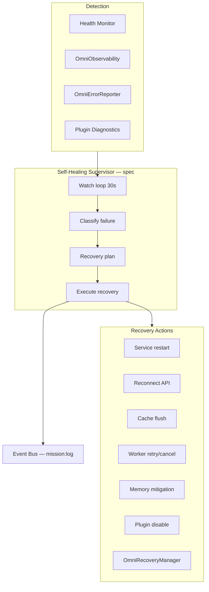

# OmniMind Self-Healing Architecture

**Parent:** [SYSTEM_KERNEL.md](./SYSTEM_KERNEL.md) · [HEALTH_MONITOR.md](./HEALTH_MONITOR.md)

---

## 1. Purpose

**Self-healing** automatically detects platform failures — dead services, broken connections, failed workers, memory pressure — and recovers safely without user intervention where possible, or with minimal surfaced prompts when human approval is required.

Self-healing is a **kernel supervisor** layered on Health Monitor, Service Registry, and Event Bus — not a replacement for those systems.

---

## 2. Architecture



| Existing module | Role in self-healing |
|-----------------|----------------------|
| `OmniHealthMonitor` | Service status detection |
| `OmniErrorReporter` | Crash capture (`lastCrash`) |
| `OmniRecoveryManager` | Backup restore wizard |
| `OmniPluginDiagnostics` | Plugin error tracking |
| `BackgroundScheduler.retry()` | Worker retry |
| `offlineQueue.flush()` | Connection recovery |
| `MarketplaceLifecycle.repair()` | Plugin health repair |

---

## 3. Failure Classes

| Class | Detection signal | Severity |
|-------|------------------|----------|
| **Dead service** | `health.status === unhealthy` for ≥2 consecutive probes | High |
| **Broken connection** | Probe exception, fetch failed, offline queue growing | Medium |
| **Failed worker** | Job `status === failed`, scheduler error set | Medium |
| **Memory leak** | Heap MB growth > 30% in 5 min without tab change | High |
| **Plugin crash** | Diagnostics `errors` increment, unhandled rejection in sandbox | Medium |
| **Stale session** | JWT expired, refresh failed | Low |
| **Sync failure** | `platformSync.status === error` | Medium |

---

## 4. Recovery Strategies

### 4.1 Dead services

```
Detect: OmniHealthMonitor service unhealthy × 2
Plan:
  1. omniEventBus.publish("mission:log", { source: "self-heal", level: "warn" })
  2. registry.restart(serviceId) — see SERVICE_REGISTRY.md
  3. Re-run omniQuality.runHealthProbes()
  4. If still unhealthy → notify user + Mission Control alert
Escalation: Do not restart protected tool bundles — only kernel/satellite services
```

### 4.2 Broken connections

```
Detect: backend-api unhealthy OR offlineQueue.length > 10
Plan:
  1. Exponential backoff reconnect (1s, 2s, 4s, max 30s)
  2. offlineQueue.flush() when API healthy
  3. omniPlatformSync.retry failed domains
  4. Publish cloud:sync retry events
User prompt: Only if offline > 5 minutes
```

### 4.3 Failed workers

```
Detect: BackgroundScheduler fail() OR agent task failed
Plan:
  1. If retryCount < maxRetries → BackgroundScheduler.retry(id)
  2. Else mark cancelled, notify via Notification Manager
  3. Audit: task.failed
Protected: Cancel via public tool API only (OmniForge deploy abort hook)
```

### 4.4 Memory leaks

```
Detect: OmniObservability metrics().memoryMb trend
Plan:
  1. Publish memory pressure warning (activity:new)
  2. Flush non-essential caches (offline queue trim, observability histogram trim)
  3. Unload disabled plugins from sandbox
  4. Suggest user reload tab (notification) — no forced reload without consent
  5. session.touch() — distinguish leak vs legitimate growth
```

### 4.5 Plugin failures

```
Detect: Plugin diagnostics errors > threshold OR security scan post-crash
Plan:
  1. MarketplaceLifecycle.disable(pluginId)
  2. OmniPluginSandbox.destroy(pluginId)
  3. Notify: "Plugin X disabled due to errors"
  4. Offer repair() or rollback() via marketplace lifecycle
```

### 4.6 Data recovery

```
Detect: Corrupt workspace session OR user-triggered restore
Plan:
  OmniRecoveryManager wizard:
    1. Select backup (OmniBackupManager)
    2. Verify integrity
    3. Choose scope (project / workspace)
    4. Restore
    5. Confirm + audit
```

---

## 5. Supervisor Loop (Specification)

```typescript
interface SelfHealingSupervisor {
  start(intervalMs?: number): void;  // default 30000
  stop(): void;
  lastAction(): RecoveryAction | null;
  policies: RecoveryPolicy[];
}

interface RecoveryPolicy {
  failureClass: string;
  maxAttempts: number;
  cooldownMs: number;
  action: (context: FailureContext) => Promise<RecoveryResult>;
}
```

**Boot:** Started after `OmniCore.boot()` when `settings` enable self-heal (planned key: `kernel.selfHealEnabled`, default `true`).

**Shutdown:** `supervisor.stop()` on `beforeunload` / logout.

---

## 6. Safety Rules

| Rule | Rationale |
|------|-----------|
| Max 3 auto-restarts per service per hour | Prevent restart storms |
| Never auto-deploy | Deploy requires PermissionGate |
| Never delete user data | Recovery only from backups |
| Protected cores never restarted by supervisor | Only syscall proxies recover |
| PHI/medical plugins: disable only, no auto data purge | HIPAA |
| Log every recovery action | `mission:log` + audit |

---

## 7. Event Integration

| Event | Direction |
|-------|-----------|
| `mission:log` | Supervisor publishes recovery steps |
| `activity:new` | User-visible activity feed |
| `notification:show` | User prompts when auto-recovery fails |
| `health:*` (internal) | Triggers detection |

Self-healing **never** calls tools directly — only kernel services and registry restart hooks.

---

## 8. Mission Control UI

| Widget | Shows |
|--------|-------|
| Recovery timeline | Last 10 self-heal actions |
| Service restart count | Per service per 24h |
| Offline queue depth | Connection healing status |
| Plugin auto-disable log | Which plugins were stopped |

Data from supervisor state + `OmniSystemLogs`.

---

## 9. Existing Building Blocks

| Capability | Status today |
|------------|--------------|
| Health probes | ✅ `OmniQuality.runHealthProbes` |
| Service status tracking | ✅ `OmniHealthMonitor` |
| Worker retry | ✅ `BackgroundScheduler.retry` |
| Plugin disable | ✅ `MarketplaceLifecycle.disable` |
| Plugin repair | ✅ `MarketplaceLifecycle.repair` |
| Offline flush | ✅ `offlineQueue.flush` |
| Backup restore | ✅ `OmniRecoveryManager` |
| Unified supervisor loop | 📋 Specification (this doc) |
| Auto service restart | 📋 Via Service Registry phase B |

---

## 10. Backward Compatibility

- Self-healing is **opt-in at runtime** via setting; default on does not change guest mode
- No modification to protected engine code paths
- Failed recovery falls back to current behavior (user sees error, no worse state)
- `OmniErrorReporter` crash log format unchanged

---

## 11. Implementation Phases

| Phase | Deliverable |
|-------|-------------|
| 1 | Failure taxonomy + policies (this doc) |
| 2 | `SelfHealingSupervisor` with connection + worker policies |
| 3 | Service registry restart integration |
| 4 | Memory pressure policy |
| 5 | Mission Control recovery timeline UI |

---

## Related Documents

- [HEALTH_MONITOR.md](./HEALTH_MONITOR.md)
- [SERVICE_REGISTRY.md](./SERVICE_REGISTRY.md)
- [EVENT_BUS.md](./EVENT_BUS.md)
- [../ecosystem/BACKGROUND_JOB_ENGINE.md](../ecosystem/BACKGROUND_JOB_ENGINE.md)
