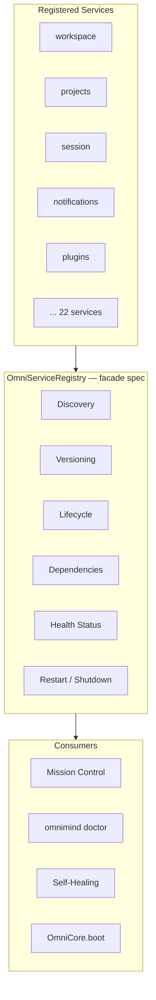

# OmniMind Service Registry Architecture

**Parent:** [SYSTEM_KERNEL.md](./SYSTEM_KERNEL.md)

---

## 1. Purpose

Every kernel **system service** registers itself with the **Service Registry** for discovery, versioning, lifecycle control, dependency resolution, health reporting, and safe restart/shutdown.

Today services are **implicitly** registered via `OmniCore` property wiring. The registry formalizes this into an explicit contract without breaking existing `omniCore.*` accessors.

---

## 2. Architecture



**Target module:** `frontend/core/kernel/OmniServiceRegistry.ts` (specification only — delegates to existing singletons).

---

## 3. Service Descriptor

```typescript
interface OmniServiceDescriptor {
  id: string;                    // e.g. "workspace-manager"
  name: string;
  version: string;
  kind: "kernel" | "platform" | "satellite";
  status: ServiceLifecycleStatus;
  health: HealthStatus;
  dependencies: string[];        // other service ids
  singleton: unknown;            // reference to manager instance
  boot?: () => void | Promise<void>;
  shutdown?: () => void | Promise<void>;
  restart?: () => void | Promise<void>;
  healthCheck?: () => Promise<HealthStatus>;
}

type ServiceLifecycleStatus =
  | "registered"
  | "starting"
  | "running"
  | "degraded"
  | "stopped"
  | "failed";

type HealthStatus = "healthy" | "degraded" | "unhealthy" | "unknown";
```

---

## 4. Registry API (Specification)

```typescript
interface OmniServiceRegistry {
  register(descriptor: OmniServiceDescriptor): void;
  unregister(serviceId: string): void;
  get(serviceId: string): OmniServiceDescriptor | null;
  list(filter?: { kind?, status? }): OmniServiceDescriptor[];
  resolveBootOrder(): string[];           // topological sort by dependencies
  bootAll(): Promise<void>;              // OmniCore.boot delegation
  shutdownAll(): Promise<void>;
  restart(serviceId: string): Promise<void>;
  healthSnapshot(): Record<string, HealthStatus>;
}
```

---

## 5. Registration Map (V12)

| Service ID | Singleton | Version source | Dependencies |
|------------|-----------|----------------|--------------|
| `workspace-manager` | `omniCore.workspace` | OmniCore | `session-manager` |
| `project-manager` | `omniCore.projects` | OmniCore | — |
| `session-manager` | `omniCore.session` | OmniCore | — |
| `window-manager` | `omniCore.windows` | OmniCore | `workspace-manager` |
| `task-manager` | `ecosystem.tasks` + `missionControl.background` | Ecosystem / MC | `ai-model-manager` |
| `notification-manager` | `omniCore.notifications` | OmniCore | `event-bus` |
| `settings-manager` | `omniCore.settings` | OmniCore | — |
| `extension-manager` | `omniCore.plugins` | Plugins `4.0.0` | `permission-manager` |
| `permission-manager` | `omniSecurity.rbac` | Security `3.0.0` | `session-manager` |
| `theme-manager` | `omniCore.theme` | OmniCore | `settings-manager` |
| `language-manager` | polyglot registry + `omniCore.i18n` | Platform | — |
| `ai-model-manager` | `omniAI.models` | OmniAI | `settings-manager` |
| `memory-manager` | `omniAI.memory` | OmniAI | — |
| `storage-manager` | `omniAssets` | Assets | `project-manager` |
| `cache-manager` | `offlineQueue` + Redis (server) | Shared / backend | `storage-manager` |
| `download-manager` | `omniAssets.importExport` | Assets | `storage-manager` |
| `upload-manager` | `omniAssets` + cloud sync | Assets / Cloud | `storage-manager` |
| `background-worker-manager` | `missionControl.background` | Mission Control | `task-manager` |
| `telemetry-manager` | `omniQuality.observability` | Quality | `event-bus` |
| `health-manager` | `omniQuality.health` | Quality | `telemetry-manager` |
| `update-manager` | `omniCore.updates` | OmniCore | `settings-manager` |
| `license-manager` | `omniCollaboration.billing` | Collaboration | `settings-manager` |
| `event-bus` | `omniCore.eventBus` | OmniCore | — |

**Backward compatibility:** `omniCore.workspace` etc. remain valid — registry is additive.

---

## 6. Discovery

```typescript
// Consumers query by capability
registry.list({ kind: "kernel", status: "running" })

// Mission Control service table
registry.healthSnapshot()

// CLI doctor extends checks with registry.list()
```

Plugins register as **satellite** services on install:

```
omniServiceRegistry.register({
  id: `plugin:${manifest.id}`,
  kind: "satellite",
  dependencies: ["extension-manager", "event-bus"],
  ...
})
```

---

## 7. Versioning

| Rule | Behavior |
|------|----------|
| Semver per service | Declared on descriptor |
| Platform floor | `OMNI_MIND_PLATFORM_VERSION` / `SDK_MIN_PLATFORM` |
| Incompatible service | `status: failed`, block dependents in boot order |
| Kernel version | `OMNICORE_VERSION` in snapshot |

`OmniUpdateManager` coordinates platform-level updates; per-plugin versions via `OmniPluginUpdater`.

---

## 8. Lifecycle

```
register() → status: registered
boot()     → starting → running (or failed)
degrade()  → running → degraded (health check)
restart()  → stopped → starting → running
shutdown() → running → stopped
```

**OmniCore.boot()** becomes:

```
order = registry.resolveBootOrder()
for (id of order) await registry.get(id).boot?.()
```

Individual facades already implement `.boot()` — registry orchestrates order.

---

## 9. Dependency Resolution

```
Boot order example:
  1. event-bus
  2. session-manager, settings-manager
  3. project-manager, permission-manager
  4. workspace-manager, storage-manager
  5. extension-manager, ai-model-manager
  6. notification-manager, task-manager
  7. missionControl, ecosystem (satellites)
```

Circular dependencies rejected at register time.

---

## 10. Health Status Integration

Each descriptor's `healthCheck()` delegates to:

- `OmniHealthMonitor.updateService(name, status)` for probes
- Service-specific logic (e.g. plugin crash count)
- Aggregated in `registry.healthSnapshot()`

Mission Control displays registry table alongside live metrics.

---

## 11. Restart & Shutdown

| Action | Scope | Safety |
|--------|-------|--------|
| `restart(serviceId)` | Single service | Dependents paused, then resumed |
| `shutdown(serviceId)` | Graceful stop | Flush storage, persist session |
| `shutdownAll()` | Kernel halt | Before page unload / logout |
| Plugin restart | `extension-manager` | Sandbox destroy + reload |

**Protected services:** Restarting `extension-manager` does not reload OmniForge engine bundle — only plugin host.

---

## 12. Migration Plan

| Step | Action |
|------|--------|
| 1 | Document descriptor map (this doc) |
| 2 | `OmniServiceRegistry.register()` called from each manager module init |
| 3 | `OmniCore.boot()` uses `resolveBootOrder()` |
| 4 | Mission Control services panel reads registry |
| 5 | Self-healing calls `registry.restart()` |

No breaking changes to public `omniCore.*` API.

---

## Related Documents

- [SYSTEM_SERVICES.md](./SYSTEM_SERVICES.md)
- [HEALTH_MONITOR.md](./HEALTH_MONITOR.md)
- [SELF_HEALING.md](./SELF_HEALING.md)
