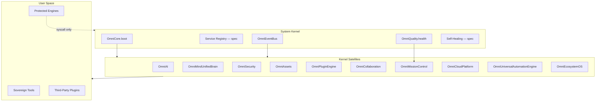

# OmniMind OS V12 — System Kernel Architecture

**Version:** 12.0.0  
**Date:** 2026-06-17  
**Status:** Enterprise kernel specification  
**Protected systems (user-space only):** OmniForge Engine · OmniForge Code Generation · Architectural Designer Core

---

## 1. Definition

The **System Kernel** is the invisible foundation of OmniMind OS V12. It is not a visual feature — it is the **orchestration layer** that boots services, routes events, monitors health, and coordinates recovery without tools importing each other directly.

**The kernel already exists** as `OmniCore` — this document names it constitutionally and defines how satellite platforms attach.

```
OmniMind OS V12
├── KERNEL (OmniCore + Service Registry + Event Bus)
├── SYSTEM SERVICES (managers — see SYSTEM_SERVICES.md)
├── PLATFORM (OmniPilot, Workspace Engine, Mission Control)
├── USER SPACE (Sovereign Tools + Plugins)
└── PROTECTED CORES (OmniForge, Designer — syscall boundary only)
```

---

## 2. Kernel Facade (Existing)

**Primary module:** `frontend/core/omnicore/OmniCore.ts`  
**Version:** `OMNICORE_VERSION = "1.0.0-rc1"`  
**SDK alignment:** `SDK_VERSION = "12.0.0"`



---

## 3. Boot Sequence

**Source:** `OmniCore.boot()` + `app/providers.tsx`

```
Phase 0 — Shell mount
  ThemeProvider → OmniMindEcosystemProvider → EcosystemOSProvider

Phase 1 — Kernel boot (OmniCoreProvider)
  omniCore.boot():
    omniAI.boot()
    omniAssets.boot()
    omniPluginEngine.boot()
    omniCollaboration.boot()
    omniSecurity.boot()
    omniQuality.boot()
    omniMindUnifiedBrain.boot()
    ecosystem.boot()
    automation.boot()
    missionControl.boot()
    cloud.boot()
    session.start()
    accessibility.applyDocumentHints()
    notifications.show("OmniCore ready", ...)

Phase 2 — Workspace & intelligence
  WorkspaceEngineProvider
  OmniMindMasterAgentProvider → OmniMindBrainProvider
  ToolFrameworkPluginBoot + SDKBoot

Phase 3 — Health probes (async)
  omniQuality.runHealthProbes()
  missionControl.system.refresh()
```

**Rule:** User-space tools must not boot before `OmniCore.boot()` completes. `OmniCoreProvider` guarantees this.

---

## 4. Kernel Responsibilities

| Responsibility | Implementation |
|----------------|----------------|
| Service lifecycle | `OmniCore.boot()`, per-facade `.boot()` |
| Inter-process communication | `OmniEventBus` (no direct imports between tools) |
| Resource accounting | `OmniResourceManager`, `OmniObservability` |
| Health aggregation | `OmniHealthMonitor` + `OmniHealthEngine` |
| Session identity | `OmniSessionManager` + `OmniSecurity.sessions` |
| Platform snapshot | `OmniCore.snapshot()` |
| Self-healing triggers | `OmniQuality.errors`, recovery managers (see SELF_HEALING.md) |
| Protected syscall boundary | Public APIs + events only for OmniForge / Designer |

---

## 5. Kernel vs User Space

| Layer | May | Must not |
|-------|-----|----------|
| **Kernel** | Boot services, publish events, enforce permissions | Render tool UI |
| **Platform** (OmniPilot, Workspace Engine) | Route requests, manage tabs | Replace kernel services |
| **Sovereign tools** | Call kernel APIs, emit events | Import peer tool stores |
| **Protected cores** | Receive context events, expose public APIs | Be modified by kernel refactors |

**Syscall pattern (protected tools):**

```
Tool action → omniEventBus.publish / OmniAI.complete / public HTTP API
Never: import OmniForgeResizableShell internals from kernel code
```

---

## 6. OmniCore.snapshot()

Single kernel introspection API used by Mission Control and diagnostics:

```typescript
omniCore.snapshot() → {
  version, state, projects, workspace, layout, dock, session,
  settings, ai, assets, plugins, collaboration, security,
  quality, brain, projectHub, platformSync, ecosystem, ...
}
```

CLI `omnimind doctor` validates kernel modules exist on disk.

---

## 7. Provider Tree (Runtime)

```
ClientErrorBoundary
  ThemeProvider
    OmniMindEcosystemProvider
      EcosystemOSProvider
        OmniCoreProvider          ← KERNEL ENTRY
          WorkspaceEngineProvider
            OmniMindMasterAgentProvider
              OmniMindBrainProvider
                OmniMindRootIDEProvider
                  AppNavigationProvider
                    ToolFrameworkPluginBoot
                    SDKBoot
                    OmniMindOSGlobalChrome
                    {routes}
```

---

## 8. Backend Kernel (Server)

| Component | Path |
|-----------|------|
| FastAPI app | `backend/main.py` |
| Auth | `backend/auth/router.py` |
| OmniCore routers | `backend/routers/omnicore_*.py` |
| Mission Control | `backend/routers/omnicore_mission_control.py` |
| Health aggregation | `backend/lib/quality/health_aggregator.py` |
| Redis cache | `backend/services/redis_cache.py` |
| JWT interceptor | `backend/middleware/jwt_interceptor.py` |

Client kernel syncs via `OmniCoreApiClient` and `OmniMissionControlApiClient`.

---

## 9. V12 Alignment

| V12 concern | Kernel binding |
|-------------|----------------|
| OmniPilot | `brain` + master agent providers |
| Workspace Engine | `workspace` manager + Phase 2 engine provider |
| Mission Control | `omniMissionControl` satellite |
| Plugin platform | `plugins` = `omniPluginEngine` |
| Enterprise security | `security` = `omniSecurity` |
| Global memory | `ai.memory` + `brain` unified layer |

---

## 10. Implementation Phases

| Phase | Work |
|-------|------|
| A | Kernel documentation (this release) |
| B | `OmniServiceRegistry` facade over existing managers |
| C | Kernel event catalog enforcement (lint: no raw DOM in new code) |
| D | Self-healing supervisor loop |
| E | Server-side service registry mirror for Mission Control |

---

## Related Documents

- [SERVICE_REGISTRY.md](./SERVICE_REGISTRY.md)
- [SYSTEM_SERVICES.md](./SYSTEM_SERVICES.md)
- [HEALTH_MONITOR.md](./HEALTH_MONITOR.md)
- [EVENT_BUS.md](./EVENT_BUS.md)
- [SELF_HEALING.md](./SELF_HEALING.md)
- [../omnipilot/OMNIPILOT_ARCHITECTURE.md](../omnipilot/OMNIPILOT_ARCHITECTURE.md)
- [../platform/PLUGIN_ENGINE.md](../platform/PLUGIN_ENGINE.md)
