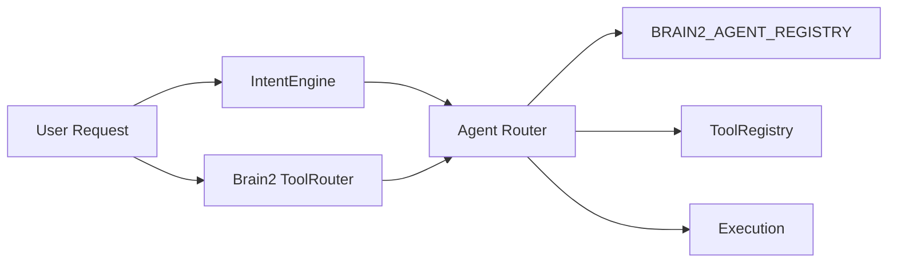

# OmniPilot — Agent Router Architecture

**Parent:** [OMNIPILOT_ARCHITECTURE.md](./OMNIPILOT_ARCHITECTURE.md)

---

## 1. Purpose

The Agent Router decides **which specialist agent(s)** execute a user request. OmniPilot does not answer directly when delegation improves quality, safety, or tool alignment.

Routing is **deterministic-first** (registry + capabilities), then **LLM-assisted** for ambiguous multi-domain requests.

---

## 2. Registry Layers



### 2.1 Specialist agents (`BRAIN2_AGENT_REGISTRY`)

**Source:** `frontend/core/brain/v2/AgentRegistry.ts`

| Agent ID | Role | Primary tools |
|----------|------|---------------|
| `master_ai` | Central orchestrator, merge | `*` |
| `chief_architect` | Planner / Architect | `omniforge-engine`, `architectural-designer` |
| `frontend_engineer` | Frontend | `omniforge-engine` |
| `backend_engineer` | Backend APIs | `omniforge-engine` |
| `database_engineer` | Schema / data | `omniforge-engine`, `business-analytics` |
| `testing_engineer` | QA | `omniforge-engine` |
| `security_engineer` | Security | `omniforge-engine` |
| `devops_engineer` | DevOps / Deploy | `omniforge-engine` |
| `documentation_agent` → `content_writer` | Docs | marketing, omniforge |
| `medical_specialist` | Medical | `medical-diagnostic*` |
| `marketing_specialist` | Marketing | `digital-marketing-hub`, `creative-visionary` |
| `vfx_artist` / `video_editor` | Creative video | `vfx-master`, `visionary-studio` |
| `business_consultant` | Analytics | `business-analytics` |
| `financial_analyst` / `quantum_trading_expert` | Trading | `quantum-trading` |
| `research_scientist` | NASA / science | `nasa-solver` |
| `architectural_designer` | Spatial design | `architectural-designer`, `interior-landscape` |
| `music_producer` | Audio | `omnimusic` |

**Selection algorithm (existing):**

1. `selectAgentsForCapabilities(capabilities, limit)` — score by capability overlap + priority
2. `agentsForTool(toolId)` — filter by tool affinity
3. `MasterAI.process()` — merge into subtasks with `mapSpecialistToBrain2()` for planner types

### 2.2 Tool registry (`ToolRegistry`)

**Source:** `frontend/core/agent/ToolRegistry.ts`

Maps sovereign slugs to `routeId`, actions, and hrefs for navigation after routing.

### 2.3 Intent engine (`IntentEngine`)

**Source:** `frontend/core/agent/IntentEngine.ts`

Pattern-based routing (confidence ≥ 0.75 triggers navigation). Examples:

- "build website" → `app-website-builder` + `full-stack-deploy` workflow
- "open medical" / "diagnose" → `medical-diagnostic`
- "marketing campaign" → `digital-marketing-hub`
- "analyze excel" → `business-analytics`

---

## 3. Routing Decision Pipeline

```
Input: OmniPilotRequest { text, ingress, contextBundle }

Step 1 — Tool route (Brain2 ToolRouter.route(text))
         → { toolId, capability, confidence }

Step 2 — Intent match (IntentEngine.resolve(text, activeToolId))
         → IntentMatch | null

Step 3 — Capability vector
         = union(intent.capabilities, toolRoute.capability, context.inferredCapabilities)

Step 4 — Agent shortlist
         agents = selectAgentsForCapabilities(capabilities, 6)
         agents += agentsForTool(activeToolId).slice(0, 3)
         dedupe; cap at 6; ensure master_ai present

Step 5 — Permission check (PermissionGate)
         filter agents by permissionLevel vs action risk

Step 6 — Plan decomposition (TaskPlanner + MasterAI)
         → BrainPlan with subtasks, each bound to agentId + toolId

Step 7 — Execution mode
         - sync: single agent, immediate PromptRouter
         - async: BackgroundScheduler.enqueue per subtask
         - workflow: WorkflowEngine.run(suggestedWorkflowId)
```

---

## 4. Multi-Agent Collaboration

**Source:** `frontend/core/brain/v2/AgentCollaboration.ts`

When ≥2 agents selected, `AgentCollaboration.run()` produces parallel perspectives merged by `AIGovernor.merge()` in `Brain2Coordinator.finalize()`.

Governor ensures:

- No unsafe deploy without approval
- Single user-facing response (one voice)
- Failover via `FailoverManager` on provider errors

---

## 5. Agent ↔ Tool Execution

| Execution type | Handler | Protected note |
|----------------|---------|----------------|
| Navigation | `AgentManager.config.onNavigate` | Routes only |
| Prompt injection | `PromptRouter.route` → `omnimind:ecosystem-agent-prompt` | Does not replace tool UI |
| Workflow steps | `WorkflowEngine` + `TaskManager` | Uses registry actions |
| OmniForge scaffold | Backend `/api/v1/build-engine/omniforge/*` | Engine code unchanged |
| Architect blueprint | `/api/v1/spatial/blueprint` | Designer core unchanged |
| Medical triage | `/api/agents/medical/triage` | Enterprise layout unchanged |

---

## 6. Permission Model

**Source:** `frontend/core/brain/permissions/PermissionGate.ts`

Each agent in `BRAIN2_AGENT_REGISTRY` has:

- `memoryAccess`: `read` | `read_write`
- `permissionLevel`: `read` | `write` | `execute` | `deploy` | `admin`

High-risk actions (deploy, delete, external spend) require user approval via `OmniMindBrainChrome` permission prompts.

---

## 7. Observability

| Signal | Consumer |
|--------|----------|
| `omnimind:brain2-live` | Live thinking UI |
| `omnimind:master-agent-log` | Copilot logs tab |
| `Brain2PerformanceMetrics` | Self-improvement engine |
| Mission Control dashboards | `OmniMissionControl` resource + agent views |

---

## 8. Consolidation Rules

1. **No new agent registries** — extend `BRAIN2_AGENT_REGISTRY` only
2. **Intent rules** — add patterns to `INTENT_RULES`, not inline copilot logic
3. **Tool actions** — declare in `ToolRegistry`, route through `PromptRouter`
4. **Protected tools** — agents may call public APIs; never import OmniForge layout internals

---

## 9. Example Routes

| User utterance | Intent | Agent(s) | Tool |
|----------------|--------|----------|------|
| "Build my website" | web scaffold | `chief_architect`, `frontend_engineer` | omniforge / app-builder |
| "Open Medical" | medical | `medical_specialist` | medical-diagnostic-suite |
| "Start Visionary" | creative | `vfx_artist` | visionary-studio |
| "Generate marketing campaign" | marketing | `marketing_specialist` | digital-marketing-hub |
| "Analyze Excel" | analytics | `business_consultant` | business-analytics |
| "Deploy application" | deploy | `devops_engineer` | omniforge-engine |
| "Improve architecture" | architecture | `chief_architect` | architectural-designer (interface only) |

See [COMMAND_SYSTEM.md](./COMMAND_SYSTEM.md) for full natural-language command catalog.
