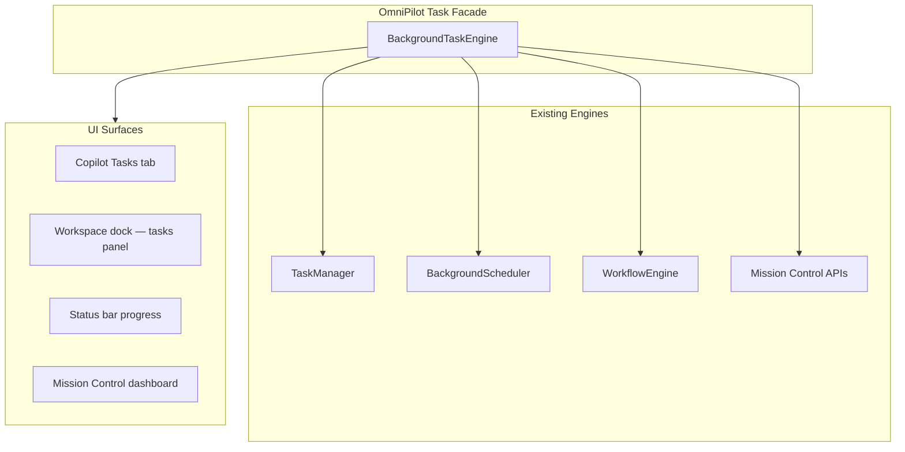

# OmniPilot — Background Task Engine Architecture

**Parent:** [OMNIPILOT_ARCHITECTURE.md](./OMNIPILOT_ARCHITECTURE.md)

---

## 1. Purpose

Long-running work (generation, deploy, analysis, multi-agent plans) must continue **in the background** with live progress, pause, resume, and cancel — without blocking the UI or losing state on navigation.

OmniPilot exposes a **unified task facade** over existing task systems.

---

## 2. Current Task Systems (To Unify)



| System | Path | Capabilities today |
|--------|------|-------------------|
| `TaskManager` | `frontend/core/agent/TaskManager.ts` | Agent tasks: pending, running, completed, failed; progress 0–100 |
| `BackgroundScheduler` | `frontend/core/brain/scheduler/BackgroundScheduler.ts` | Brain actions: **pause**, **resume**, **cancel**; `omnimind:brain-actions` events |
| `WorkflowEngine` | `frontend/core/agent/WorkflowEngine.ts` | Multi-step workflows with task chaining |
| Mission Control | `app/(shell)/mission-control/` | Resource + job dashboards |

---

## 3. Unified Task Model

```typescript
interface OmniPilotTask {
  id: string;
  label: string;
  type: 'agent' | 'workflow' | 'brain_action' | 'deploy' | 'sync' | 'custom';

  status: 'queued' | 'running' | 'paused' | 'completed' | 'failed' | 'cancelled';

  progress: number;          // 0–100
  message?: string;          // live status line
  agentId?: string;
  toolId?: string;
  workflowId?: string;

  createdAt: number;
  startedAt?: number;
  completedAt?: number;

  cancellable: boolean;
  pausable: boolean;

  result?: unknown;
  error?: string;
}
```

Mapping:

| Source | `type` | Pause/cancel |
|--------|--------|--------------|
| `TaskManager` task | `agent` / `workflow` | Cancel via task abort (extend) |
| `BackgroundScheduler` action | `brain_action` | **pause/resume/cancel** native |
| Deploy hook | `deploy` | Cancel before provision |
| OmniCloud sync | `sync` | Cancel in-flight sync |

---

## 4. Lifecycle

```
CREATE
  OmniPilot.enqueue(taskSpec)
    → TaskManager.create OR BackgroundScheduler.schedule OR WorkflowEngine.start

RUN
  Worker executes step
    → progress events → UI

PAUSE (if pausable)
  BackgroundScheduler.pause(actionId)
  TaskManager: set status paused (planned extension)

RESUME
  BackgroundScheduler.resume(actionId)
  TaskManager: resume queue (planned)

CANCEL
  BackgroundScheduler.cancel(actionId)
  TaskManager.cancel(taskId)
  WorkflowEngine.abort(runId)

COMPLETE
  MemoryEngine.remember(task result summary)
  UI toast + copilot log entry
```

---

## 5. Event Contract

**Primary channel:** `omnimind:brain-actions` (existing)

```typescript
interface BrainActionEvent {
  id: string;
  type: string;
  status: 'queued' | 'running' | 'paused' | 'completed' | 'failed' | 'cancelled';
  progress?: number;
  message?: string;
  timestamp: number;
}
```

**OmniPilot extension (planned):** `omnimind:omnipilot-task` — superset including `TaskManager` tasks for single subscription in UI.

Consumers:

| Consumer | Behavior |
|----------|----------|
| `OmniMindOSCopilot` | Tasks tab, progress chips |
| Workspace dock `tasks` panel | List + pause/cancel controls |
| Status bar | Aggregate progress (running count) |
| Mission Control | Historical job log |

---

## 6. UI Integration Points

### 6.1 Copilot

`OmniMindMasterCopilot` already surfaces agent logs. Extend with:

- Live progress bar per active task
- Pause / Resume / Cancel buttons when `pausable` / `cancellable`

### 6.2 Workspace Engine Dock

**Path:** `frontend/components/workspace-engine/OmniMindWorkspaceDock.tsx`

`tasks` panel shows unified queue from task facade. Keyboard: `Ctrl+\`` toggles terminal; tasks panel accessible from dock tabs.

### 6.3 Status Bar

**Path:** `frontend/components/os/OmniMindStatusBar.tsx`

Show: `⚡ 2 tasks running` with click → dock tasks panel.

### 6.4 Mission Control

Long-running platform jobs (deploy, cloud sync, automation rules) register with same task IDs for cross-surface visibility.

---

## 7. Agent & Workflow Integration

When Agent Router returns multi-step `BrainPlan`:

```
for each subtask in plan.subtasks:
  if subtask.estimatedDuration > SYNC_THRESHOLD (30s):
    enqueue background task
  else:
    await sync execution

SYNC_THRESHOLD configurable via user preference
```

WorkflowEngine steps inherit parent task ID for nested progress.

---

## 8. Persistence & Recovery

| Concern | Strategy |
|---------|----------|
| In-flight on refresh | `BackgroundScheduler` persists action queue to `localStorage` (existing) |
| TaskManager tasks | Ephemeral; re-queue critical deploy tasks from workflow checkpoint |
| Session restore | Workspace engine restores tabs; tasks re-hydrate from scheduler snapshot |
| Server jobs | Mission Control polls backend job status for deploy/sync |

---

## 9. Error Handling

| Failure | Behavior |
|---------|----------|
| Agent provider error | `FailoverManager` retry → task stays running |
| Unrecoverable error | status `failed`, error in copilot + Mission Control |
| User cancel | status `cancelled`, cleanup hooks per tool |
| Protected tool abort | Call tool's public cancel API only |

---

## 10. Implementation Phases

| Phase | Work |
|-------|------|
| 1 | `BackgroundTaskEngine` facade wrapping scheduler + TaskManager |
| 2 | Unified event bus `omnimind:omnipilot-task` |
| 3 | Dock tasks panel wired to facade |
| 4 | Pause/resume on `TaskManager` parity with scheduler |
| 5 | Mission Control historical API alignment |

No new job runner — orchestration only.

---

## 11. Success Metrics

- User can navigate away during deploy; progress visible on return
- Pause/resume works for brain-scheduled actions today
- Cancel stops in-flight generation without corrupting OmniForge workspace
- Single task list across copilot, dock, and status bar
