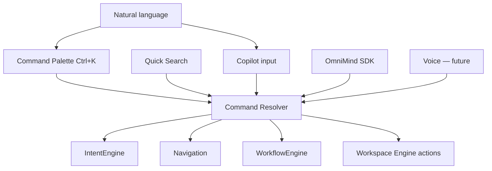

# OmniPilot — Universal Command System Architecture

**Parent:** [OMNIPILOT_ARCHITECTURE.md](./OMNIPILOT_ARCHITECTURE.md)

---

## 1. Purpose

The Command System translates **natural language** and **structured commands** into OS actions: navigation, agent delegation, workflow execution, and workspace manipulation.

Users should never learn syntax. OmniPilot infers intent from context (see [CONTEXT_ENGINE.md](./CONTEXT_ENGINE.md)).

---

## 2. Command Ingress Surfaces



| Surface | Component | Path |
|---------|-----------|------|
| Command palette | `OmniMindCommandPalette` | `frontend/components/os/OmniMindCommandPalette.tsx` |
| Quick search | `OmniMindQuickSearch` | `frontend/components/os/OmniMindQuickSearch.tsx` |
| Copilot | `OmniMindMasterCopilot` | `frontend/components/os/copilot/` |
| Ecosystem commands | `omnimind:ecosystem-command` event | `OmniMindEcosystemProvider` |
| Keyboard | Workspace engine bindings | `frontend/lib/workspace-engine/store.ts` |

---

## 3. Command Resolution Pipeline

```
1. Normalize input (trim, locale, strip wake word if voice)
2. Check structured command registry (palette items, slash commands)
3. IntentEngine.resolve(text, activeToolId)
4. If confidence ≥ 0.75 → execute intent action
5. Else Brain2 ToolRouter.route(text) → tool + capability
6. Else OmniPilot LLM classify (lightweight, context-aware)
7. Execute: navigate | workflow | agent prompt | workspace op
8. Log to Recent Commands memory
```

---

## 4. Universal Command Catalog

Mapped to existing `INTENT_RULES` and tool registry. Confidence thresholds apply.

### Build & Create

| User says | Intent / action | Target |
|-----------|-----------------|--------|
| Build my website | `web scaffold` | `app-website-builder` or `omniforge-engine` |
| Create an app | `app scaffold` | `omniforge-engine` + `full-stack-deploy` workflow |
| Create a project | ecosystem command | New project tab + OmniCore project |
| Generate code | prompt route | Active tool via `PromptRouter` |

### Open & Switch

| User says | Intent / action | Target |
|-----------|-----------------|--------|
| Open Medical | `medical` | `/medical-diagnostic-suite` |
| Start Visionary | `creative` | `/visionary-studio` |
| Open settings | `settings` | `/?settings=1` |
| Open plugin | `marketplace` | `/marketplace` |
| Switch workspace | workspace engine | `switchProject` / quick switcher |
| Open Mission Control | navigation | `/mission-control` |

### Generate & Analyze

| User says | Intent / action | Target |
|-----------|-----------------|--------|
| Generate marketing campaign | `marketing` | `digital-marketing-hub` |
| Analyze Excel | `analytics` | `business-analytics` |
| Run NASA solver | `research` | `nasa-solver` |
| Trade / quantum | `trading` | `quantum-trading` |
| Make music | `music` | `omnimusic` |

### Improve & Optimize

| User says | Intent / action | Target |
|-----------|-----------------|--------|
| Improve architecture | `architecture` | `architectural-designer` (interface only) |
| Optimize project | `optimize` | `chief_architect` agent + OmniForge context |
| Review security | `security` | `security_engineer` agent |
| Run tests | `testing` | `testing_engineer` + test workflow |

### Deploy & Ops

| User says | Intent / action | Target |
|-----------|-----------------|--------|
| Deploy application | `deploy` | `devops_engineer` + deploy workflow |
| Preview site | `preview` | `omnimind:ecosystem-command` preview |
| Check health | probe | Active tool `apiProbe` |

### Search & Translate

| User says | Intent / action | Target |
|-----------|-----------------|--------|
| Search project | `search` | `omniCore.ecosystem.searchAll` |
| Find file | workspace dock | Explorer panel (Phase 2b) |
| Translate conversation | `translate` | OmniAI with conversation scope |

---

## 5. Structured Commands (Palette)

Palette commands are **registered**, not hardcoded in copilot:

| Category | Examples | Source |
|----------|----------|--------|
| Navigation | All sovereign tools from `SOVEREIGN_TOOL_REGISTRY` | `lib/sovereign-tool-registry.ts` |
| Workspace | New tab, close tab, split horizontal/vertical, reopen closed | `workspace-engine/store.ts` |
| Brain | Clear context, sync memory, open live thinking | `OmniMindBrainChrome` |
| Ecosystem | Run, deploy, preview, save workspace | `omnimind-ecosystem-context.tsx` |

**Registration pattern:**

```typescript
// Existing pattern — extend via registry, not copilot strings
ecosystem.registerCommand({
  id: 'deploy-app',
  label: 'Deploy application',
  keywords: ['deploy', 'ship', 'release'],
  run: () => ecosystem.runDeploy(),
});
```

---

## 6. Workflow Binding

**Source:** `frontend/core/agent/WorkflowEngine.ts`

High-confidence intents map to workflows:

| Workflow ID | Trigger phrases |
|-------------|-----------------|
| `full-stack-deploy` | deploy, ship, release, go live |
| `medical-triage` | triage, symptoms, diagnose |
| `marketing-campaign` | campaign, ads, social |
| `analytics-report` | excel, spreadsheet, report |

Workflow steps invoke `TaskManager` tasks with agent bindings (see [BACKGROUND_TASK_ENGINE.md](./BACKGROUND_TASK_ENGINE.md)).

---

## 7. Context-Aware Disambiguation

OmniPilot **does not ask** when context resolves ambiguity:

| Ambiguity | Context signal | Resolution |
|-----------|----------------|------------|
| "Deploy" | Active tab = omniforge | Deploy current scaffold |
| "Deploy" | No project | Offer project picker once |
| "Analyze" | Excel file in selection | business-analytics with file context |
| "Open it" | Last mentioned tool in conversation | `MemoryManager` conversation tail |

---

## 8. Error & Fallback Behavior

| Condition | Behavior |
|-----------|----------|
| No intent match | Route to `master_ai` with full context bundle |
| Tool offline | `apiProbe` failure → Mission Control alert + user message |
| Permission denied | `PermissionGate` prompt; command queued until approved |
| Protected tool | Navigate + inject prompt only; no layout mutation |

---

## 9. Recent Commands Memory

Stored via Memory Engine:

- Last 50 palette/copilot commands (session scope)
- MRU tool switches from workspace engine
- Surfaced in command palette "Recent" section and copilot suggestions

---

## 10. SDK Integration

`window.OmniMindSDK` (Medical Enterprise today) must call OmniPilot ingress:

```
OmniMindSDK.prompt(text) → OmniPilot.process({ text, ingress: 'sdk', toolId })
```

No direct `AgentManager` access from third-party plugins.

---

## 11. Implementation Checklist

- [ ] Single `OmniPilot.process()` entry for copilot + palette
- [ ] Extend `INTENT_RULES` for catalog gaps (translate, switch workspace)
- [ ] Wire palette "Recent" to Memory Engine
- [ ] Document slash-command prefix (`/deploy`, `/medical`) as optional power-user layer
