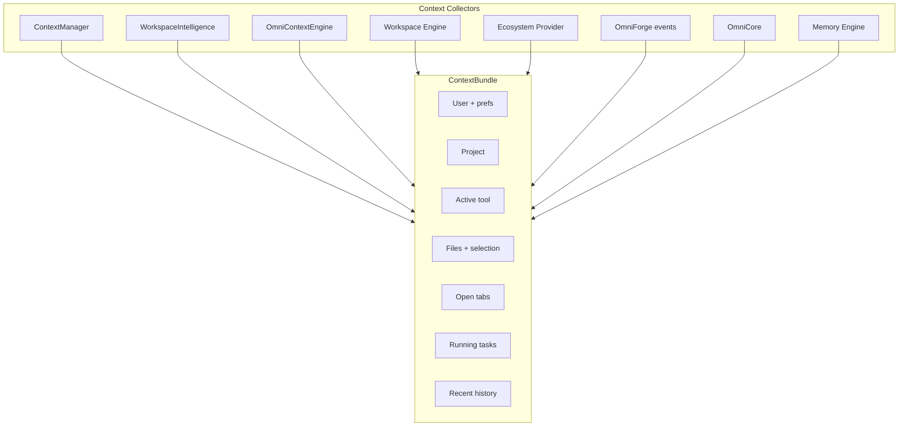

# OmniPilot — Context Engine Architecture

**Parent:** [OMNIPILOT_ARCHITECTURE.md](./OMNIPILOT_ARCHITECTURE.md)

---

## 1. Principle

**Before OmniPilot responds, context is gathered automatically.**

The Context Engine assembles a `ContextBundle` from all available OS signals. It never prompts the user for information already present in workspace, memory, or selection state.

---

## 2. Context Sources



---

## 3. Module Responsibilities

### 3.1 `ContextManager` (Agent layer)

**Path:** `frontend/core/agent/ContextManager.ts`

Tracks:

- `activeToolId`, `activeRoute`, `activeProjectId`
- `workspaceSnapshot` (from agent sync)
- `recentTools`, `recentCommands`
- `selection` (text, file path when provided by tools)
- `cursorPosition` (when tool emits)

Updated via `AgentManager.syncWorkspace()` on navigation and tab change.

### 3.2 `WorkspaceIntelligence` (Brain layer)

**Path:** `frontend/core/brain/orchestrator/WorkspaceIntelligence.ts`

Builds higher-level signals:

- Inferred capabilities from open tools
- Cross-tool project coherence
- Suggested next actions

Feeds `OmniMindBrain.processRequest()`.

### 3.3 `OmniContextEngine` (AI layer)

**Path:** `frontend/core/ai/OmniContextEngine.ts`

Stack-based context slices for inference:

- Push/pop tool contexts
- Token-budget trimming
- Scope-aware blocks for `OmniAI.complete()`

### 3.4 Workspace Engine (Phase 2)

**Path:** `frontend/lib/workspace-engine/`

Provides:

| Signal | Field |
|--------|-------|
| Open tabs | `state.tabs[]` |
| Active tab | `state.activeTabId` |
| Pinned tabs | `tab.pinned` |
| Split layout | `state.splitMode`, pane assignments |
| MRU order | `state.mruTabIds` |
| Dock state | terminal/logs/tasks visibility |
| Session | `omnimind_workspace_engine_v2` persistence |

Hook: `useWorkspaceEngine()` in `WorkspaceEngineProvider`.

### 3.5 Ecosystem Provider

**Path:** `frontend/lib/omnimind-ecosystem-context.tsx`

Provides:

- Project tabs, active project, tech stack
- Profile, deployment targets
- `home.snapshot()` for dashboard context
- Command registry state

### 3.6 OmniCore

**Path:** `frontend/core/omnicore/OmniCore.ts`

- Project list, workspace CRUD
- `ecosystem.searchAll()` for file/project search context
- Health and sync status

### 3.7 Tool-specific context (event-based)

Protected tools emit context; OmniPilot does not import their internals:

| Tool | Mechanism |
|------|-----------|
| OmniForge | `omnimind:ecosystem-agent-prompt`, workspace files via ecosystem |
| Architectural Designer | Spatial state via public context events |
| Medical | Enterprise session context via tool provider |
| Monaco / IDE | Selection via `ClientMountGate` bridge when mounted |

---

## 4. ContextBundle Schema

Logical structure passed to Agent Router and LLM:

```typescript
interface ContextBundle {
  // Identity
  userId?: string;
  sessionId: string;

  // Workspace
  workspaceId: string;
  projectId: string | null;
  projectName?: string;
  techStack?: string[];

  // Tool
  activeToolId: string;
  activeRoute: string;
  activeToolCapabilities: string[];

  // Editor (when available)
  openFiles: { path: string; language?: string; dirty?: boolean }[];
  activeFilePath?: string;
  selection?: { text: string; startLine: number; endLine: number };
  cursor?: { line: number; column: number };

  // Workspace engine
  openTabs: { id: string; toolId: string; href: string; pinned: boolean }[];
  splitMode: string;
  dockPanels: { explorer: boolean; terminal: boolean; logs: boolean; tasks: boolean };

  // Execution
  runningTasks: { id: string; label: string; progress: number; status: string }[];
  backgroundJobs: { id: string; type: string; status: string }[];

  // Memory slices
  pinnedContext: string[];
  recentCommands: string[];
  conversationSummary?: string;
  architectureNotes?: string[];

  // Preferences
  theme: string;
  modelPreference?: string;
  locale?: string;

  // Meta
  gatheredAt: number;
  tokenBudget: number;
}
```

Assembly is incremental; collectors run in parallel where possible.

---

## 5. Gathering Pipeline

```
OmniPilot.gatherContext(request):

  Phase A — Synchronous ( < 5ms )
    - Read ContextManager snapshot
    - Read workspace engine state (React store)
    - Read ecosystem active project + route (pathname)

  Phase B — Memory ( < 20ms )
    - MemoryEngine.buildContext(scopes for activeTool)
    - GlobalMemory.buildGlobalContext()

  Phase C — Platform ( async, cached )
    - omniCore.ecosystem.home.snapshot()
    - TaskManager.listActive()
    - BackgroundScheduler.list()

  Phase D — Tool injection ( event / timeout 100ms )
    - Dispatch omnimind:brain-request-context
    - Merge tool responses into bundle.files / selection

  Phase E — Rank & trim
    - OmniContextEngine.push(bundle)
  - Apply token budget (default 8k context tokens for routing; 32k for generation)

Return ContextBundle
```

---

## 6. Sync Triggers

Context must refresh on:

| Event | Action |
|-------|--------|
| Route change (`usePathname`) | `agent.syncWorkspace()`, `brain.syncContext()` |
| Tab switch | Workspace engine `setActiveTab` → sync |
| Project switch | Ecosystem `setActiveProject` → memory reload |
| File selection | Tool emits → `ContextManager.setSelection` |
| Task progress | `omnimind:brain-actions` → update runningTasks |
| Memory write | Invalidate conversation slice only |

**Existing hook:** `OmniMindMasterAgentProvider` calls `syncWorkspace` on pathname change.

**Gap:** Wire workspace engine tab events to same sync (Phase B implementation).

---

## 7. Anti-Patterns (Forbidden)

| Anti-pattern | Correct approach |
|--------------|------------------|
| Copilot asks "which project?" when `activeProjectId` set | Read ecosystem context |
| Re-fetch full project list every message | Cache with invalidation on project switch |
| Import OmniForge store in brain | Listen for context events |
| Duplicate context in copilot component | Single `gatherContext()` call |

---

## 8. Context in Responses

After execution, context updates propagate:

1. `MemoryEngine.remember` for durable facts
2. `ContextManager.recordCommand` for ephemeral
3. `GlobalMemory.rememberTool` on navigation
4. `saveSessionNow()` if layout changed

---

## 9. Privacy Boundaries

- Medical context slices are **not** included in marketing agent bundles
- Cross-tool context requires same `projectId` or explicit user pin
- Selection text truncated at 4k chars before LLM unless user confirms

---

## 10. Observability

Debug overlay (dev only): `OmniMindBrainChrome` context inspector showing bundle sections and token counts.

Production: Mission Control "Context Health" widget (planned) — stale context age, sync failures.
