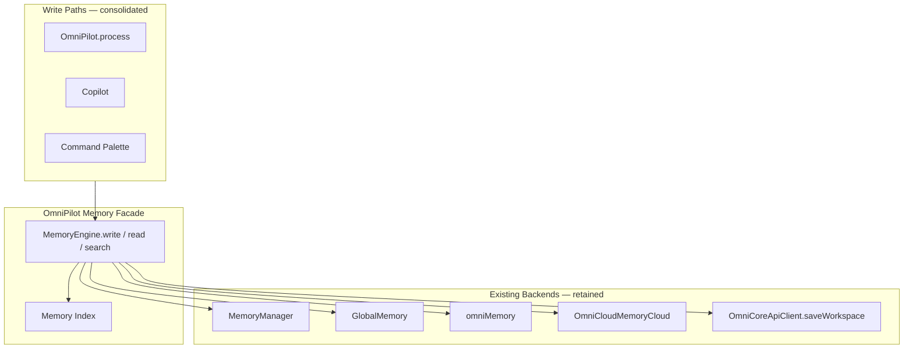

# OmniPilot — Global Memory Engine Architecture

**Parent:** [OMNIPILOT_ARCHITECTURE.md](./OMNIPILOT_ARCHITECTURE.md)

---

## 1. Problem Statement

OmniMind currently persists AI context across **five parallel stores**:

| Store | Key / location | Scope |
|-------|----------------|-------|
| `MemoryManager` | `omnimind_master_memory_v1` | Master Agent: project, conversation, workspace |
| `GlobalMemory` | `omnimind_brain_global_v1` | Brain: preferences, business context, tool history |
| `omniMemory` | In-memory (`OmniMemory.entries`) | OmniAI: scoped entries (session, project, long-term) |
| `OmniCloudMemoryCloud` | Cloud sync domain `ai-memory` | Cross-device memory |
| `WorkspaceEngine` session | `omnimind_workspace_engine_v2` | Tabs, MRU, layout (not semantic memory) |
| Ecosystem context | `omnimind_ecosystem_v1` | Project tabs, snapshots, tech stack |

**OmniPilot Memory Engine** is the **single write facade** that coordinates these backends without deleting existing APIs.

---

## 2. Target Architecture



---

## 3. Memory Taxonomy (Unified Schema)

Logical record types OmniPilot indexes:

| Type | Scopes | Examples | Primary backend |
|------|--------|----------|-----------------|
| **Project** | project | name, stack, deployment target | `MemoryManager.projectMemory` + `OmniCore.projects` |
| **Preference** | user-prefs | theme, voice, model | `GlobalMemory.preferences` + `omniMemory` user-prefs |
| **Conversation** | conversation, session | turns, summaries | `MemoryManager.conversationMemory` + `OmniAI.conversations` |
| **Architecture decision** | long-term, project | ADRs, blueprint choices | `omniMemory` long-term |
| **Pinned item** | workspace | user-pinned context | `MemoryManager.workspaceMemory.pinnedContext` |
| **Recent command** | session | palette + copilot history | `GlobalMemory` + workspace engine MRU |
| **Learning history** | long-term | self-improvement metrics | `Brain2PerformanceMetrics` |
| **AI context slice** | tool-context | per-tool active slice | `OmniContextEngine` stack |
| **Agent memory** | tool-context | specialist outputs | `omniMemory` with `toolSlug` |

**OmniAI scopes (canonical enum):** `session` | `conversation` | `workspace` | `project` | `long-term` | `user-prefs` | `tool-context`  
**Source:** `frontend/core/ai/types.ts`

---

## 4. Read Path

```
OmniPilot.buildMemoryContext(request):
  1. agent.memory.getMemory()           → workspace + conversation slice
  2. brain.globalMemory.buildGlobalContext()
  3. omniMemory.list(scopes relevant to activeTool)
  4. workspaceEngine snapshot           → open tabs, active tab, pinned tabs
  5. ecosystem snapshot                 → project tabs, tech stack, profile
  6. omniforge context (if active)      → via events, not direct store import
  7. omniCore.ecosystem.home.snapshot()  → dashboard signals

Merge → ranked context blocks (token budget aware)
Never ask user for data present in steps 1–7
```

---

## 5. Write Path

```
OmniPilot.remember(event):
  switch event.type:
    conversation_turn  → MemoryManager.pushConversation + omniMemory + GlobalMemory.rememberConversation
    pin                → MemoryManager.pinContext + GlobalMemory.pinNote
    preference         → GlobalMemory.setPreference + omniMemory user-prefs
    project_fact       → MemoryManager.setProjectMemory + omniMemory project scope
    tool_visit         → GlobalMemory.rememberTool
    architecture_decision → omniMemory long-term + optional cloud sync

  schedule debounced:
    OmniPlatformSync.syncAll() when workspace.autoSave
    saveSessionNow() for workspace engine layout
```

---

## 6. Deduplication Rules

| Rule | Action |
|------|--------|
| Same semantic key in `MemoryManager` and `omniMemory` | Write both during migration; read prefers `omniMemory` for AI inference |
| Pinned context duplicated | `GlobalMemory.pinNote` already calls `agentMemory.pinContext` — keep this chain |
| Conversation duplication | Cap: 80 turns (agent), 40 summaries (brain), 500 entries (omniMemory) with LRU eviction |
| Cloud conflict | `OmniCloudMemoryCloud` last-write-wins with `syncedAt` timestamp |

---

## 7. Cloud & Persistence

| Layer | Mechanism |
|-------|-----------|
| Local durable | localStorage keys above + `OmniWorkspaceStorage` (`ws:{tool}:{projectId}`) |
| Server | `PUT /api/v1/omnicore/workspaces/{projectId}` bundles projects + memory + settings |
| Cloud domain | `ai-memory` in `OmniCloudSyncEngine` |
| Mission Control | Displays `memoryEntries` count from project command center |

**Gap (planned):** Wire `OmniCoreApiClient.saveWorkspace` from Memory Facade on significant writes (architecture spec; not yet called from UI).

---

## 8. Security & Privacy

- Medical memory: HIPAA-oriented isolation — `toolSlug` `medical-diagnostic-suite` entries never merge into marketing context without explicit user action
- Passkeys / SSO stubs remain gated — memory does not store raw credentials
- `PermissionGate` blocks agents with `read`-only memory from write operations

---

## 9. Migration Plan

| Step | Action |
|------|--------|
| 1 | Introduce `core/omnipilot/MemoryEngine.ts` facade delegating to existing managers |
| 2 | Redirect `AgentManager.memory.*` writes through facade (thin wrapper) |
| 3 | Redirect `brain.globalMemory.*` writes through facade |
| 4 | On `OmniPilot.process`, sync `omniMemory` from agent slice |
| 5 | Deprecate direct localStorage access outside facade (lint rule) |
| 6 | Enable cloud sync on facade commit hook |

No data loss: migration reads old keys on first boot and imports into unified index.

---

## 10. API Surface (Planned Facade)

```typescript
// core/omnipilot/MemoryEngine.ts — specification only

interface MemoryEngine {
  buildContext(opts: ContextQuery): Promise<MemoryBundle>;
  remember(event: MemoryEvent): void;
  search(query: string, opts?: SearchOpts): MemoryHit[];
  pin(text: string, scope?: MemoryScope): void;
  forget(key: string, scope: MemoryScope): void;
  sync(): Promise<SyncResult>;
}
```

Implementation delegates to existing classes; no parallel storage format.
