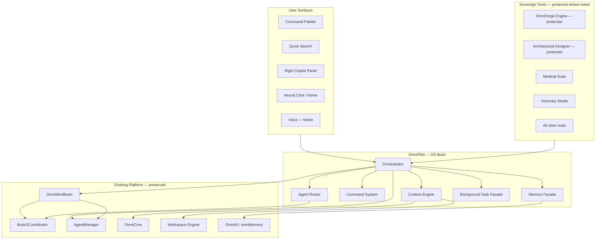

# OmniPilot — Operating System Brain Architecture

**Version:** 1.0  
**Date:** 2026-06-17  
**Status:** Architecture specification (Constitution Art. 5 compliant)  
**Protected systems (integration only):** OmniForge Engine · OmniForge Code Generation · Architectural Designer Core

---

## 1. Definition

**OmniPilot is not a chatbot.**

OmniPilot is the **central intelligence and orchestration layer** of OmniMind OS. It is the single entry point through which every tool, workspace, project, and specialist agent communicates with AI services.

| Misconception | Reality |
|---------------|---------|
| OmniPilot = chat UI | Chat is one **surface** (`OmniMindMasterCopilot`); OmniPilot is the **brain** behind it |
| OmniPilot = new LLM | OmniPilot **routes** to `OmniAI`, backend `/api/v1/omnicore/ai`, and tool-specific pipelines |
| OmniPilot replaces Brain | OmniPilot **unifies** `OmniMindBrain`, `AgentManager`, `Brain2Coordinator`, and `OmniCore` under one contract |

Constitution Article 5 requires every AI feature to connect to OmniPilot, Memory Engine, Mission Control, Automation, SDK, Global Search, Command Palette, and Workspace Manager. This document defines how that connection is achieved **without redesigning protected modules**.

---

## 2. Position in the OS Stack



---

## 3. Canonical Module Map (Existing Codebase)

OmniPilot is implemented as a **facade namespace** over proven modules. No duplicate orchestration logic.

| OmniPilot concern | Primary implementation | Location |
|-------------------|------------------------|----------|
| OS Brain orchestration | `OmniMindBrain` | `frontend/core/brain/OmniMindBrain.ts` |
| Multi-agent coordination | `Brain2Coordinator` | `frontend/core/brain/v2/Brain2Coordinator.ts` |
| Intent + workflow routing | `AgentManager` | `frontend/core/agent/AgentManager.ts` |
| Specialist registry | `BRAIN2_AGENT_REGISTRY` | `frontend/core/brain/v2/AgentRegistry.ts` |
| Tool capability registry | `ToolRegistry` | `frontend/core/agent/ToolRegistry.ts` |
| Platform services | `OmniCore` | `frontend/core/omnicore/OmniCore.ts` |
| Workspace tabs / session | Workspace Engine | `frontend/lib/workspace-engine/` |
| Ecosystem state | `OmniMindEcosystemProvider` | `frontend/lib/omnimind-ecosystem-context.tsx` |
| AI completion + memory API | `OmniAI` / `omniMemory` | `frontend/core/ai/` |
| Cloud memory sync | `OmniCloudMemoryCloud` | `frontend/core/omnicloud/OmniCloudMemoryCloud.ts` |
| UI bridge | `OmniMindMasterAgentProvider` + `OmniMindBrainProvider` | `frontend/lib/*-context.tsx` |
| Global chrome | `OmniMindOSGlobalChrome` | `frontend/components/os/OmniMindOSGlobalChrome.tsx` |
| Copilot presentation | `OmniMindMasterCopilot` | `frontend/components/os/copilot/` |

**Target facade (next implementation phase):** `frontend/core/omnipilot/OmniPilot.ts` — thin re-export and `process()` entry that delegates to `getOmniMindBrain()` + workspace context collectors. Architecture only in this release; no stub classes.

---

## 4. Request Flow (All Tools → OmniPilot)

Every AI or command request follows one pipeline:

```
1. Ingress        — Copilot, palette, voice, tool action, SDK hook
2. Context gather — Context Engine (automatic, no redundant prompts)
3. Intent         — IntentEngine + Brain2 ToolRouter
4. Permission     — PermissionGate (deploy, file write, external API)
5. Plan           — TaskPlanner + MasterAI decomposition
6. Route          — Agent Router selects specialist(s)
7. Execute        — ToolOrchestrator / WorkflowEngine / backend APIs
8. Background     — BackgroundScheduler for long tasks
9. Memory write   — Unified Memory Engine
10. Response      — Single voice to user (governor merge in Brain2)
```

**Ingress points today:**

| Source | Handler |
|--------|---------|
| Right copilot | `useOmniMindMasterAgent().processMessage` → `AgentManager.processUserMessage` → optional `brain.processRequest` |
| Command palette | `OmniMindCommandPalette` → ecosystem commands → `AgentManager` / navigation |
| Quick search | `OmniMindQuickSearch` → `omniCore.ecosystem.searchAll` |
| Tool chat consoles | `omnimind:ecosystem-agent-prompt` event → `PromptRouter.route` |
| SDK | `window.OmniMindSDK` → tool register hooks (Medical Enterprise today) |

**OmniPilot consolidation:** All ingress paths must call `OmniPilot.process(request)` instead of ad-hoc `AgentManager` / `brain` calls. Facade preserves backward compatibility.

---

## 5. Tool Coverage Matrix

All listed surfaces route through OmniPilot orchestration (intent rules in `IntentEngine`, agents in `AgentRegistry`):

| Surface | Tool slug / route | Agent specialist |
|---------|-------------------|------------------|
| Neural Chat | `/`, `dashboard` | `master_ai` |
| Medical | `medical-diagnostic-suite` | `medical_specialist` |
| Visionary | `visionary-studio` | `vfx_artist`, `video_editor` |
| Marketing | `digital-marketing-hub` | `marketing_specialist` |
| VFX | `vfx-master` | `video_editor`, `vfx_artist` |
| Business Analytics | `business-analytics` | `business_consultant`, `financial_analyst` |
| Quantum Trading | `quantum-trading` | `quantum_trading_expert` |
| NASA Solver | `nasa-solver` | `research_scientist` |
| OmniMusic | `omnimusic` | `music_producer` |
| Mission Control | `/mission-control` | `master_ai` + Mission Control APIs |
| Automation | `/automation-engine` | `devops_engineer` + automation workflows |
| SDK / Marketplace | `/marketplace` | `PluginManager` + registry |
| Cloud | `/omnicloud` | platform sync agents |
| Settings | `/?settings=1` | preference memory only |
| OmniForge | `omniforge-engine` | `chief_architect`, `frontend_engineer`, etc. — **via existing interfaces only** |
| Architectural Designer | `architectural-designer` | `architectural_designer` agent — **core layout untouched** |

---

## 6. Provider Tree (Runtime)

Current mount order in `app/providers.tsx`:

```
ThemeProvider
  → OmniMindEcosystemProvider
    → EcosystemOSProvider
      → OmniCoreProvider
        → WorkspaceEngineProvider      ← tabs, session, MRU
          → OmniMindMasterAgentProvider ← AgentManager bridge
            → OmniMindBrainProvider     ← Brain + Brain2
              → OmniMindRootIDEProvider
                → AppNavigationProvider
                  → OmniMindOSGlobalChrome
                  → {routes}
```

**OmniPilot provider (planned):** Insert `OmniPilotProvider` immediately after `WorkspaceEngineProvider`, wiring:

- `brain.configure({ onNavigate })`
- `agent.configure({ onNavigate, onCopilotTab })`
- `agent.syncWorkspace()` from workspace engine + ecosystem on every tab change
- `brain.globalMemory` sync with `omniMemory` on write

---

## 7. Protected System Boundaries

| System | OmniPilot may | OmniPilot must not |
|--------|---------------|---------------------|
| OmniForge Engine | Read workspace context; dispatch prompts via `omnimind:ecosystem-agent-prompt`; route to dev agents | Replace `OmniForgeResizableShell`, Monaco, terminal, or scaffold pipeline |
| OmniForge Code Generation | Trigger generation via existing API (`/api/v1/build-engine/omniforge/*`) | Alter generator templates or engine internals |
| Architectural Designer Core | Route spatial/blueprint intents; inject context via `WorkspaceIntelligence` | Replace `SpatialStudioShell` or spatial render stores |

Integration pattern: **events + context injection**, never layout replacement.

---

## 8. Events Bus (Cross-Module Contract)

OmniPilot listens and emits on the existing DOM event bus:

| Event | Direction | Purpose |
|-------|-----------|---------|
| `omnimind:ecosystem-agent-prompt` | Tool → Brain | Routed user text |
| `omnimind:ecosystem-command` | Palette → OS | Run/deploy/preview |
| `omnimind:brain-workspace-context` | Brain → Tools | Injected tool hints |
| `omnimind:brain-actions` | Scheduler → UI | Background task updates |
| `omnimind:brain2-live` | Brain2 → Chrome | Live thinking overlay |
| `omnimind:workspace-saved` | Engine → Sync | Session persistence |
| `omnimind:master-agent-log` | Agent → Copilot | Audit trail |

---

## 9. Backend Integration

| API | Role in OmniPilot |
|-----|-------------------|
| `POST /api/v1/omnicore/ai/complete` | Primary LLM inference |
| `PUT /api/v1/omnicore/workspaces/{projectId}` | Durable workspace + memory bundle |
| `PUT /api/v1/omnicore/ai/memory` | Server-side memory persistence |
| Tool-specific probes | Health checks per sovereign tool (`apiProbe` in registry) |
| `POST /api/execute` | Guarded domain execution (Phase 1 auth) |

OmniPilot never bypasses OmniCore versioning (`/api/v1/omnicore/*`).

---

## 10. Implementation Phases

| Phase | Deliverable | Changes |
|-------|-------------|---------|
| **A — Architecture** (this document) | Spec + consolidation map | None to protected systems |
| **B — Facade** | `core/omnipilot/OmniPilot.ts`, `OmniPilotProvider` | Delegates only; deprecate direct `getAgentManager()` in new code |
| **C — Ingress unification** | Palette, copilot, SDK → `OmniPilot.process` | No UI redesign |
| **D — Memory consolidation** | Single write path via Memory Engine | Migrate `omnimind_master_memory_v1` + `omnimind_brain_global_v1` |
| **E — Voice** | Wake word / streaming architecture wired | See `VOICE_ARCHITECTURE.md` |

---

## 11. Success Criteria

- Zero duplicate orchestration paths for new features
- Constitution Art. 5 satisfied: OmniPilot name used in docs and facade; no isolated AI
- All 42+ frontend tests remain green; protected tools unchanged
- User can issue natural commands (see `COMMAND_SYSTEM.md`) from any surface with shared context
- Background tasks visible in Mission Control, copilot, and status bar

---

## Related Documents

- [AGENT_ROUTER.md](./AGENT_ROUTER.md)
- [MEMORY_ENGINE.md](./MEMORY_ENGINE.md)
- [COMMAND_SYSTEM.md](./COMMAND_SYSTEM.md)
- [CONTEXT_ENGINE.md](./CONTEXT_ENGINE.md)
- [BACKGROUND_TASK_ENGINE.md](./BACKGROUND_TASK_ENGINE.md)
- [VOICE_ARCHITECTURE.md](./VOICE_ARCHITECTURE.md)
- [../OMNIMIND_CONSTITUTION.md](../OMNIMIND_CONSTITUTION.md)
- [../PHASE2_WORKSPACE_ENGINE.md](../PHASE2_WORKSPACE_ENGINE.md)
