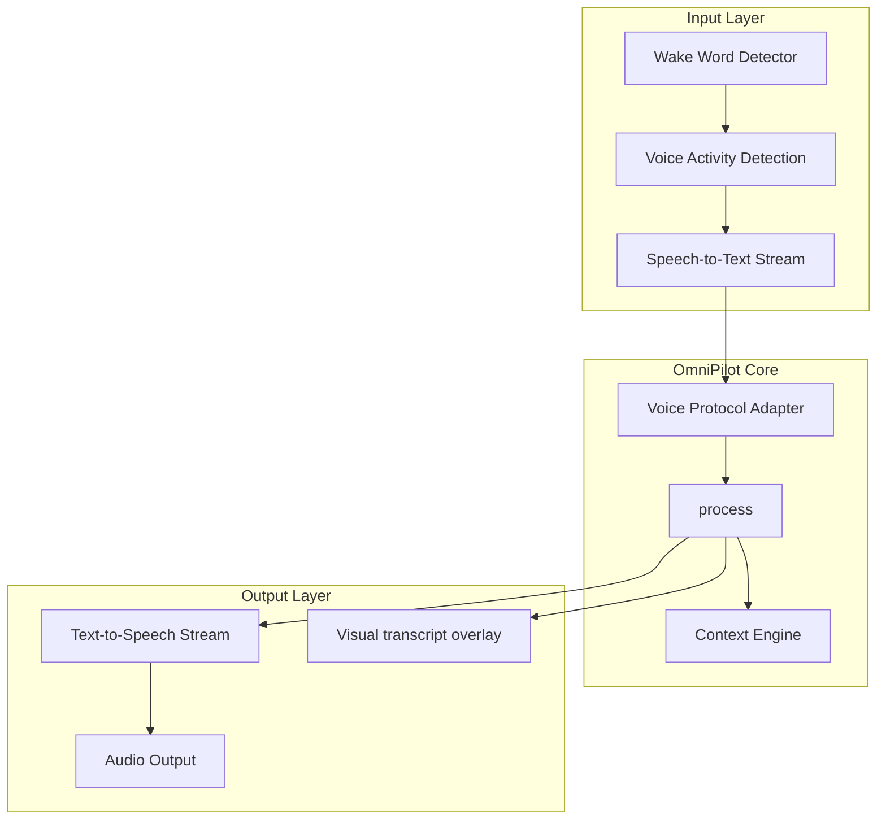

# OmniPilot — Voice Architecture (Future-Ready)

**Parent:** [OMNIPILOT_ARCHITECTURE.md](./OMNIPILOT_ARCHITECTURE.md)  
**Status:** Architecture specification only — no voice implementation in current release

---

## 1. Scope

Voice is a **first-class ingress surface** for OmniPilot, not a separate assistant. Spoken input follows the same pipeline as copilot and command palette:

```
Audio → Speech-to-Text → OmniPilot.process() → Context Engine → Agent Router → TTS Stream
```

Existing stubs:

| Module | Path | State |
|--------|------|-------|
| `VoiceManager` | `frontend/core/agent/VoiceManager.ts` | Stub; `supported: false` |
| `VoiceBridge` | `frontend/core/brain/voice/VoiceBridge.ts` | Brain integration hook |

This document defines layers for future implementation without modifying protected systems.

---

## 2. Layered Architecture



---

## 3. Voice Modes

| Mode | Description | User experience |
|------|-------------|-----------------|
| **Wake Word** | Always-listening low-power pipeline | "Hey OmniMind" → active session |
| **Push-to-Talk** | Hold key / button | Immediate STT; no wake word |
| **Conversation** | Multi-turn with end-of-utterance detection | Hands-free dialogue |
| **Command** | Single utterance → action | Mirrors command palette |
| **Dictation** | Insert text at cursor | Routes to active editor, not agent |

Mode selected via `VoiceManager.setMode()` and user preference in Memory Engine.

---

## 4. Wake Word Subsystem

```
Microphone (browser MediaStream or native bridge)
  → WASM / native wake word model (e.g. openWakeWord, Porcupine)
  → On detection: VoiceManager.activate()
  → Optional chime + visual indicator in OmniMindOSGlobalChrome
  → Start STT session with 30s inactivity timeout
```

**Constraints:**

- Wake word runs client-side only; no audio sent until activation
- User opt-in required (GDPR / consent stored in preferences)
- Disabled when `document.hidden` unless user enables background listen

---

## 5. Speech-to-Text (STT)

| Tier | Provider | Use case |
|------|----------|----------|
| Browser | `webkitSpeechRecognition` / Web Speech API | Fallback, offline-limited |
| Streaming | Backend `/api/v1/omnicore/voice/transcribe` (planned) | Production quality |
| Native | Electron / mobile bridge (future) | Desktop app |

STT streams partial transcripts to UI; final utterance triggers `OmniPilot.process()` when end-of-utterance detected.

**Voice Protocol Adapter** normalizes:

```typescript
interface VoiceIngress {
  transcript: string;
  isFinal: boolean;
  confidence: number;
  locale: string;
  mode: VoiceMode;
}
```

---

## 6. Conversation Mode

Multi-turn flow:

```
1. Wake or PTT → sessionId assigned
2. Each final utterance → gatherContext (includes prior voice turns in session scope)
3. Agent Router → response text
4. TTS streams response while UI shows live transcript
5. Barge-in: user speech during TTS cancels playback and starts new STT
6. Session end: silence timeout or "goodbye" intent → MemoryEngine.remember summary
```

Conversation memory stored in `session` + `conversation` scopes only; not duplicated in tool stores.

---

## 7. Text-to-Speech (TTS)

| Tier | Provider | Use case |
|------|----------|----------|
| Browser | `speechSynthesis` | Zero-config |
| Streaming | Backend chunked audio (planned) | Low-latency, consistent voice |
| Neural | Third-party voice API via OmniCore | Premium voices |

**Streaming responses:** LLM tokens → sentence buffer → TTS chunk queue. User hears first sentence while model completes rest.

Event: `omnimind:voice-tts-chunk` for UI waveform visualization.

---

## 8. Hands-Free Control

Voice commands map to [COMMAND_SYSTEM.md](./COMMAND_SYSTEM.md) intents:

| Spoken | Command |
|--------|---------|
| "Open Medical" | navigation |
| "Deploy" | deploy workflow (with confirmation for high-risk) |
| "Pause task" | `BackgroundTaskEngine.pause(activeTaskId)` |
| "Cancel" | cancel active voice session or task |
| "Switch to terminal" | workspace dock focus |

**Confirmation gate:** Deploy, delete, and spend actions require spoken "confirm" or UI approval.

---

## 9. Integration with Existing Modules

| Module | Integration |
|--------|-------------|
| `VoiceManager` | Owns mic permissions, mode, session lifecycle |
| `VoiceBridge` | Forwards final transcripts to `OmniMindBrain.processRequest` |
| `AgentManager` | `processUserMessage` with `ingress: 'voice'` metadata |
| `PermissionGate` | Spoken deploy triggers same approval as click |
| `OmniMindOSGlobalChrome` | Mic indicator, waveform, mute |
| Protected tools | Receive injected prompts via existing event bus only |

**No changes** to OmniForge Engine, Architectural Designer, or generator pipelines for voice v1.

---

## 10. Security & Privacy

| Requirement | Implementation |
|-------------|----------------|
| Consent | First-run modal; preference in GlobalMemory |
| Data minimization | Audio not persisted; transcripts optional |
| Medical | Voice disabled by default in medical routes unless enterprise enables |
| Network | STT/TTS over TLS; no third-party without OmniCore gateway |

---

## 11. Platform Matrix

| Platform | Wake word | STT | TTS |
|----------|-----------|-----|-----|
| Web (Chrome) | PTT first | Web Speech API | speechSynthesis |
| Web (production) | Planned | OmniCore stream | OmniCore stream |
| Electron (future) | Native | Native + cloud | Native + cloud |
| Mobile (future) | OS-level | Platform STT | Platform TTS |

---

## 12. Implementation Phases

| Phase | Deliverable |
|-------|-------------|
| V0 | `VoiceManager.supported = true` for PTT + Web Speech in copilot |
| V1 | Streaming STT/TTS via OmniCore |
| V2 | Wake word + conversation mode |
| V3 | Hands-free workspace control + barge-in |
| V4 | Native desktop/mobile bridges |

Each phase enables capability flags without breaking prior ingress paths.

---

## 13. Feature Flags

```typescript
interface VoiceCapabilities {
  supported: boolean;
  wakeWord: boolean;
  streamingStt: boolean;
  streamingTts: boolean;
  conversationMode: boolean;
  handsFreeControl: boolean;
}
```

Exposed via `VoiceManager.getCapabilities()` for UI conditional rendering.

Current release: all flags `false` except architecture documentation.
