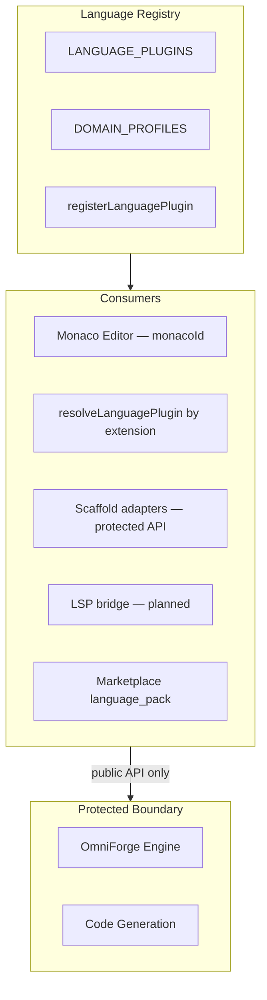

# OmniMind Language Engine Architecture

**Parent:** [PLUGIN_ENGINE.md](./PLUGIN_ENGINE.md)

---

## 1. Purpose

The Language Engine provides **syntax services, file association, build/run profiles, and future LSP integration** for polyglot development — without modifying the OmniForge Engine core. Languages are **plugins** registered in a central registry; Monaco and scaffold pipelines consume the registry.

---

## 2. Architecture



**Primary module:** `frontend/lib/omniforge-polyglot-registry.ts`  
**Note:** File lives under `lib/` for historical OmniForge coupling but is a **platform registry** — third-party language packs register here without editing engine layout.

---

## 3. Language Plugin Model

```typescript
interface LanguagePlugin {
  id: LanguageId;
  label: string;
  extensions: string[];     // .ts, .py, ...
  monacoId: string;           // Monaco language id
  compileCmd?: string;      // e.g. "tsc", "cargo build"
  runCmd?: string;            // e.g. "node {file}", "python {file}"
}
```

### Registration API

```typescript
registerLanguagePlugin(plugin: LanguagePlugin): void
// Updates LANGUAGE_PLUGINS + extension map (pluginByExt)

registerDomainProfile(profile: DomainProfile): void
// Scaffold domain → default language set
```

---

## 4. Supported Languages (Built-In)

| Language | ID | Extensions | Monaco ID |
|----------|-----|------------|-----------|
| TypeScript | `typescript` | `.ts`, `.tsx` | `typescript` |
| JavaScript | `javascript` | `.js`, `.mjs`, `.cjs` | `javascript` |
| Python | `python` | `.py` | `python` |
| C | `c` | `.c`, `.h` | `c` |
| C++ | `cpp` | `.cpp`, `.hpp`, `.cc` | `cpp` |
| C# | `csharp` | `.cs` | `csharp` |
| Java | `java` | `.java` | `java` |
| Go | `go` | `.go` | `go` |
| Rust | `rust` | `.rs` | `rust` |
| PHP | `php` | `.php` | `php` |
| HTML | `html` | `.html`, `.htm` | `html` |
| CSS | `css` | `.css`, `.scss` | `css` |
| SQL | `sql` | `.sql` | `sql` |
| Swift | `swift` | `.swift` | `swift` |
| Kotlin | `kotlin` | `.kt`, `.kts` | `kotlin` |
| Dart | `dart` | `.dart` | `dart` |
| Ruby | `ruby` | `.rb` | `ruby` |
| R | `r` | `.r`, `.R` | `r` |
| Lua | `lua` | `.lua` | `lua` |
| Bash | `bash` | `.sh` | `shell` |
| PowerShell | `powershell` | `.ps1` | `powershell` |

### Planned built-ins (extension slots)

| Language | Planned ID | Notes |
|----------|------------|-------|
| Scala | `scala` | Marketplace `language_pack` |
| MATLAB | `matlab` | Marketplace pack |
| YAML | `yaml` | Config files — monaco `yaml` |
| JSON | `json` | monaco built-in |
| Markdown | `markdown` | monaco `markdown` |

Add via `registerLanguagePlugin()` — no core file edit required.

---

## 5. File Resolution

```typescript
resolveLanguagePlugin(path: string): LanguagePlugin | null
// Walks extension map — longest match wins
```

Used by:

- Editor tab language mode
- Syntax highlighting selection
- Run/build command template substitution (`{file}`)

---

## 6. Domain Profiles

**Scaffold context** — maps project type to default languages:

| Domain | Default languages | Scaffold adapter |
|--------|-------------------|------------------|
| `web_saas` | TS, JS, HTML, CSS, Python | `app-builder` |
| `mobile_flutter` | Dart | `app-builder` |
| `game_2d` | C#, JavaScript | `game-dev` |
| `microservice` | Go, Python, TS | `app-builder` |
| `data_science` | Python, R, SQL | `app-builder` |
| `enterprise` | Java, C#, SQL | `business-site-maker` |

**Protected:** `scaffoldAdapter` invokes existing backend APIs — generator internals unchanged.

---

## 7. Syntax Services

### Tier 1 — Monaco (today)

| Service | Source |
|---------|--------|
| Syntax highlighting | `monacoId` from registry |
| Basic completion | Monaco built-in per language |
| bracket matching | Monaco defaults |

### Tier 2 — Language pack plugins (planned)

```typescript
interface LanguagePackManifest extends OmniPluginManifest {
  kind: "language_pack";
  languages: LanguagePlugin[];
  lsp?: {
    languageId: string;
    command: string;      // server spawn
    transport: "stdio" | "socket";
  };
  grammars?: { path: string; scopeName: string }[];  // TextMate
}
```

Install via Marketplace → `registerLanguagePlugin` for each language.

### Tier 3 — LSP bridge (specification)

```
OmniLanguageServiceHost:
  startServer(languageId, pluginId)
  → WebWorker or backend proxy
  → Monaco registerCompletionItemProvider from LSP
  → Protected: inject into OmniForge editor via public bridge only
```

---

## 8. Marketplace Language Packs

| Listing kind | Contents |
|--------------|----------|
| `language_pack` | `LanguagePlugin[]` + optional LSP server |
| Bundled with `theme` | Syntax colorization for new grammars |

**Example:** Scala language pack adds `id: "scala"`, `.scala` extension, LSP jar via server sandbox.

---

## 9. Run & Build Integration

```
User runs file in terminal dock:
  1. resolveLanguagePlugin(activeFile)
  2. Substitute runCmd: "python {file}" → actual path
  3. Background Job Engine enqueue type: project-build
  4. Workspace terminal executes (sandboxed shell permission)
```

`compileCmd` used by OmniForge build pipeline via **existing** terminal API — not generator rewrite.

---

## 10. Backend Mirror

Backend polyglot services (`backend/services/`) mirror language list for scaffold and sandbox execution. Client registry is **authoritative for UI**; server validates supported languages on `/api/v1/build-engine/omniforge/*`.

Sync contract: marketplace language pack publishes server capability manifest alongside client plugin.

---

## 11. Future Language Plugins

To add a language **without platform code changes**:

```typescript
// In language pack plugin activate():
registerLanguagePlugin({
  id: "scala",
  label: "Scala",
  extensions: [".scala", ".sc"],
  monacoId: "scala",
  compileCmd: "sbt compile",
  runCmd: "scala {file}",
});
```

Optional: register TextMate grammar + LSP server binary in plugin bundle (signed).

---

## 12. Protected System Rules

| Rule | Enforcement |
|------|-------------|
| No Monaco fork | Language mode via `monacoId` only |
| No generator template edits | Scaffold uses adapter name reference |
| No spatial/designer coupling | Language registry independent |

---

## Related Documents

- [PLUGIN_ENGINE.md](./PLUGIN_ENGINE.md)
- [MARKETPLACE.md](./MARKETPLACE.md)
- [THEME_ENGINE.md](./THEME_ENGINE.md)
