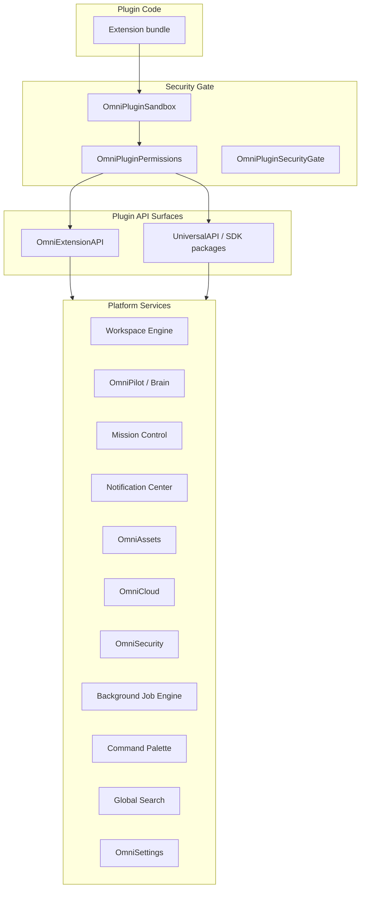

# OmniMind Plugin API Architecture

**Parent:** [PLUGIN_ENGINE.md](./PLUGIN_ENGINE.md)

---

## 1. Purpose

The Plugin API exposes **stable, permission-gated surfaces** for extensions to interact with OmniMind OS — without tight coupling to internal modules. All APIs route through OmniPilot, OmniCore, and the Global Event Bus.

Two API facades exist today and **converge** into one developer experience:

| Facade | Path | Runtime |
|--------|------|---------|
| **OmniExtensionAPI** | `core/plugins/omnicore-platform/OmniExtensionAPI.ts` | In-process platform hooks |
| **UniversalAPI** | `sdk/browser/api/UniversalAPI.ts` | Browser SDK for modules |

---

## 2. API Architecture



---

## 3. OmniExtensionAPI (Platform Hooks)

**Source:** `OmniExtensionAPI.ts`

| Method | Purpose |
|--------|---------|
| `registerCommand(cmd)` | Command palette entry |
| `registerPanel(panel)` | UI region: `sidebar` \| `bottom` \| `window` |
| `registerTool(reg)` | Tool Registry entry |
| `on(hook, pluginId)` | Subscribe to lifecycle hooks |
| `hookPlugins(hook)` | List plugins on hook |

**Hooks (`PluginHook`):** `ai` | `project` | `asset` | `search` | `command` | `menu`

---

## 4. UniversalAPI (SDK Packages)

**Source:** `sdk/browser/api/UniversalAPI.ts`

| Namespace | Package | Platform mapping |
|-----------|---------|------------------|
| **Workspace** | `CoreSDK` | Workspace Engine tabs, project context |
| **Editor** | `DevToolsSDK` | Monaco bridge (OmniForge interface — no core import) |
| **AI** | `AISDK` | `/api/v1/omnicore/ai/complete` proxy |
| **OmniPilot** | `BrainSDK` | `processRequest` ingress (planned facade) |
| **Mission Control** | `AnalyticsSDK` | Metrics, agent status |
| **Notifications** | `notifications.emit()` | `omnimind:notification` → Notification Center |
| **Storage** | `StorageSDK` | `OmniWorkspaceStorage`, SDK localStorage |
| **Files** | `StorageSDK` + assets | `OmniAssets.register` via events |
| **Cloud** | `NetworkingSDK` | OmniCloud sync domains |
| **Authentication** | `AuthSDK` | `secureSession`, org context |
| **Background Tasks** | `events` + workflow | Job Engine events |
| **Command Palette** | `registerModule` → `command-palette` target | AutoRegistration |
| **Search** | `search.index()` | `omnimind:search-index` |
| **Settings** | via `CoreSDK` | `OmniSettings` tool scope |

### SDK package list (existing)

`CoreSDK`, `UISDK`, `AISDK`, `MemorySDK`, `BrainSDK`, `PluginSDKPackage`, `VoiceSDK`, `AuthSDK`, `StorageSDK`, `DatabaseSDK`, `NetworkingSDK`, `DeploymentSDK`, `SecuritySDK`, `AnalyticsSDK`, `DevToolsSDK`, `TestingSDK`

---

## 5. API Surface by Requirement

### 5.1 Workspace

```typescript
// SDK — CoreSDK + registration target "workspace"
api.core.getActiveProject(): { projectId, toolSlug }
api.core.openTab(href: string, opts?: { pinned?: boolean })
// Events: omniEventBus "workspace:changed"
```

**Workspace Engine:** `useWorkspaceEngine()` state exposed read-only via SDK bridge.

### 5.2 Editor

```typescript
// DevToolsSDK — OmniForge boundary
api.devtools.getActiveFile(): { path, language } | null
api.devtools.onSelectionChange(cb): unsubscribe
// Emits: omnimind:brain-request-context — no direct Monaco store access
```

**Protected:** Editor API is **event-based** for OmniForge; plugins never import `OmniForgeResizableShell`.

### 5.3 AI

```typescript
api.ai.chat(messages, opts?)
api.ai.stream(messages, onChunk)
// Server-side keys only; omniSecurity.authorize(ctx, "tool:execute")
```

### 5.4 OmniPilot

```typescript
api.brain.prompt(text: string, opts?: { toolId?, agentId? })
// Routes to OmniPilot.process (planned) → AgentManager / Brain
```

### 5.5 Mission Control

```typescript
api.analytics.reportEvent(name, payload)
api.analytics.getSystemHealth(): Promise<LiveSystemSnapshot>
```

### 5.6 Notifications

```typescript
api.notifications.emit(title, body)
// → omniNotificationCenter.show + omniLiveNotifications
```

### 5.7 Storage & Files

```typescript
api.storage.get(key): string | null      // sdk-scoped localStorage
api.storage.set(key, value)
// Files: publish FileGenerated event → OmniAssets
```

### 5.8 Cloud

```typescript
api.networking.sync(domain: "assets" | "settings" | "ai-memory")
// → OmniCloudSyncEngine
```

### 5.9 Authentication

```typescript
api.auth.getSession(): { userId, orgId } | null
api.auth.requestPermission(scope: string): Promise<boolean>
// → OmniSecurity.authorize + marketplace permission UI
```

### 5.10 Background Tasks

```typescript
api.events.publish("TaskStarted", { jobId, label })
// Subscribe: omnimind:omnipilot-task / omnimind:brain-actions
```

### 5.11 Command Palette

```typescript
getAutoRegistration().register(manifest)
// targets: ["command-palette", "global-search", "navigation", ...]
```

### 5.12 Search

```typescript
api.search.index(moduleId, terms: string[])
// → OmniGlobalSearch indexer
```

### 5.13 Settings

```typescript
// Planned: api.core.getSetting(key) / setSetting(key, value)
// Scope: toolSlug from manifest.toolId
```

---

## 6. Module Registration

**Source:** `sdk/browser/registration/AutoRegistration.ts`

```typescript
register(manifest: SDKModuleManifest): Promise<SDKRegistrationResult>
```

**Targets (`SDKRegistrationTarget`):**

`brain` | `memory` | `actions` | `theme` | `plugins` | `marketplace` | `permissions` | `analytics` | `notifications` | `search` | `command-palette` | `workspace` | `recent-activity` | `navigation` | `global-search`

On success: `omnimind:sdk-registered` event.

---

## 7. Event Bus Bridge

SDK events map to platform bus:

| SDK Event | Platform |
|-----------|----------|
| `WorkflowCompleted` | `activity:new` |
| `PluginInstalled` | `hub:tool-registered` |
| Custom | `omnimind:sdk:{name}` via `SDKEventBus` |

Plugins should prefer `omniEventBus.publish()` for cross-tool communication (see [EVENT_BUS](../ecosystem/EVENT_BUS.md)).

---

## 8. Permission Enforcement

Every API call:

```
1. Resolve pluginId from sandbox context
2. Check declared permissions vs granted (OmniPluginPermissions)
3. omniSecurity.authorize(ABACContext, required SecurityPermission)
4. Execute API handler
5. Audit sensitive operations (api-key usage, file write, deploy)
```

Denied calls return structured error — never throw raw stack to plugin.

---

## 9. Automation API

**Source:** `OmniAutomationSDK` (platform)

Plugins register automation nodes:

```typescript
{ id, kind: "trigger" | "action" | "condition", label, config }
```

Wired to Automation Engine (`/automation-engine`) via `automation:workflow-created` events.

---

## 10. Theme API

**Source:** `OmniThemeSDK`

```typescript
theme.register(ThemeExtension)
theme.apply(pluginId)
// → CSS variables + design system tokens
```

See [THEME_ENGINE.md](./THEME_ENGINE.md).

---

## 11. Versioning & Compatibility

| Constant | Value |
|----------|-------|
| `SDK_VERSION` | `12.0.0` |
| `SDK_MIN_PLATFORM` | `12.0.0` |
| `OMNICORE_PLUGINS_VERSION` | `4.0.0-phase4` |

Manifest `minOmniVersion` enforced by `VersionManager.compare()`.

---

## 12. Backward Compatibility

- `window.OmniMindSDK` preserved (`SDKBoot.tsx`)
- Legacy `getOmniPluginManager()` API unchanged
- Sovereign tools use same manifest shape as marketplace plugins
- DOM events (`omnimind:*`) remain during SDK migration

---

## Related Documents

- [PLUGIN_ENGINE.md](./PLUGIN_ENGINE.md)
- [SDK_GUIDE.md](./SDK_GUIDE.md)
- [../omnipilot/OMNIPILOT_ARCHITECTURE.md](../omnipilot/OMNIPILOT_ARCHITECTURE.md)
