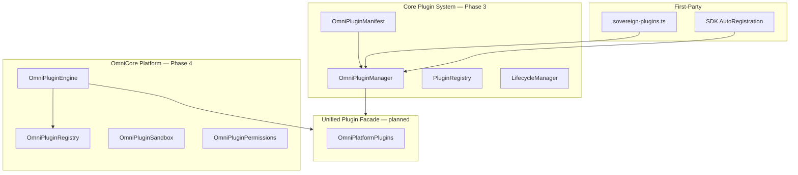
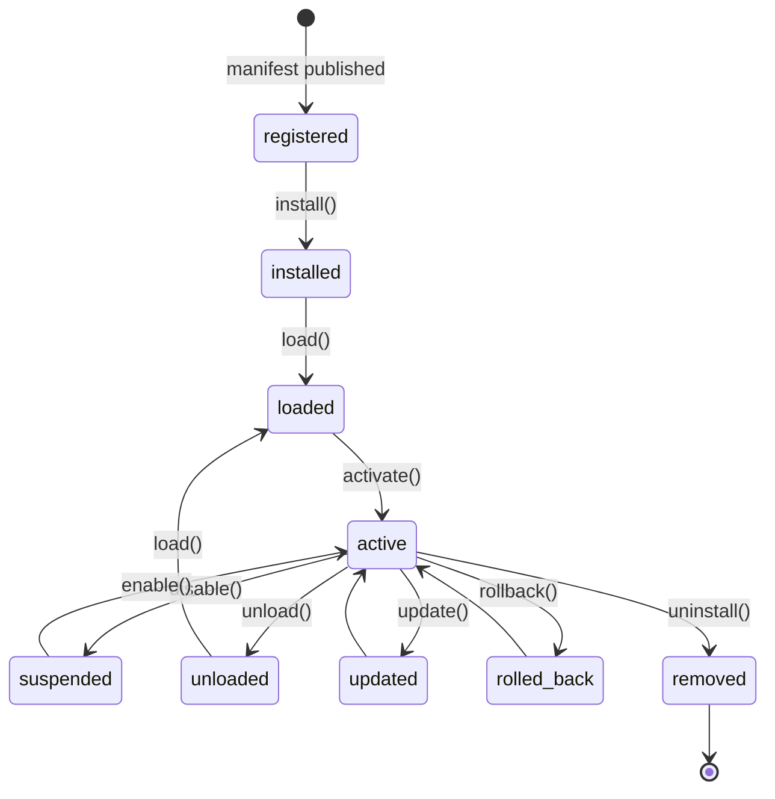

# OmniMind Plugin Engine Architecture

**Version:** 1.0  
**Date:** 2026-06-17  
**Status:** Enterprise platform specification  
**Protected systems (integration only):** OmniForge Engine · OmniForge Code Generation · Architectural Designer Core

---

## 1. Mission

Transform OmniMind into an **extensible platform** where first-party sovereign tools and third-party extensions share one plugin contract. Every capability — commands, AI skills, themes, languages — registers through the Plugin Engine and is discoverable by **OmniPilot**, the **Tool Registry**, and **Mission Control**.

---

## 2. Dual-Layer Architecture (Existing — Converging)

OmniMind has two plugin layers that **unify** under one facade:



| Layer | Path | Version | Role |
|-------|------|---------|------|
| **OmniPluginManager** | `frontend/core/plugins/PluginManager.ts` | Platform | Manifest install, capabilities, actions, brain bridge |
| **OmniPluginEngine** | `frontend/core/plugins/omnicore-platform/OmniPluginEngine.ts` | `4.0.0-phase4` | Marketplace, sandbox, updater, theme SDK |
| **Sovereign seeds** | `frontend/core/plugins/manifests/sovereign-plugins.ts` | — | 16 built-in tools as manifests |
| **Marketplace** | `frontend/core/marketplace/MarketplaceManager.ts` | Enterprise | Install, security scan, cloud sync |

**Consolidation rule:** New code uses `omniPluginEngine` + `getOmniPluginManager()` through one ingress; no third plugin registry.

---

## 3. Plugin Manifest Contract

Every plugin — first-party or third-party — ships an **`OmniPluginManifest`**:

**Source:** `frontend/core/plugins/types.ts`

```typescript
interface OmniPluginManifest {
  // Metadata
  id: string;
  name: string;
  description: string;
  version: string;
  author?: string;
  icon: LucideIcon;
  category: string;

  // Routing
  route: string;
  toolId: SovereignToolSlug | string;
  workspace?: SovereignLayoutKind | "native" | "os-shell";
  routeId?: string;

  // Capabilities
  capabilities: OmniCapability[];
  actions: PluginActionDefinition[];
  permissions: PluginPermissionScope[];
  supportedInputs: string[];
  supportedOutputs: string[];
  keywords?: string[];

  // Lifecycle
  dependencies?: PluginDependency[];
  minOmniVersion?: string;
  featureFlags?: PluginFeatureFlags;
  keyboardShortcuts?: PluginKeyboardShortcut[];

  // Marketplace
  marketplace?: PluginMarketplaceMeta;  // signature, rating, downloadUrl
}
```

### Platform extension record (`OmniPlatformPlugin`)

**Source:** `frontend/core/plugins/omnicore-platform/types.ts`

Adds runtime fields: `enabled`, `verified`, `rating`, `signature`, `type` (`ai` | `developer` | `theme` | …).

---

## 4. Manifest Fields (User Requirements)

| Field | Manifest key | Description |
|-------|--------------|-------------|
| **Manifest** | Full `OmniPluginManifest` | Canonical contract |
| **Metadata** | `name`, `description`, `author`, `category`, `keywords` | Discovery + search |
| **Version** | `version`, `minOmniVersion` | Semver + compatibility |
| **Permissions** | `permissions[]` | Declared scopes; user grants at install |
| **Commands** | `actions[]`, `keyboardShortcuts[]` | Command palette + shortcuts |
| **Settings** | `settingsSchema` (planned extension) | Per-plugin keys in unified settings |
| **Dependencies** | `dependencies[]` | `pluginId` + `versionRange` |
| **Update Channel** | `marketplace.changelogUrl`, channel flag | `stable` / `beta` / `enterprise` |
| **Digital Signature** | `marketplace.signature` | Required for verified marketplace install |

**Settings extension (specification):**

```typescript
settingsSchema?: {
  key: string;
  type: "boolean" | "string" | "number" | "select";
  default: unknown;
  scope: "global" | "workspace" | "tool";
}[];
```

Stored via `OmniSettings` with `toolSlug = manifest.toolId` (see [UNIFIED_SETTINGS](../security/../ecosystem/UNIFIED_SETTINGS.md)).

---

## 5. Plugin Lifecycle



| Phase | Handler | Actions |
|-------|---------|---------|
| **Install** | `OmniPluginManager.install()` / `MarketplaceLifecycle.install()` | Dependency resolve, version check, security scan |
| **Enable** | `omniPlatformPluginManager.enable()` | Set `enabled: true`, load |
| **Disable** | `disable()` / `MarketplaceLifecycle.disable()` | Suspend, keep on disk |
| **Update** | `OmniPluginUpdater.update()` / `MarketplaceLifecycle.update()` | Push version history, reload |
| **Rollback** | `MarketplaceLifecycle.rollback()` | Restore `versionHistory[1]` from `omnimind_plugin_versions_v1` |
| **Uninstall** | `OmniPluginManager.uninstall()` | `lifecycle.remove()`, registry cleanup |
| **Sandbox** | `OmniPluginSandbox.create()` | Isolated API surface |
| **Permission review** | `OmniPluginPermissions.request()` + `MarketplaceSecurity.scan()` | User prompt + vulnerability report |

**Lifecycle states:** `registered` → `installed` → `loaded` → `active` → `suspended` → `unloaded` (`PluginLifecycleState` in types.ts).

---

## 6. Dependency Resolution

**Source:** `DependencyResolver` in `PluginManager.ts`

```
install(manifest):
  1. Compare minOmniVersion vs OMNI_MIND_PLATFORM_VERSION
  2. Resolve dependencies → topological install order
  3. Fail if missing: { ok: false, error: "Missing dependencies: ..." }
  4. lifecycle.install → load → activate
  5. syncPluginToRegistries(manifest) → Tool Registry + Agent ToolRegistry
```

**Source:** `OmniPackageManager` (platform) — `PackageResolution` with `installOrder`, `conflicts`, `missing`.

---

## 7. Sandbox Execution

**Source:** `OmniPluginSandbox.ts`

```
create(pluginId, apis: ["extension-api", ...]):
  → isolated context map
  → runIsolated(pluginId, fn) — executes within declared APIs only
  → destroy(pluginId) on uninstall
```

**Marketplace limits** (`MarketplaceSecurity`): `maxMemoryMb: 128`, `maxCpuPercent: 25`, `networkAllowed: false` by default.

**Enterprise plugins:** `OmniPluginSecurityGate` + `PluginSecurityManifest.sandboxLevel`: `strict` | `standard` | `trusted`.

Third-party code **never** imports protected tool internals. Integration via `OmniExtensionAPI` hooks and events only.

---

## 8. Permission Model

| Scope | Label | Gate |
|-------|-------|------|
| `filesystem` | File read/write | RBAC + user grant |
| `network` | HTTP / WebSocket | Zero trust |
| `ai-models` | OmniAI completion | Org AI credits |
| `microphone` / `camera` | Media devices | Browser prompt + grant |
| `notifications` | OS notifications | Unified notification center |
| `clipboard` | Clipboard access | Session grant |
| `projects` | Project CRUD | Org permission |
| `assets` | Global file system | Asset scope |
| `tool-access` | Cross-tool hooks | Tool Registry |

**Review flow:**

1. `MarketplaceSecurity.scan(manifest)` — signature, dangerous permissions
2. Install UI shows `PERMISSION_LABELS` from `omnicore-platform/constants.ts`
3. `omnimind:marketplace-permission` event → user approve/deny
4. `OmniPluginPermissions.request(pluginId, permissions)` — persist grants

---

## 9. First-Party vs Third-Party

| Type | Registration | Signature |
|------|--------------|-----------|
| Sovereign tools | `sovereign-plugins.ts` → `OmniPluginManager` at boot | OmniMind signed |
| SDK modules | `AutoRegistration.register(manifest)` | Developer key |
| Marketplace | `MarketplaceManager.installListing()` | Required for verified |
| Enterprise private | `privateOrgId` on listing | Org CA |

**Protected tools** (OmniForge, Architectural Designer): remain sovereign manifests; plugins **extend** via hooks — never replace engine bundles.

---

## 10. Integration Matrix

| Consumer | Plugin Engine API |
|----------|-------------------|
| OmniPilot | Capabilities + actions for Agent Router |
| Tool Registry | `syncPluginToRegistries()` |
| Command Palette | `actions[]` + `ExtensionCommand` |
| Workspace Engine | `registerPanel(region)` — sidebar, bottom, window |
| Mission Control | `OmniPluginDiagnostics`, analytics |
| Global Search | `keywords[]` indexed on activate |
| Event Bus | `getPluginEventBus()` + `omnimind:marketplace-*` |
| Security | `MarketplaceSecurity.scan`, `OmniPluginSecurityGate` |

---

## 11. Boot Sequence

```
app/providers.tsx
  → OmniCoreProvider.boot()
  → omniPluginEngine.boot()
  → getOmniPluginManager() — sovereign manifests pre-registered
  → SDKBoot (components/sdk/SDKBoot.tsx) — window.OmniMindSDK
  → Marketplace sync (optional)
```

---

## 12. Implementation Phases

| Phase | Deliverable |
|-------|-------------|
| A | Architecture (this document) |
| B | Unified facade over PluginManager + OmniPluginEngine |
| C | `settingsSchema` in manifest + unified settings UI |
| D | Production signature verification service |
| E | iframe/worker sandbox for untrusted plugins |
| F | Update channel + auto-update policy per org |

---

## Related Documents

- [PLUGIN_API.md](./PLUGIN_API.md)
- [MARKETPLACE.md](./MARKETPLACE.md)
- [SDK_GUIDE.md](./SDK_GUIDE.md)
- [../ecosystem/TOOL_REGISTRY.md](../ecosystem/TOOL_REGISTRY.md)
- [../security/SECRET_VAULT.md](../security/SECRET_VAULT.md)
