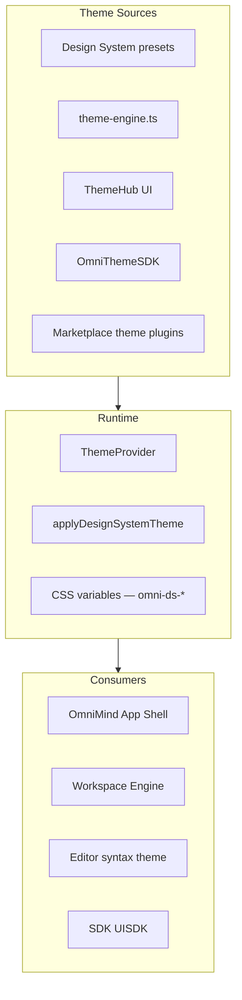

# OmniMind Theme Engine Architecture

**Parent:** [PLUGIN_ENGINE.md](./PLUGIN_ENGINE.md) · [MARKETPLACE.md](./MARKETPLACE.md)

---

## 1. Purpose

The Theme Engine provides **consistent visual identity** across OmniMind OS — dark, light, high contrast, custom themes, icon packs, typography, and syntax highlighting — with first-party presets and third-party theme plugins via the Marketplace.

---

## 2. Architecture



| Module | Path | Role |
|--------|------|------|
| Design system | `frontend/design-system/themes/presets.ts` | Enterprise theme tokens |
| Theme engine | `frontend/lib/theme-engine.ts` | Legacy bridge + custom color |
| ThemeProvider | `frontend/components/theme/ThemeProvider.tsx` | React context |
| ThemeHub | `frontend/components/theme/ThemeHub.tsx` | User picker UI |
| OmniThemeSDK | `frontend/core/plugins/omnicore-platform/OmniThemeSDK.ts` | Plugin theme registration |
| Unified settings | `theme.id` in `OmniSettings` | Persistence + cloud sync |

---

## 3. Built-In Themes

**Source:** `ENTERPRISE_THEMES` in `design-system/themes/presets.ts`

| Theme ID | Mode | Use case |
|----------|------|----------|
| `deep-purple` | Dark | Default OmniMind aesthetic |
| `gold-accent` | Dark | Premium / founder |
| `light` | Light | Daytime work |
| `oled-black` | Dark | OLED displays |
| `grey-professional` | Dark | Enterprise neutral |
| `high-contrast` | Dark | Accessibility (WCAG) |
| `omnimind-dark` | Dark | Legacy alias |
| `custom` | Either | User accent color picker |

**Application:**

```typescript
applyDesignSystemTheme(ENTERPRISE_THEMES[id])
// Sets --omni-ds-bg-*, --omni-ds-text-*, --omni-ds-accent-*, etc.
```

---

## 4. Theme Modes

| Mode | Support | Implementation |
|------|---------|----------------|
| **Dark** | ✅ | Default enterprise presets |
| **Light** | ✅ | `light` preset |
| **High Contrast** | ✅ | `high-contrast` preset — enhanced a11y tokens |
| **Custom Themes** | ✅ | `themeFromCustomColor()` + `generateRandomTheme()` |
| **Custom Icons** | Planned | Icon pack plugins → Lucide subset swap |
| **Typography Packs** | Planned | Font family CSS variables |

### Custom theme flow

```
User picks accent color in ThemeHub
  → themeFromCustomColor(hex)
  → applyThemeTokens(tokens)
  → omniSettings.set("theme.customAccent", hex)
  → omniEventBus.publish("theme:changed", { themeId: "custom" })
```

### Auto theme

`triggerAutoTheme()` — generates palette via `generateRandomTheme()` (hue-randomized dark scheme).

---

## 5. Theme Extension Model (Plugins)

**Source:** `ThemeExtension` in `omnicore-platform/types.ts`

```typescript
interface ThemeExtension {
  id: string;
  pluginId: string;
  colors: Record<string, string>;    // maps to --omni-* CSS vars
  fonts: Record<string, string>;     // ui, mono
  iconSet: string;                   // lucide | custom-pack-id
  syntaxTheme: string;               // monaco theme id
  branding: Record<string, string>;  // logo, wordmark
}
```

**Registration:**

```typescript
omniThemeSDK.register(themeExtension)
omniThemeSDK.apply(pluginId)
```

**Marketplace:** `kind: "theme"` listings (e.g. `ext-theme-dark-pro` seed).

---

## 6. CSS Variable Contract

Dual token systems (migration in progress):

| System | Prefix | Authority |
|--------|--------|-----------|
| Design system | `--omni-ds-*` | **Canonical** — App Shell, workspace |
| Legacy theme | `--omni-*` | OmniThemeSDK.apply, gradual migration |

Plugin themes write to `--omni-*`; App Shell reads `--omni-ds-*`. Bridge layer copies on apply.

---

## 7. Syntax Themes (Editor)

| Concern | Binding |
|---------|---------|
| Monaco theme | `syntaxTheme` on `ThemeExtension` |
| Built-in dark | `omnimind-dark` |
| Plugin pack | Marketplace `language_pack` + theme bundle |

**Protected:** OmniForge Monaco instance receives theme via **public** `editor.setTheme(id)` hook — no engine file changes.

---

## 8. Icon Packs (Specification)

```typescript
interface IconPackExtension {
  pluginId: string;
  packId: string;
  icons: Record<string, string>;  // lucide-name → svg path or component id
}
```

Registered via theme plugin; `Tool Registry` resolves `icon` override for plugin tools only.

---

## 9. Typography Packs (Specification)

```typescript
interface TypographyPack {
  pluginId: string;
  ui: string;       // font-family stack
  mono: string;
  scale?: Record<"xs" | "sm" | "md" | "lg", string>;
}
```

Applied to `--omni-ds-font-ui` and `--omni-ds-font-mono`.

---

## 10. Persistence & Sync

| Key | Scope | Storage |
|-----|-------|---------|
| `theme.id` | global | `OmniSettings` |
| `theme.enterprisePreset` | global | `OmniSettings` |
| `theme.customAccent` | global | `OmniSettings` |
| `omnimind-v12-theme` | local | localStorage (legacy bridge) |

Cloud sync via `OmniPlatformSync` when `cloud.syncEnabled`.

---

## 11. Unified Settings Migration

**Target:** ThemeHub becomes a **viewer** of unified settings — not per-shell duplicate.

```
Settings → Appearance:
  - Preset grid (enterprise themes)
  - Custom color
  - High contrast toggle
  - Typography pack selector (from installed plugins)
  - Icon pack selector
  - Syntax theme (editor)
```

Flagship shells with `embeddedInAppShell` hide local ThemeHub (see [UNIFIED_SETTINGS](../ecosystem/UNIFIED_SETTINGS.md)).

---

## 12. Accessibility

`high-contrast` preset includes dedicated `a11y` color tokens in `DSColorValues`:

- Focus ring colors
- Minimum contrast ratios on text/border
- Status colors distinguishable for color blindness

System preference: `prefers-color-scheme` can trigger auto light/dark (planned `theme.followSystem`).

---

## Related Documents

- [PLUGIN_ENGINE.md](./PLUGIN_ENGINE.md)
- [LANGUAGE_ENGINE.md](./LANGUAGE_ENGINE.md)
- [../ecosystem/UNIFIED_SETTINGS.md](../ecosystem/UNIFIED_SETTINGS.md)
