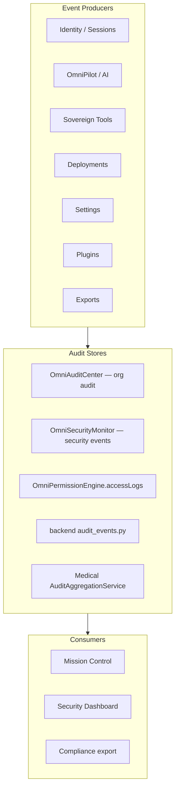

# Audit Logs Architecture

**Parent:** [ENTERPRISE_SECURITY.md](./ENTERPRISE_SECURITY.md)

---

## 1. Purpose

Immutable, searchable audit trails for compliance, forensics, and Mission Control timelines. Every security-sensitive action produces an audit record across **platform**, **organization**, and **clinical** layers.

---

## 2. Audit Systems (Existing)



| Store | Path | Capacity | Scope |
|-------|------|----------|-------|
| `OmniAuditCenter` | `frontend/core/collaboration/OmniAuditCenter.ts` | 5000 entries | Per-org actions |
| `OmniSecurityMonitor` | `frontend/core/security/OmniSecurityMonitor.ts` | 5000 events | Security events |
| `OmniPermissionEngine` | `accessLogs[]` | 500 entries | Permission checks |
| Backend | `backend/lib/security/audit_events.py` | 5000 events | Server security |
| Medical | `governance/audit/AuditAggregationService.ts` | Clinical | PHI audit |

---

## 3. Tracked Events

### 3.1 Required audit categories (enterprise spec)

| Category | Action codes | Producer |
|----------|--------------|----------|
| **Logins** | `auth.login`, `auth.logout`, `auth.failed_login`, `auth.mfa` | OmniAuthEngine, backend auth |
| **File Access** | `asset.read`, `asset.write`, `asset.delete` | OmniAssets, tools |
| **AI Commands** | `ai.prompt`, `ai.agent_start`, `ai.workflow` | OmniPilot, AgentManager |
| **Deployments** | `deploy.start`, `deploy.success`, `deploy.failed` | WorkflowEngine, OmniForge API |
| **Settings Changes** | `settings.change` | OmniSettings → `settings:changed` event |
| **Permission Changes** | `rbac.role_assign`, `rbac.custom_role`, `permission.denied` | OmniRoleManager, OmniSecurity |
| **Plugin Installation** | `plugin.install`, `plugin.uninstall`, `plugin.execute` | MarketplaceManager |
| **Project Deletion** | `project.delete` | OmniProjectEngine, ecosystem |
| **Exports** | `export.start`, `export.complete` | OmniImportExport, analytics |
| **Downloads** | `download.file`, `download.report` | Tools, medical export |

---

## 4. Audit Entry Schema

### Organization audit (`AuditEntry`)

```typescript
// frontend/core/collaboration/types.ts
interface AuditEntry {
  id: string;
  orgId: string;
  actorId: string;
  action: string;
  resource: string;
  ip: string | null;
  timestamp: string;
  metadata: Record<string, string>;
}
```

### Security event (`SecurityEvent`)

```typescript
interface SecurityEvent {
  id: string;
  kind: "login" | "logout" | "failed_login" | "permission_denied" | "api_abuse" | "anomaly" | "plugin" | "secret";
  severity: "low" | "medium" | "high" | "critical";
  actorId: string | null;
  resource: string;
  detail: string;
  ip: string | null;
  timestamp: string;
}
```

### Medical governance audit

Clinical events include `patientId` hash, `departmentId`, and `phiAccessed: boolean` — stored in Medical `AuditAggregationService` with stricter retention (see `RETENTION_POLICIES` phi: 2555 days).

---

## 5. Write Path

```
Action occurs
  ↓
omniAuditCenter.log(orgId, actorId, action, resource, metadata, ip)
  AND/OR
omniSecurity.monitor.record({ kind, severity, actorId, resource, detail, ip })
  AND/OR
record_security_event() — backend
  ↓
omniEventBus.publish("activity:new", { id, kind })
  ↓
Mission Control timeline + Security Dashboard refresh
```

**OmniPilot AI commands:**

```
AgentManager.processUserMessage / brain.processRequest:
  omniAuditCenter.log(orgId, userId, "ai.prompt", toolSlug, {
    ingress: "copilot",
    agentId: selectedAgent,
    promptHash: sha256(text),  // never store raw PHI prompts in platform audit
  })
```

---

## 6. Read Path

| Consumer | API |
|----------|-----|
| Mission Control | `OmniSecurityCenter.snapshot().auditLogs` |
| Security Dashboard | `list_events(limit)` + `OmniAuditCenter.list(orgId)` |
| Org admin | `OmniAuditCenter.search(orgId, query)` |
| Compliance export | `OmniAuditCenter.export(orgId)` |
| Medical auditor | `AuditLogViewer` + governance export |

**Permission:** `audit:read` (Administrator+) or clinical `audit:read` for PHI logs.

---

## 7. Immutability & Retention

| Policy | Rule |
|--------|------|
| Append-only | No update/delete of audit entries in application code |
| Cap | In-memory 5000 (current); production → Mongo immutable collection |
| Retention | Per `RETENTION_POLICIES` classification |
| PHI | 7 years minimum; separate store |
| Export | Signed JSON / CSV for compliance officers |

**Production target:** Write-once storage with hash chain for tamper evidence.

---

## 8. Correlation IDs

Cross-service tracing:

```
sessionId + requestId propagated:
  OmniPilot process → workflow run → background job → deploy hook

Audit metadata:
  { sessionId, requestId, workflowId, jobId, projectId }
```

Enables Mission Control drill-down from security event to full action chain.

---

## 9. Sensitive Data Handling

| Data | Audit storage |
|------|---------------|
| Passwords | Never |
| Raw API keys | Never — key prefix only |
| PHI content | Hash or ID reference only in platform audit |
| Full prompts | Truncated or hashed; medical in clinical store |
| IP / user agent | Allowed for security events |

`OmniDataProtection` classifies fields before audit write.

---

## 10. Integration Points

| System | Audit hook |
|--------|------------|
| Workspace Engine | `layout:saved`, tab changes → `workspace.change` |
| Tool Registry | `hub:tool-registered` |
| Event Bus | `activity:new` fans out to Activity Center |
| Background Jobs | `TaskCompleted` → audit |
| Secret Vault | `secret.read`, `secret.rotate` — server only |
| SDK | `sdk.registered`, API key usage |

---

## 11. Backend API

| Endpoint | Purpose |
|----------|---------|
| `GET /api/v1/omnicore/security/events` | Security events list |
| `POST /api/v1/omnicore/security/events/failed-login` | Record failed login |
| Medical governance routes | Clinical audit aggregation |

**Planned:** `GET /api/v1/omnicore/audit?orgId=&from=&to=` — paginated org audit.

---

## 12. Implementation Phases

| Phase | Work |
|-------|------|
| 1 | Event catalog (this doc) |
| 2 | Unified `audit.log()` facade wrapping all stores |
| 3 | OmniPilot prompt audit on every `process()` |
| 4 | Persistent Mongo audit collection |
| 5 | Mission Control audit timeline UI |
| 6 | Hash chain integrity verification |

---

## Related Documents

- [ENTERPRISE_SECURITY.md](./ENTERPRISE_SECURITY.md) — Security Dashboard
- [SESSION_MANAGEMENT.md](./SESSION_MANAGEMENT.md)
- [PERMISSION_MATRIX.md](./PERMISSION_MATRIX.md)
