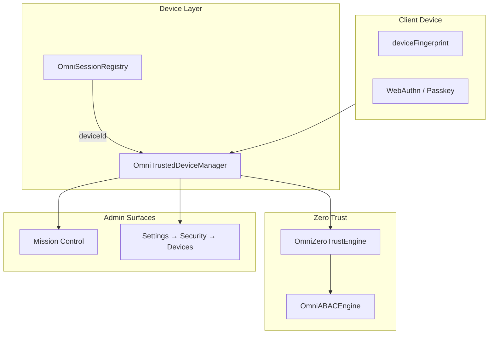

# Device Management Architecture

**Parent:** [ENTERPRISE_SECURITY.md](./ENTERPRISE_SECURITY.md) · [SESSION_MANAGEMENT.md](./SESSION_MANAGEMENT.md)

---

## 1. Purpose

Device Management registers client devices, maintains **trusted device** status for zero-trust decisions, and enables administrators to view and revoke devices linked to user sessions.

**Facade:** `OmniTrustedDeviceManager` — `frontend/core/security/OmniTrustedDeviceManager.ts`  
**Integration:** `OmniZeroTrustEngine`, `OmniSessionRegistry`, Mission Control Security Dashboard

---

## 2. Architecture



---

## 3. Device Model

```typescript
interface TrustedDevice {
  id: string;
  userId: string;
  name: string;              // "Chrome on Windows", "iPhone 15"
  fingerprint: string;       // stable device hash
  trustedAt: string;
  lastSeenAt: string;
}
```

**Session link:** `AuthSession.deviceId` matches `TrustedDevice.fingerprint` or `TrustedDevice.id`.

---

## 4. Device Fingerprinting

**Current (client):** `OmniAuthEngine.deviceFingerprint()`

```
fp-{userAgent.length}-{screen.width}x{screen.height}
```

**Production target (specification):**

| Signal | Weight | Notes |
|--------|--------|-------|
| User agent | Medium | Browser + OS |
| Screen resolution | Low | Combined hash |
| Timezone | Low | |
| WebGL renderer | Medium | Hardware signal |
| Passkey credential ID | High | Strongest binding |

Fingerprint used for `isTrusted()` — not for cross-site tracking. Stored per user only.

---

## 5. Registered Devices

### 5.1 Auto-registration on login

```
First login from fingerprint:
  devices.register(userId, deriveDeviceName(), fingerprint)
  session.trusted = false  // until user confirms

Returning trusted device:
  devices.touch(userId, fingerprint)
  session.trusted = true
```

### 5.2 User-visible device list

**Settings → Security → Devices** (unified settings):

| Column | Source |
|--------|--------|
| Device name | `TrustedDevice.name` |
| Last seen | `lastSeenAt` |
| Trusted | Badge if `isTrusted` |
| Active session | Link to session if `deviceId` matches |
| Actions | Trust / Revoke |

### 5.3 Passkey-bound devices

WebAuthn registration automatically marks device **trusted** with `userVerification: required`:

```
passkeyRegister success
  → devices.register(userId, "Passkey: {authenticator}", credentialId)
  → session.trusted = true
  → mfaVerified = true
```

---

## 6. Trusted Devices

### 6.1 Trust elevation

User confirms "Trust this device" after MFA:

```
devices.register(...) or mark existing as trusted
session.trusted = true
ABAC context: deviceTrusted = true
```

### 6.2 Zero-trust impact

**Source:** `OmniZeroTrustEngine.validateRequest()`

```typescript
deviceTrusted: omniTrustedDeviceManager.isTrusted(
  ctx.userId,
  ctx.attributes?.deviceFingerprint as string ?? ""
)
```

| Operation | Untrusted device | Trusted device |
|-----------|------------------|----------------|
| Read project | ✅ | ✅ |
| Tool execute | ✅ | ✅ |
| Deploy | 🔒 MFA + approval | 🔒 approval |
| API key manage | ❌ MFA required | 🔒 MFA |
| Security admin | ❌ | 🔒 MFA |
| PHI write (Medical) | ❌ | ✅ with clinical role |

`OmniABACEngine` adds checks for untrusted + sensitive permissions.

---

## 7. Active Sessions per Device

Mission Control correlates:

```
For each AuthSession in omniSessionRegistry.list(orgUserId):
  device = devices.list(userId).find(d => d.fingerprint === session.deviceId)
  → show combined row: device name, session status, IP, lastActive
```

**Remote logout device:** Revoke all sessions matching `deviceId` + `devices.revoke(deviceId)`.

---

## 8. Session History by Device

From [SESSION_MANAGEMENT.md](./SESSION_MANAGEMENT.md):

```
SessionHistoryEntry.deviceId → TrustedDevice.name
Timeline filter: by device
Anomaly: same user, new fingerprint, geo-impossible (planned)
```

`OmniSecurityMonitor` records `anomaly` on suspicious new device + sensitive action attempt.

---

## 9. Device Revocation

```
devices.revoke(deviceId):
  1. Remove from trusted list
  2. omniSessionRegistry: revoke all sessions with matching deviceId
  3. Invalidate passkey credential (server) if bound
  4. Audit: device.revoked { deviceId, userId }
  5. Notification: security alert to user email
```

**Admin revoke:** Requires `auth:session:revoke` + `security:admin`.

---

## 10. Platform Matrix

| Platform | Fingerprint | Passkey | Push for login alerts |
|----------|-------------|---------|----------------------|
| Web (Chrome) | JS fingerprint | WebAuthn | Browser notification |
| Web (Safari) | JS fingerprint | WebAuthn | — |
| Desktop (future) | Native ID | Platform passkey | OS notification |
| iOS / Android (future) | Device ID | Platform passkey | Push |
| SDK / API | API key identity | N/A | Webhook |

---

## 11. Integration Summary

| System | Integration |
|--------|-------------|
| **Identity** | Device registered at login |
| **Sessions** | `deviceId` on every `AuthSession` |
| **OmniPilot** | `deviceTrusted` in ABAC context |
| **Workspace Engine** | No device data in layout session |
| **Mission Control** | Device + session combined view |
| **Audit** | `device.register`, `device.revoke`, `device.trust` |
| **Tool Registry** | No per-tool device logic — platform only |

---

## 12. Privacy

- Fingerprints are one-way hashes — not reversible to hardware serial
- Device list visible only to user + org administrators
- No cross-org device sharing
- GDPR: device data deleted on account erasure request

---

## 13. Implementation Phases

| Phase | Work |
|-------|------|
| 1 | Document model (this spec) |
| 2 | Settings → Devices UI |
| 3 | Mission Control device/session panel |
| 4 | Enhanced fingerprint for production |
| 5 | Geo anomaly detection (optional enterprise) |
| 6 | Native desktop/mobile device IDs |

---

## Related Documents

- [SESSION_MANAGEMENT.md](./SESSION_MANAGEMENT.md)
- [IDENTITY_SYSTEM.md](./IDENTITY_SYSTEM.md)
- [ENTERPRISE_SECURITY.md](./ENTERPRISE_SECURITY.md) — Security Dashboard
