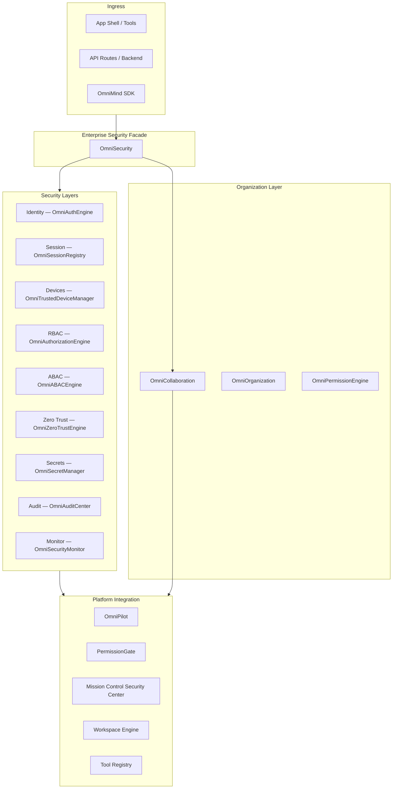

# OmniMind Enterprise Security Architecture

**Version:** 1.0  
**Date:** 2026-06-17  
**Status:** Enterprise Phase architecture specification  
**Protected systems (permission boundaries only):** OmniForge Engine · OmniForge Code Generation · Architectural Designer Core

---

## 1. Mission

OmniMind enters **Enterprise Phase** with a unified security layer. Every feature — tools, AI, cloud, SDK, automation — must authenticate, authorize, audit, and protect secrets through one platform facade integrated with **Workspace Engine**, **OmniPilot**, **Mission Control**, and the **Global Tool Registry**.

Security is **not** a bolt-on. It is the perimeter through which all OS traffic flows.

---

## 2. Security Stack (Existing)



| Module | Path | Role |
|--------|------|------|
| `OmniSecurity` | `frontend/core/security/OmniSecurity.ts` | Platform facade |
| `OmniCollaboration` | `frontend/core/collaboration/OmniCollaboration.ts` | Orgs, teams, billing |
| `PermissionGate` | `frontend/core/brain/permissions/PermissionGate.ts` | Destructive action approval |
| `OmniSecurityCenter` | `frontend/core/mission-control/OmniSecurityCenter.ts` | Dashboard data |
| Backend API | `backend/routers/omnicore_security.py` | Server-side authZ, audit |
| JWT Auth | `backend/auth/router.py` | Token issuance |
| Internal API guard | `frontend/lib/server/api-route-auth.ts` | `requireInternalApiAuth` |
| Medical governance | `frontend/core/medical-enterprise/governance/` | HIPAA RBAC overlay |

**Version:** `OMNICORE_SECURITY_VERSION = "3.0.0-sprint3"`

---

## 3. Request Security Pipeline

Every protected operation follows:

```
1. Authenticate   — JWT / session / API key / SSO
2. Identify org   — active org from OmniCollaboration
3. Authorize      — omniSecurity.authorize(ABACContext, permission)
4. Zero Trust     — device trust, MFA flag, IP context
5. Tool gate      — Tool Registry permission + PermissionGate for destructive ops
6. Execute        — business logic
7. Audit          — OmniAuditCenter + backend record_security_event
8. Monitor        — OmniSecurityMonitor anomaly detection
```

**OmniPilot integration:** `OmniMindBrain.processRequest` and `AgentManager` call `omniSecurity.authorize()` before deploy, file write, and plugin install. `PermissionGate.guardText()` remains the user-approval layer for destructive natural-language commands.

---

## 4. Organizations

**Source:** `OmniOrganization`, `OmniCollaboration` (`frontend/core/collaboration/`)

Each organization contains:

| Entity | Manager | Purpose |
|--------|---------|---------|
| **Projects** | `OmniProjectEngine` / ecosystem | Scoped work units |
| **Teams** | `OmniTeamManager` | Department groupings |
| **Members** | `OmniOrganization` | Users with org roles |
| **Billing** | `OmniBillingArchitecture` | Plans, credits |
| **Plugins** | `MarketplaceManager` | Org-scoped installs |
| **Storage** | `OmniAssets` + `OrgWorkspace.storageUsedBytes` | Quota tracking |
| **AI Credits** | OmniCharge / billing slice | Usage metering |
| **Workspaces** | `OmniWorkspace` (collab) + Workspace Engine | Layout + tabs |

Active org: `omniCollaboration.organization.activeOrgId` — propagated to ABAC context (`orgId`).

---

## 5. Data Classification

**Source:** `PIClassification` in `frontend/core/security/types.ts`

| Class | Examples | Retention | Encrypt at rest |
|-------|----------|-----------|-----------------|
| `public` | Marketing assets | 365 days | No |
| `internal` | Project metadata | 365 days | No |
| `confidential` | Business analytics | 90 days | Yes |
| `pii` | User profiles | 90 days | Yes |
| `phi` | Medical records | 2555 days | Yes |
| `secret` | API keys, tokens | 30 days (refs) | Yes |

`OmniDataProtection` enforces classification on export and cross-tool handoff (see [GLOBAL_FILE_SYSTEM](../ecosystem/GLOBAL_FILE_SYSTEM.md)).

---

## 6. Compliance Frameworks

**Source:** `OmniComplianceCenter` + backend `/api/v1/omnicore/security/compliance`

| Framework | Status | Primary domain |
|-----------|--------|----------------|
| SOC 2 | Partial | Platform ops |
| ISO 27001 | Partial | Security management |
| HIPAA | Planned (Medical active) | Medical Enterprise governance |
| GDPR | Planned | EU user data |
| CCPA | Planned | California privacy |

Medical tools use **additional** governance layer — not a replacement for platform RBAC.

---

## 7. Security Dashboard

**Surface:** Mission Control → Security Center  
**Data:** `OmniSecurityCenter.snapshot()` → `OmniMissionControlApiClient.fetchSecurity()` with local fallback to `omniSecurity.snapshot()`

### 7.1 Widgets

| Widget | Data source | Description |
|--------|-------------|-------------|
| **Threat Level** | `threatDashboard()` | Aggregated: anomalies + critical events |
| **Failed Logins** | `failedLogins24h` | Rolling 24h from `OmniSecurityMonitor` |
| **API Usage** | `apiUsageCount` / active sessions | Rate and session volume |
| **Token Status** | `OmniSessionRegistry` + JWT expiry | Active / expiring sessions |
| **Permissions** | `permissionViolations` | RBAC denials |
| **Security Recommendations** | `OmniComplianceCenter.readinessReport()` | Gap analysis per framework |
| **Audit Timeline** | `OmniAuditCenter` + `list_events()` | Chronological security + audit events |

### 7.2 Threat level calculation

```
threatScore =
  (critical_events × 10) +
  (anomalies × 5) +
  (failed_logins_24h × 0.5) +
  (permission_denials_24h × 0.2)

Level: 0–10 low | 11–30 medium | 31–60 high | 61+ critical
```

### 7.3 Recommendations engine (specification)

| Condition | Recommendation |
|-----------|----------------|
| MFA not enabled for org | Enable MFA for all administrators |
| >3 expired sessions | Purge stale sessions |
| Secret rotation overdue | Rotate keys in Secret Vault |
| HIPAA score < 50 | Complete Medical governance checklist |
| Plugin unsigned | Review marketplace plugin signatures |
| `zeroTrust` disabled in settings | Enable `security.zeroTrust` |

---

## 8. Protected System Boundaries

| System | Security integration | Must not |
|--------|------------------------|----------|
| OmniForge Engine | `tool:execute`, deploy approval, internal API auth | Modify engine auth internals |
| Code Generation | Same as OmniForge; scaffold API JWT | Change generator templates |
| Architectural Designer | Spatial API auth; read-only for viewers | Replace spatial permission model |

Tools check `omniSecurity.authorize()` at action boundaries; protected cores receive gated API calls only.

---

## 9. Backward Compatibility

| Concern | Strategy |
|---------|----------|
| Guest / founder mode | Unauthenticated users get `guest` role; existing home flow unchanged |
| `GUEST_ID` in `app/page.tsx` | Maps to `guest` until login |
| Dev mode API routes | `requireInternalApiAuth` skips when secret unset in development |
| Medical governance | Clinical RBAC **extends** platform RBAC; never bypasses PHI rules |
| Legacy DOM events | `omnimind:brain-permission` preserved for PermissionGate UI |

New enterprise features are **additive**. Existing routes work without org assignment (default org seed).

---

## 10. API Surface

| Endpoint | Purpose |
|----------|---------|
| `GET /api/v1/omnicore/security/dashboard` | Threat dashboard |
| `GET /api/v1/omnicore/security/events` | Security events |
| `POST /api/v1/omnicore/security/authorize` | Server-side RBAC check |
| `GET /api/v1/omnicore/security/compliance` | Compliance report |
| `GET /api/v1/omnicore/security/auth/providers` | OAuth provider list |
| `POST /api/v1/omnicore/security/auth/passkey/challenge` | WebAuthn challenge |
| `POST /api/v1/auth/login` | Email JWT issuance |
| `POST /api/v1/auth/refresh` | Token refresh |
| `POST /api/v1/auth/session` | Sovereign session handshake |

All OmniCore security under `/api/v1/omnicore/security/*`.

---

## 11. Implementation Phases

| Phase | Deliverable |
|-------|-------------|
| A | Architecture docs (this release) |
| B | Unify org RBAC (`OmniRoleManager`) with platform RBAC (`OmniAuthorizationEngine`) |
| C | Wire `omniSecurity.authorize` into OmniPilot ingress |
| D | Mission Control Security Dashboard UI completion |
| E | Server-side secret vault (KMS); client references only |
| F | MFA + passkey production backends |
| G | Audit log persistence (Mongo / immutable store) |

---

## Related Documents

- [IDENTITY_SYSTEM.md](./IDENTITY_SYSTEM.md)
- [RBAC.md](./RBAC.md)
- [PERMISSION_MATRIX.md](./PERMISSION_MATRIX.md)
- [SECRET_VAULT.md](./SECRET_VAULT.md)
- [AUDIT_LOGS.md](./AUDIT_LOGS.md)
- [SESSION_MANAGEMENT.md](./SESSION_MANAGEMENT.md)
- [DEVICE_MANAGEMENT.md](./DEVICE_MANAGEMENT.md)
- [../omnipilot/OMNIPILOT_ARCHITECTURE.md](../omnipilot/OMNIPILOT_ARCHITECTURE.md)
- [../ecosystem/TOOL_REGISTRY.md](../ecosystem/TOOL_REGISTRY.md)
