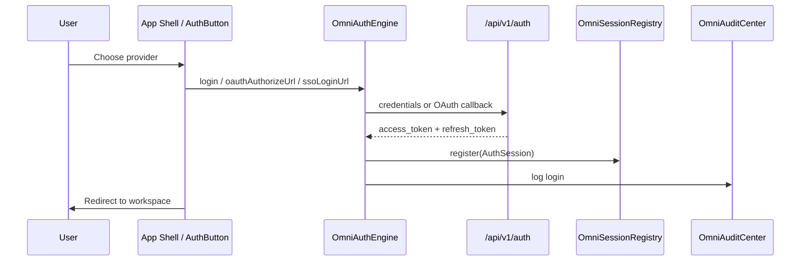

# Identity System Architecture

**Parent:** [ENTERPRISE_SECURITY.md](./ENTERPRISE_SECURITY.md)

---

## 1. Purpose

The Identity System authenticates users and service principals across web, desktop, mobile, and SDK clients. It integrates with **OmniPilot** (user context), **Workspace Engine** (session restore), and **Mission Control** (login monitoring).

**Facade:** `OmniAuthEngine` — `frontend/core/security/OmniAuthEngine.ts`  
**Backend:** `backend/auth/router.py` — JWT issuance  
**Client storage:** `frontend/lib/shared/secure-session.ts` — access token in `sessionStorage` only

---

## 2. Supported Providers

| Provider | `AuthProvider` enum | Status | Entry |
|----------|---------------------|--------|-------|
| **Email** | `email` | Active | `POST /api/v1/auth/login` |
| **Google** | `google` | Enabled (config) | `/api/v1/auth/oauth/google/authorize` |
| **GitHub** | `github` | Configurable | `/api/v1/auth/oauth/github/authorize` |
| **Microsoft** | `microsoft` | Configurable | `/api/v1/auth/oauth/microsoft/authorize` |
| **Apple** | `apple` | Configurable | `/api/v1/auth/oauth/apple/authorize` |
| **Enterprise SSO** | `saml` / `oidc` | Per-org | `/api/v1/auth/sso/{protocol}/{orgId}/login` |
| **Passkeys** | `passkey` | Architecture ready | WebAuthn challenge API |
| **Magic Link** | `email` (variant) | Planned | Time-limited token via email |

**Provider config:** `OAUTH_PROVIDERS` in `frontend/core/security/constants.ts` and `backend/routers/omnicore_security.py`.

---

## 3. Authentication Flow



### 3.1 Email + password

```
POST /api/v1/auth/login { email, password }
  → verify_password (backend/auth/security.py)
  → create_access_token(subject, extra={ role })
  → create_refresh_token(subject)
  → secureSession.setAccessToken(access)  // client
  → omniSessionRegistry.register(session)
```

Passwords **never** stored client-side. Bootstrap admin via `OMNIMIND_BOOTSTRAP_EMAIL` / `OMNIMIND_BOOTSTRAP_PASSWORD` (server env only).

### 3.2 OAuth (Google, GitHub, Microsoft, Apple)

```
omniAuthEngine.oauthAuthorizeUrl(provider)
  → redirect to provider
  → callback /api/v1/auth/oauth/{provider}/callback
  → map provider subject → OmniMind userId
  → issue JWT pair
```

Enable per provider via env: `GOOGLE_OAUTH_CLIENT_ID`, `GITHUB_OAUTH_CLIENT_ID`, etc.

### 3.3 Enterprise SSO

```
omniAuthEngine.configureSSO({ orgId, protocol, issuerUrl, metadataUrl, enabled })
omniAuthEngine.ssoLoginUrl(orgId)
  → SAML assertion or OIDC id_token validation (server)
  → JIT provision org member if configured
  → issue org-scoped JWT with saml:groups → role mapping
```

SSO configs stored per org in `OmniAuthEngine.ssoConfigs[]`; production persistence via OmniCore workspace bundle.

### 3.4 Passkeys (WebAuthn)

**Client:** `passkeyRegisterChallenge(userId)`, `passkeyLoginChallenge()`  
**Server:** `POST /api/v1/omnicore/security/auth/passkey/challenge`

```
Registration:
  1. Server issues challenge + rpId
  2. navigator.credentials.create()
  3. Server verifies attestation, stores credential ID (server DB)
  4. Mark device trusted in OmniTrustedDeviceManager

Login:
  1. Server issues assertion challenge
  2. navigator.credentials.get()
  3. Verify signature → issue JWT
  4. mfaVerified = true in ABAC context
```

### 3.5 Magic Link

```
POST /api/v1/auth/magic-link { email }
  → generate single-use token (15 min TTL, server)
  → email link: /auth/verify?token=...
  → verify → issue JWT
  → audit: login via magic_link
```

Architecture specification; email delivery via platform notification service.

---

## 4. Multi-Factor Authentication

MFA layers on primary auth:

| Factor | Method |
|--------|--------|
| TOTP | Authenticator app (planned) |
| Passkey | WebAuthn with user verification required |
| SMS / Email OTP | Backup factor (enterprise) |

**ABAC flag:** `mfaVerified: boolean` in `ABACContext` — required for:

- `security:admin`
- `api:key:manage`
- Deploy to production (`PermissionGate` kind `deploy`)
- Medical PHI write operations

**Setting:** `security.mfaRequired` per org in `OmniEnterpriseSettings`.

---

## 5. Token Model

| Token | Storage | TTL | Purpose |
|-------|---------|-----|---------|
| Access JWT | `sessionStorage` (`omnimind:access-token`) | 1h default | API authorization |
| Refresh token | **httpOnly cookie** (server) | 7–30 days | Silent refresh |
| Sovereign session | Env-gated | 24h | Operator bootstrap |
| API key | `OmniAPIKeyManager` | Until revoked | SDK / integrations |
| Internal API secret | Server env only | — | `requireInternalApiAuth` |

**Refresh flow:**

```
POST /api/v1/auth/refresh { refresh_token }
  → decode_token, validate
  → new access_token
  → secureSession.setAccessToken
```

**JWT interceptor:** `backend/middleware/jwt_interceptor.py` validates Bearer on protected routes.

---

## 6. Identity ↔ Organization Binding

On successful login:

```
1. Resolve userId from JWT subject
2. omniCollaboration.organization.listForUser(userId)
3. Set activeOrgId (last used or default)
4. omniAuthorizationEngine.assignRole(userId, orgRole → platform role mapping)
5. Context Engine: userId + orgId in ContextBundle
```

Invitations via `OmniInviteManager` — pending members get `invited` status until first login.

---

## 7. Guest & Founder Mode

**Backward compatible:** Unauthenticated sessions use:

- `userId: "guest-founder"` (home page) or JWT `guest` role
- `omniAuthorizationEngine.rolesFor()` defaults to `["guest"]`
- Tool read access per [PERMISSION_MATRIX.md](./PERMISSION_MATRIX.md)

Login upgrades session without workspace data loss (`Workspace Engine` session key independent of auth).

---

## 8. SDK Identity

```
OmniMindSDK.authenticate(apiKey)
  → OmniAPIKeyManager.validate(prefix, scope)
  → service principal ABACContext { userId: keyId, orgId }
```

Plugins never receive user passwords or refresh tokens.

---

## 9. Security Events

| Event | Trigger |
|-------|---------|
| `login` | Successful auth |
| `logout` | Session revoke |
| `failed_login` | Bad credentials → `POST /api/v1/omnicore/security/events/failed-login` |
| `anomaly` | Brute force (>5 failures per actor) |

Recorded in `OmniSecurityMonitor` and backend `audit_events.py`.

---

## 10. Implementation Phases

| Phase | Work |
|-------|------|
| 1 | Document providers (this spec) |
| 2 | OAuth callback routes on backend |
| 3 | SSO SAML/OIDC validation service |
| 4 | Passkey credential store |
| 5 | Magic link + MFA TOTP |
| 6 | httpOnly refresh cookie in production |

---

## Related Documents

- [SESSION_MANAGEMENT.md](./SESSION_MANAGEMENT.md)
- [DEVICE_MANAGEMENT.md](./DEVICE_MANAGEMENT.md)
- [RBAC.md](./RBAC.md)
