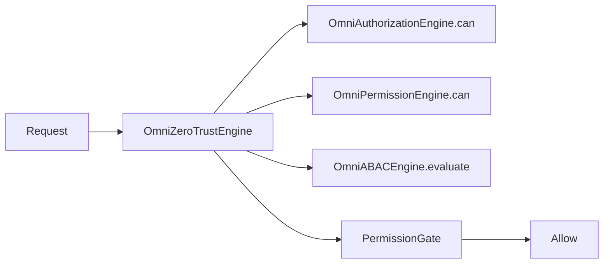

# Role-Based Access Control (RBAC) Architecture

**Parent:** [ENTERPRISE_SECURITY.md](./ENTERPRISE_SECURITY.md)

---

## 1. Purpose

Enterprise RBAC controls **who can do what** across organizations, workspaces, projects, tools, APIs, and plugins. Every tool registered in the [Global Tool Registry](../ecosystem/TOOL_REGISTRY.md) must respect permissions enforced through `omniSecurity.authorize()`.

OmniMind uses **two complementary RBAC layers** that merge at authorization time:

| Layer | Module | Scope |
|-------|--------|-------|
| **Platform RBAC** | `OmniAuthorizationEngine` | Cross-platform permissions |
| **Organization RBAC** | `OmniRoleManager` + `OmniPermissionEngine` | Per-org collaboration |
| **Clinical RBAC** | Medical `RoleManagement` | PHI overlay (Medical tools only) |

---

## 2. Enterprise Roles

User-facing roles map to platform and org permission sets:

| Enterprise Role | Org Role (`OrgRole`) | Platform Role (`SecurityRole`) | Primary use |
|-----------------|----------------------|-------------------------------|-------------|
| **Owner** | `owner` | `org:owner` / `platform:owner` | Full org control, billing |
| **Administrator** | `administrator` | `org:admin` / `platform:admin` | Users, security, plugins |
| **Manager** | `manager` | `workspace:manager` | Teams, workspaces, projects |
| **Developer** | `editor` | `project:editor` | Code, OmniForge, deploy (gated) |
| **Designer** | `editor` + tool scope | `project:editor` | Visionary, Architectural Designer |
| **Analyst** | `editor` + analytics scope | `tool:operator` | Business Analytics, exports |
| **Medical Specialist** | `editor` + clinical | Medical governance role | Medical Suite (PHI) |
| **Viewer** | `viewer` | `viewer` | Read-only |
| **Guest** | `guest` | `guest` | Limited read |
| **Custom** | `custom` | Mapped via `CustomRole` | Org-defined permission sets |

**Source:** `ROLE_PERMISSIONS` in `frontend/core/collaboration/constants.ts` and `frontend/core/security/constants.ts`.

---

## 3. Permission Types

### 3.1 Platform permissions (`SecurityPermission`)

```typescript
// frontend/core/security/types.ts
"auth:session:read" | "auth:session:revoke"
"org:read" | "org:write"
"workspace:read" | "workspace:write"
"project:read" | "project:write"
"tool:execute"
"api:key:manage"
"plugin:install" | "plugin:execute"
"audit:read"
"security:admin"
```

### 3.2 Organization permissions (`OrgPermission`)

```typescript
// frontend/core/collaboration/types.ts
"org:read" | "org:write" | "org:admin"
"workspace:read" | "workspace:write"
"project:read" | "project:write"
"asset:read" | "asset:write"
"comment:write" | "review:approve"
"billing:read"
"api-key:manage"
```

### 3.3 Agent permissions (OmniPilot)

**Source:** `BRAIN2_AGENT_REGISTRY` — each agent has `permissionLevel` and `memoryAccess`.

OmniPilot Agent Router filters agents when `omniSecurity.authorize()` denies `tool:execute`.

---

## 4. Authorization Engine



**Unified check:**

```typescript
omniSecurity.authorize({
  userId,
  orgId,
  workspaceId,
  projectId,
  toolSlug,
  mfaVerified,
  deviceTrusted,
}, permission);
```

Returns `ZeroTrustDecision { allowed, reason, checks }`.

**Server mirror:** `POST /api/v1/omnicore/security/authorize` → `backend/lib/security/zero_trust.py`.

---

## 5. Role → Permission Mapping

### Platform (`ROLE_PERMISSIONS` — security/constants.ts)

| Role | Key permissions |
|------|-----------------|
| `platform:owner` | All permissions |
| `platform:admin` | All except implicit owner-only billing |
| `org:owner` | org:*, workspace:*, project:*, tool:execute, api:key:manage, plugin:install, audit:read |
| `org:admin` | org:read/write, workspace:*, project:*, tool:execute, audit:read |
| `workspace:manager` | workspace:*, project:*, tool:execute |
| `project:editor` | project:read/write, tool:execute |
| `tool:operator` | tool:execute, project:read |
| `api:integrator` | api:key:manage, tool:execute |
| `plugin:developer` | plugin:install, plugin:execute |
| `viewer` | project:read, workspace:read, org:read |
| `guest` | project:read |

### Organization (`ROLE_PERMISSIONS` — collaboration/constants.ts)

| Org Role | Permissions |
|----------|-------------|
| `owner` | Full org set including `billing:read`, `api-key:manage` |
| `administrator` | Full except billing |
| `manager` | Workspace + project write, no org:admin |
| `editor` | Project/asset write |
| `reviewer` | Read + review:approve |
| `viewer` | Read only |
| `guest` | project:read only |

### Custom roles

```
omniRoleManager.createCustom(orgId, name, permissions: OrgPermission[])
  → stored in customRoles[]
  → member.customRoleId links user to custom set
```

---

## 6. Tool Registry Integration

Each tool in `sovereign-plugins.ts` declares `permissions`:

```typescript
PERMISSIONS_BY_SLUG["omniforge-engine"] = ["filesystem", "network", "terminal", "deployment", "browser"]
```

**Enforcement:**

```
Before tool action:
  1. Map plugin permission → SecurityPermission (e.g. deployment → tool:execute + deploy approval)
  2. omniSecurity.authorize(ctx, "tool:execute")
  3. OmniPluginSecurityGate.validate(manifest)
  4. PermissionGate for destructive commands
```

Protected tools: permission checks at **API boundary**; internal engine code unchanged.

---

## 7. Medical Clinical RBAC Overlay

**Source:** `frontend/core/medical-enterprise/governance/rbac/RoleManagement.ts`

Clinical roles (`doctor`, `nurse`, `radiologist`, etc.) add **governance permissions** (`emr:read`, `imaging:upload`, `audit:read`).

**Rule:** Platform role must allow tool access AND clinical role must allow PHI operation.

```
canAccessMedical(user, action):
  omniSecurity.authorize(ctx, "tool:execute")  // toolSlug = medical-diagnostic-suite
  AND getRoleManagement().hasPermission(clinicalRole, governancePermission)
```

PHI assets never visible to non-clinical roles regardless of platform `project:read`.

---

## 8. Delegation & Temporary Access

| Pattern | Mechanism |
|---------|-----------|
| Project invite | `OmniInviteManager` → role on accept |
| Review assignment | `reviewer` role on specific asset |
| API key scope | `OmniAPIKeyManager` scoped permissions |
| Agent delegation | OmniPilot routes to agent within user's permission ceiling |

Agents **cannot** escalate beyond invoking user's permissions.

---

## 9. Denial Handling

On `allowed: false`:

1. `OmniSecurityMonitor.record({ kind: "permission_denied" })`
2. Backend `record_security_event` if server-side
3. User message via copilot (no sensitive detail leak)
4. Mission Control security widget increment

---

## 10. Migration & Compatibility

| Legacy | Enterprise |
|--------|------------|
| `guest-founder` | `guest` role |
| `root_operator` JWT | `platform:owner` |
| Unauthenticated dev | Dev mode bypass for internal API only |
| Medical Phase 1 roles | Mapped via `ROLE_MAP` in `IdentityProvider` |

Existing users without org assignment attach to seed org `org-1` (OmniMind Labs).

---

## 11. Implementation Phases

| Phase | Work |
|-------|------|
| 1 | Role mapping table (this doc) |
| 2 | `Developer` / `Designer` / `Analyst` / `Medical Specialist` as org role aliases |
| 3 | Wire `omniCollaboration.can()` into tool action handlers |
| 4 | OmniPilot agent filter on authorize |
| 5 | Custom role UI in unified settings |

---

## Related Documents

- [PERMISSION_MATRIX.md](./PERMISSION_MATRIX.md)
- [IDENTITY_SYSTEM.md](./IDENTITY_SYSTEM.md)
- [AUDIT_LOGS.md](./AUDIT_LOGS.md)
