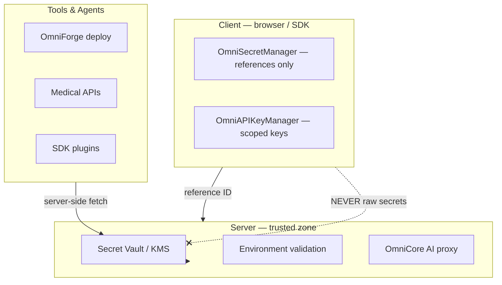

# Secret Vault Architecture

**Parent:** [ENTERPRISE_SECURITY.md](./ENTERPRISE_SECURITY.md)

---

## 1. Principle

**Never expose secrets.**

API keys, environment variables, OAuth tokens, database credentials, encryption keys, and signing keys are managed through the **Secret Vault** — server-side storage with client-side **references only**.

---

## 2. Architecture



| Module | Path | Role |
|--------|------|------|
| `OmniSecretManager` | `frontend/core/security/OmniSecretManager.ts` | Client reference registry |
| `OmniAPIKeyManager` | `frontend/core/collaboration/OmniAPIKeyManager.ts` | Org API key lifecycle |
| `validate_environment` | `backend/lib/security/env_validation.py` | Server env audit |
| `requireInternalApiAuth` | `frontend/lib/server/api-route-auth.ts` | Internal route guard |

---

## 3. Secret Categories

| Category | Examples | Storage | Client visibility |
|----------|----------|---------|-------------------|
| **API Keys** | Gemini, Tavily, HuggingFace | Server env / vault | Reference only |
| **Environment Variables** | `DATABASE_URL`, `REDIS_URL` | Server env | Blocked list |
| **OAuth Tokens** | Provider refresh tokens | Server DB encrypted | Never |
| **Database Credentials** | Postgres, Mongo connection | Server vault | Never |
| **Encryption Keys** | AES data keys, JWT secret | KMS / server env | Never |
| **Signing Keys** | Plugin manifests, JWT RS256 | KMS | Public key only |
| **User API Keys** | `omni_xxxx` integration keys | `OmniAPIKeyManager` | Shown once at creation |

---

## 4. Client Blocked Keys

**Source:** `CLIENT_BLOCKED_KEYS` in `OmniSecretManager.ts`

```
JWT_SECRET_KEY
GEMINI_API_KEY / GOOGLE_API_KEY
DATABASE_URL
REDIS_URL
SUPABASE_SERVICE_ROLE_KEY
OMNIMIND_BOOTSTRAP_PASSWORD
OMNIMIND_INTERNAL_API_SECRET
```

`registerReference()` throws if blocked key registered in browser context.

`validateEnv()` returns `server_only` status for blocked keys.

---

## 5. Secret Reference Model

```typescript
interface SecretReference {
  key: string;
  scope: "auth" | "ai" | "database" | "integration" | "plugin";
  rotationDueAt: string | null;
  lastRotatedAt: string | null;
}
```

Client holds **metadata only**:

- Key name
- Rotation schedule
- Scope
- Health status (`configured` | `missing` | `rotation_overdue`)

---

## 6. Server-Side Vault (Specification)

Production vault requirements:

| Requirement | Implementation |
|-------------|----------------|
| Encryption at rest | AES-256-GCM per secret |
| Access control | Service identity + RBAC `api:key:manage` |
| Audit | Every read logged to [AUDIT_LOGS.md](./AUDIT_LOGS.md) |
| Rotation | `scheduleRotation(key, days)` → automated re-issue |
| Versioning | Previous version valid during grace window |
| Injection | Runtime inject into process env — not build artifacts |

**AI keys:** All LLM calls route through `/api/v1/omnicore/ai/complete` — keys never sent to browser.

**Integration keys:** Backend `INTEGRATION_KEYS` in `main.py` — loaded at boot from env.

---

## 7. Organization API Keys

**Source:** `OmniAPIKeyManager`

```
create(orgId, name, scopes):
  → prefix: omni_{random}
  → secret shown ONCE: omni_{prefix}_{secret}
  → store hash server-side (planned); client stores prefix + metadata

validate(prefix, requiredScope):
  → check not revoked
  → scope includes required or "*"
  → update lastUsedAt
  → audit: api_key_used
```

| Scope | Access |
|-------|--------|
| `tool:execute` | Run tool APIs |
| `asset:read` | Read project assets |
| `webhook` | Receive automation webhooks |
| `*` | Full integrator (Owner only) |

Revocation: `revoke(keyId)` — immediate invalidation.

---

## 8. OAuth Token Storage

```
OAuth callback (server):
  1. Exchange code for access + refresh tokens
  2. Encrypt refresh token → vault entry { userId, provider, encrypted }
  3. Issue OmniMind JWT to client (no provider tokens)
  4. Server uses refresh token for provider API on behalf of user
```

Client receives **no** Google/GitHub/Microsoft tokens.

---

## 9. Database Credentials

```
Per-org database provision (Architect deploy-hook):
  1. Generate credentials server-side
  2. Store in vault scoped to projectId
  3. Return connection reference ID to OmniForge (not password)
  4. OmniForge uses server proxy for DB operations OR ephemeral inject for deploy only
```

`/api/architect/provision-db` protected by `requireInternalApiAuth`.

---

## 10. Plugin Secrets

**Source:** `OmniPluginSecurityGate`

Plugins declare required secrets in manifest. Runtime:

```
Plugin requests secret "STRIPE_KEY"
  → OmniPluginSecurityGate.check(pluginId, scope)
  → Server vault inject into sandboxed worker
  → Never returned to plugin host page
```

Marketplace `omnimind:marketplace-permission` event for scope grants.

---

## 11. Rotation Policy

| Secret type | Rotation interval | Notification |
|-------------|-------------------|----------------|
| JWT signing key | 90 days | Security dashboard |
| API integration keys | 180 days | Admin email |
| User API keys | Manual | Last-used warning at 90d idle |
| DB credentials | 365 days | Mission Control alert |
| OAuth refresh | Provider-driven | On refresh failure |

`scheduleRotation(key, days)` updates `rotationDueAt` on reference.

---

## 12. Exposure Prevention

| Vector | Mitigation |
|--------|------------|
| Browser devtools | No secrets in JS bundle; blocked keys enforced |
| Logs | `secure-session.ts` — never log tokens |
| Error messages | Sanitize env validation output |
| Git | `.env` gitignored; `env/validate` endpoint for ops |
| Copilot / AI | OmniSafetyEngine redacts secret patterns in prompts |
| Export bundles | `OmniImportExport` strips env files |

---

## 13. Compliance Mapping

| Framework | Control |
|-----------|---------|
| SOC 2 | CC6.1 logical access — vault + RBAC |
| ISO 27001 | A.10 cryptography — encryption at rest |
| HIPAA | 164.312(a) — PHI encryption keys in vault only |
| GDPR | Art. 32 — security of processing |

---

## Related Documents

- [AUDIT_LOGS.md](./AUDIT_LOGS.md)
- [RBAC.md](./RBAC.md)
- [IDENTITY_SYSTEM.md](./IDENTITY_SYSTEM.md)
