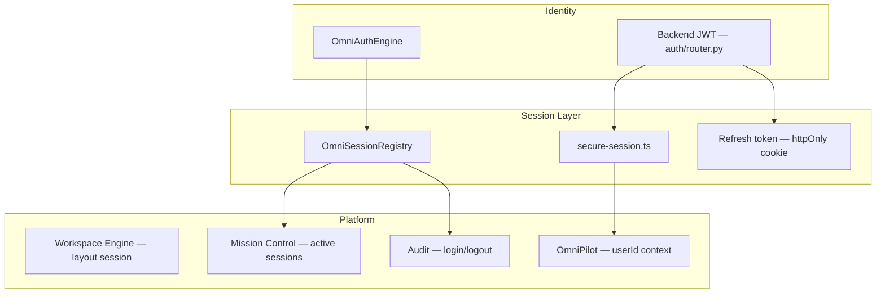

# Session Management Architecture

**Parent:** [ENTERPRISE_SECURITY.md](./ENTERPRISE_SECURITY.md) · [IDENTITY_SYSTEM.md](./IDENTITY_SYSTEM.md)

---

## 1. Purpose

Session Management tracks **authenticated user sessions** across devices, integrates with the **Workspace Engine** (session restore is layout-only; auth session is separate), and supports **remote logout** from Mission Control and unified settings.

---

## 2. Components



| Module | Path | Role |
|--------|------|------|
| `OmniSessionRegistry` | `frontend/core/security/OmniSessionRegistry.ts` | Multi-device session store |
| `OmniAuthEngine` | `frontend/core/security/OmniAuthEngine.ts` | Login/logout lifecycle |
| `secureSession` | `frontend/lib/shared/secure-session.ts` | Access token client storage |
| `AuthSession` type | `frontend/core/security/types.ts` | Session model |
| Backend JWT | `backend/auth/security.py` | Token create/decode |

---

## 3. Session Model

```typescript
interface AuthSession {
  id: string;
  userId: string;
  provider: AuthProvider;      // email, google, passkey, saml, ...
  deviceId: string;            // links to TrustedDevice
  trusted: boolean;
  ip: string | null;
  userAgent: string | null;
  createdAt: string;
  lastActiveAt: string;
  expiresAt: string;
}
```

---

## 4. Session Lifecycle

### 4.1 Create (login)

```
Successful authentication
  ↓
Build AuthSession {
  deviceId: deviceFingerprint(),
  trusted: devices.isTrusted(userId, fingerprint),
  expiresAt: now + TTL
}
  ↓
omniSessionRegistry.register(session)
omniAuthEngine.sessions.push(session)
secureSession.setAccessToken(jwt)
  ↓
Audit: auth.login
omniEventBus.publish("session:started", { sessionId })
```

### 4.2 Active use

```
Each API request:
  Authorization: Bearer {accessToken}
  jwt_interceptor validates → subject, role, expiry

Client activity:
  omniSessionRegistry.touch(sessionId) → update lastActiveAt

OmniPilot ContextBundle:
  sessionId, userId from active session
```

### 4.3 Refresh

```
Access token near expiry:
  POST /api/v1/auth/refresh { refresh_token }
  → new access_token
  → secureSession.setAccessToken
  → extend expiresAt on session record
```

Refresh token **only** in httpOnly cookie (production) — not in `sessionStorage`.

### 4.4 Logout (single session)

```
User logout OR remote revoke:
  omniAuthEngine.logout(sessionId)
  omniSessionRegistry.revoke(sessionId)
  secureSession.clearAccessToken()
  clear refresh cookie (server)
  ↓
Audit: auth.logout
```

### 4.5 Remote logout (all other devices)

```
omniSessionRegistry.revokeAllExcept(userId, keepSessionId)
  ↓
Invalidate refresh tokens server-side for revoked sessions
  ↓
Audit: auth.session_revoke { count }
```

**Permission:** `auth:session:revoke` (Administrator+).

---

## 5. Session Types

| Type | TTL | Use |
|------|-----|-----|
| Standard user JWT | 1 hour access / 7d refresh | Web app |
| Sovereign session | 24 hours | `POST /api/v1/auth/session` operator bootstrap |
| Operator token | 12 hours | `POST /api/v1/auth/session-token` |
| API key session | Until revoked | SDK integrations |
| Guest | No JWT | `guest` role, no registry entry |

---

## 6. Workspace Engine vs Auth Session

**Critical separation:**

| Concern | Storage | Key |
|---------|---------|-----|
| **Auth session** | `OmniSessionRegistry` + JWT | User identity |
| **Workspace layout** | Workspace Engine | `omnimind_workspace_engine_v2` |

Workspace Engine restores tabs and splits **without** requiring re-login. Auth session expiry does not delete workspace layout (user re-authenticates to continue).

On login after expiry:

```
1. Restore workspace from localStorage
2. Re-bind userId to ecosystem context
3. Re-sync OmniCloud if cloud.syncEnabled
```

---

## 7. Mission Control Integration

**Active Sessions widget:**

```
Data: omniSessionRegistry.list(userId) — admin sees all org member sessions
Display: device name, IP, lastActive, provider, trusted badge
Actions:
  - Revoke single session (remote logout)
  - Revoke all except current
```

**API (planned):** `GET /api/v1/omnicore/security/sessions?orgId=`

---

## 8. Session History

Historical sessions (expired + revoked) archived for audit:

```typescript
interface SessionHistoryEntry {
  sessionId: string;
  userId: string;
  provider: AuthProvider;
  startedAt: string;
  endedAt: string;
  endReason: "logout" | "expired" | "revoked" | "remote_logout";
  ip: string | null;
  deviceId: string;
}
```

Retention: 90 days (PII classification). Surfaced in Security Dashboard → Session History tab.

---

## 9. Expiry & Cleanup

```
omniSessionRegistry.purgeExpired():
  Remove sessions where expiresAt < now

Scheduled: on app boot + every 15 minutes
Audit: no per-session log for natural expiry (aggregate metric only)
```

`expired()` query used by Mission Control warnings.

---

## 10. Security Controls

| Control | Implementation |
|---------|----------------|
| Token in sessionStorage only | `secure-session.ts` — not localStorage |
| No token logging | Comment-enforced in secure-session |
| Concurrent session limit | Org policy `security.maxSessions` (planned, default 10) |
| Idle timeout | `lastActiveAt` + org `security.idleTimeoutMinutes` |
| MFA session elevation | `mfaVerified` flag on session after step-up |
| CSRF | SameSite cookies for refresh token |

---

## 11. OmniPilot Context

```typescript
ContextBundle {
  userId: session.userId,
  sessionId: session.id,
  // MFA and device trust feed ABAC
}
```

Agent actions attributed to `actorId = session.userId` in audit logs.

---

## 12. Backward Compatibility

| Scenario | Behavior |
|----------|------------|
| No login (guest) | No `AuthSession`; workspace engine still works |
| Existing `GUEST_ID` | Treated as anonymous until JWT present |
| Dev without refresh cookie | Access token only; re-login on expiry |
| Mobile handshake | `/api/v1/auth/session` sovereign credentials |

---

## 13. Implementation Phases

| Phase | Work |
|-------|------|
| 1 | Document lifecycle (this spec) |
| 2 | httpOnly refresh cookie in production |
| 3 | Mission Control sessions UI |
| 4 | Session history persistence |
| 5 | Idle timeout + max sessions policy |
| 6 | Server-side session store (Redis) for multi-instance |

---

## Related Documents

- [DEVICE_MANAGEMENT.md](./DEVICE_MANAGEMENT.md)
- [IDENTITY_SYSTEM.md](./IDENTITY_SYSTEM.md)
- [AUDIT_LOGS.md](./AUDIT_LOGS.md)
