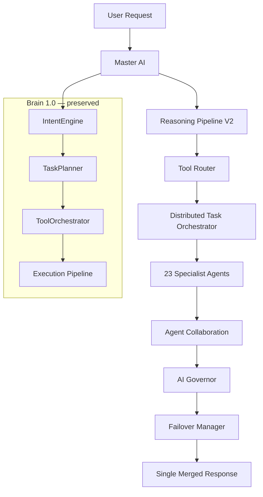

# OmniMind Brain 2.0 Architecture

OmniMind Brain 2.0 is the **central intelligence layer** of OmniMind V12. Every tool, plugin, engine, and service communicates through the Brain. Brain 2.0 **extends** Brain 1.0 — it does not replace routes, agents, or existing UI.

---

## 1. System Overview



| Layer | Path | Role |
|-------|------|------|
| Brain 1.0 | `core/brain/` | Intent, plan, execute, validate (unchanged) |
| Brain 2.0 | `core/brain/v2/` | Master AI, agents, collaboration, governor |
| React | `lib/omnimind-brain-context.tsx` | Provider + live state |
| UI | `components/brain/` | Pipeline, Action Center, Live Thinking |

---

## 2. Master AI

**Path:** `core/brain/v2/MasterAI.ts`

The Master AI:

1. Understands intent from Brain 1.0 plan + plugin tool route
2. Breaks complex requests into `Brain2Subtask` entries
3. Assigns specialist agents by capability and tool
4. Merges agent outputs via the AI Governor
5. Returns **one** intelligent response to the user

---

## 3. Agent Registry

**Path:** `core/brain/v2/AgentRegistry.ts`

23 specialist agents, each with:

| Field | Description |
|-------|-------------|
| `id` | Unique agent identifier |
| `name` | Display name |
| `identity` | Role description |
| `capabilities` | Matched to plugin capabilities |
| `priority` | Selection ranking |
| `tools` | Sovereign tool IDs |
| `memoryAccess` | `read` or `read_write` |
| `permissionLevel` | Agent permission scope |
| `status` | `idle` · `selected` · `working` · `done` |

Agents include: Chief Architect, Frontend/Backend/Database Engineers, DevOps, Security, Medical Specialist, Marketing, Music Producer, Video Editor, VFX Artist, Business Consultant, Financial Analyst, Quantum Trading Expert, Architectural Designer, Research Scientist, Translator, Legal Assistant, Content Writer, Prompt Engineer, Testing Engineer, Debugger, Performance Engineer, and **Master AI**.

Brain 1.0 `SPECIALIST_AGENTS` remain for backward compatibility.

---

## 4. Distributed Task Orchestrator

**Path:** `core/brain/v2/DistributedTaskOrchestrator.ts`

Pipeline:

```
Receive request
  → Analyze (Master AI + Reasoning)
  → Select agents
  → Execute tasks in parallel (where safe)
  → Collect results
  → Governor merges
  → Return final answer
```

Subtasks marked `parallel: true` run via `Promise.all`. Sequential tasks run in order.

---

## 5. Agent Collaboration

**Path:** `core/brain/v2/AgentCollaboration.ts`

Agents consult each other behind the scenes:

| From | To | Example trigger |
|------|-----|-----------------|
| Medical Specialist | Research Scientist | clinical research |
| Frontend Engineer | Security Engineer | auth / OWASP |
| Marketing Specialist | VFX Artist | video creatives |
| Music Producer | VFX Artist | soundtrack sync |
| Business Consultant | Financial Analyst | revenue forecast |

The user sees only the **merged** final response.

---

## 6. Reasoning Pipeline (V2)

**Path:** `core/brain/v2/ReasoningPipeline.ts`

Eight stages:

1. **Understanding** — parse intent and entities
2. **Planning** — decompose into subtasks
3. **Research** — cross-agent context
4. **Execution** — tool + agent dispatch
5. **Validation** — integrity checks
6. **Review** — quality pass
7. **Optimization** — context handoff
8. **Final Response** — governor merge

Brain 1.0 eight-stage pipeline (`understand` → `return_result`) runs in parallel for UI compatibility.

---

## 7. Tool Router

**Path:** `core/brain/v2/ToolRouter.ts`

Automatic routing — no manual tool selection:

| Domain | Tool |
|--------|------|
| Medical | Medical Diagnostic |
| Coding | OmniForge |
| Images | Creative Visionary |
| Video | VFX Master |
| Music | OmniMusic |
| Architecture | Architectural Designer |
| Analytics | Business Analytics |
| Finance | Quantum Trading |
| Translation | OmniTranslator |

Uses **plugin CapabilityRegistry** first, then pattern rules, then active workspace context.

---

## 8. AI Governor

**Path:** `core/brain/v2/Governor.ts`

Responsibilities:

- Prevent conflicting agent outputs
- Rank response candidates by score
- Resolve tool routing disagreements
- Block unsafe content patterns
- Emit single stable response

---

## 9. Failover

**Path:** `core/brain/v2/FailoverManager.ts`

If a provider fails:

1. Retry on fallback provider (`fallback_a`, `fallback_b`)
2. Maintain conversation continuity
3. Log failover events (`omnimind:brain2-live` timeline)
4. Update recovery metrics

---

## 10. Self-Improvement Metrics

**Path:** `core/brain/v2/SelfImprovement.ts`

Tracked metrics:

- Accuracy
- Latency (ms)
- Tool usage count
- Failures
- Recovery rate
- Learning score
- Memory quality
- Reasoning quality

Persisted in `localStorage` (`omnimind_brain2_metrics_v1`).

---

## 11. Live Thinking Panel

**Path:** `components/brain/Brain2LiveThinkingPanel.tsx`

Optional panel showing:

- Intent
- Selected agents
- Reasoning progress (8 stages)
- Collaboration messages
- Running tools
- Provider / failover
- Token usage estimate
- Performance metrics

Toggle via **Hide** or `brain.brain2.setLiveThinkingEnabled(false)`.

---

## 12. Integration Points

| Consumer | Integration |
|----------|-------------|
| `OmniMindBrain.processRequest` | Calls `brain2.startSession`, `onPlan`, `onExecute`, `finalize` |
| Universal Tool Framework | `processRequest` via context |
| OmniForge Enterprise | `pinNote`, plugin events |
| Plugin System | `CapabilityRegistry` in Tool Router |
| Master Agent | Delegates to `brain.processRequest` |
| OS Copilot | `useOmniMindBrainOptional` |

---

## 13. Scalability Strategy

1. **Agent registry** — add agents without changing Brain 1.0
2. **Plugin capabilities** — new tools auto-route via CapabilityRegistry
3. **Parallel orchestrator** — horizontal subtask execution
4. **Failover providers** — swap LLM backends without UI changes
5. **Governor** — consistent merge as agent count grows
6. **Metrics** — feedback loop for routing quality
7. **Event bus** — `omnimind:brain2-live`, `omnimind:brain2-metrics`

Future: remote agent workers, queue-backed subtasks, marketplace agent plugins.

---

## 14. Key Files

```
core/brain/v2/
  Brain2Coordinator.ts    # Main 2.0 entry
  MasterAI.ts
  AgentRegistry.ts
  DistributedTaskOrchestrator.ts
  AgentCollaboration.ts
  ReasoningPipeline.ts
  ToolRouter.ts
  Governor.ts
  FailoverManager.ts
  SelfImprovement.ts
  types.ts
  index.ts

core/brain/OmniMindBrain.ts  # Wires brain2 into processRequest
lib/omnimind-brain-context.tsx
components/brain/Brain2LiveThinkingPanel.tsx
docs/BRAIN_ARCHITECTURE.md
```

---

## Goal

OmniMind functions as **one intelligent AI Operating System** — dozens of specialist agents collaborate behind the scenes while the user experiences a single seamless conversation.
