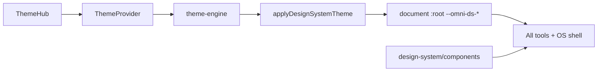

# OmniMind V12 — Enterprise Design System

The OmniMind Design System is the **single visual language** for every sovereign tool, OS shell, marketplace, and future module. It extends the existing `ThemeProvider` and `OS_TOKENS` — it does not replace routes, tools, or layouts.

---

## 1. Architecture

```
frontend/design-system/
  tokens/           # Colors, typography, spacing, effects, motion, icons
  themes/           # Enterprise presets + applyDesignSystemTheme()
  components/       # Reusable enterprise UI primitives
  ai/               # AI visual language (thinking, streaming, badges)
  hooks/            # useOmniTokens, useBreakpoint
  bridge/           # OS_TOKENS backward compatibility
  index.ts

frontend/lib/theme-engine.ts     # Extended — 6 enterprise themes
frontend/components/theme/       # ThemeProvider + ThemeHub
frontend/components/ui/button.tsx # Consumes DS button variants
frontend/components/os/tokens.ts  # Re-exports from design-system bridge
frontend/app/globals.css         # --omni-ds-* CSS variable defaults
```

### Integration flow



---

## 2. Design Tokens

### CSS variables (semantic)

| Category | Prefix | Examples |
|----------|--------|----------|
| Background | `--omni-ds-bg-*` | canvas, shell, workspace, panel, sidebar |
| Text | `--omni-ds-text-*` | primary, muted, accent, inverse |
| Border | `--omni-ds-border-*` | subtle, accent, focus |
| Accent | `--omni-ds-accent-*` | primary, glow, secondary |
| Status | `--omni-ds-status-*` | success, warning, error, live |
| Accessibility | `--omni-ds-a11y-*` | focusRing, highContrast |
| Elevation | `--omni-ds-elevation-*` | md, lg, xl, glow |

### TypeScript tokens

```typescript
import { DS_SPACING, DS_RADIUS, DS_MOTION, DS_GLASS } from "@/design-system";
```

| Token file | Contents |
|------------|----------|
| `tokens/colors.ts` | `DS_COLOR_VARS` — CSS var name map |
| `tokens/typography.ts` | Font sizes (9px–20px scale), weights, tracking |
| `tokens/spacing.ts` | 4px grid, layout dimensions, breakpoints |
| `tokens/effects.ts` | Radius, elevation, blur, glass, gradients |
| `tokens/motion.ts` | Durations, easing, framer-motion presets |
| `tokens/icons.ts` | Lucide-only, sizes xs–xl |

### Legacy compatibility

`--omni-*` and `--neon-*` variables are still set by `applyDesignSystemTheme()` for existing CSS utilities (`.omni-glass-panel`, etc.).

---

## 3. Theme Engine

### Presets

| ID | Label | Use case |
|----|-------|----------|
| `deep-purple` | Enterprise Dark | Default — OmniMind V12 |
| `oled-black` | OLED Black | True black displays |
| `grey-professional` | Grey Professional | Corporate / neutral |
| `gold-accent` | Gold Accent | Premium accent |
| `light` | Enterprise Light | Daylight / presentations |
| `high-contrast` | High Contrast | Accessibility |
| `auto` | Auto-Theme Matrix | Random generated |
| `custom` | Custom Accent | User picker color |

### Instant OS-wide switching

```typescript
import { applyDesignSystemTheme, ENTERPRISE_THEMES } from "@/design-system";

applyDesignSystemTheme(ENTERPRISE_THEMES.light);
```

Theme Hub (`components/theme/ThemeHub.tsx`) exposes all presets. `ThemeProvider` persists to `localStorage` (`omnimind-v12-theme`).

---

## 4. Component Library

Import from `design-system` or `design-system/components`:

| Component | Purpose |
|-----------|---------|
| `DSButton` / `DSIconButton` | Primary actions (also powers `components/ui/button`) |
| `DSCard` / `DSGlassCard` / `DSMetricCard` | Content containers |
| `DSBadge` / `DSToolBadge` / `DSAgentBadge` | Labels and status |
| `DSStatusIndicator` | Live / idle / error dots |
| `DSInput` / `DSTextarea` | Form fields |
| `DSTabs` | Tab navigation |
| `DSWorkspaceHeader` / `DSSectionHeader` | Tool chrome |
| `DSSkeleton` / `DSSpinner` / `DSProgress` | Loading states |

### AI visual language (`design-system/ai/`)

| Component | Purpose |
|-----------|---------|
| `DSThinkingIndicator` | AI reasoning pulse |
| `DSStreamingDots` / `DSTypingIndicator` | Token streaming |
| `DSReasoningTimeline` | Multi-stage reasoning |
| `DSExecutionProgress` | Tool execution % |
| `DSMemoryUsage` | Memory engine bar |
| `DSChatBubble` | Standardized chat |
| `DSAIResponseCard` | Structured AI output |

---

## 5. Usage in tools

### Prefer CSS variables (any component)

```tsx
<div className="bg-[color:var(--omni-ds-bg-panel)] text-[color:var(--omni-ds-text-primary)] border-[color:var(--omni-ds-border-subtle)]">
```

### Use DS components

```tsx
import { DSMetricCard, DSWorkspaceHeader } from "@/design-system";

<DSWorkspaceHeader title="OmniForge" subtitle="Enterprise IDE" />
<DSMetricCard label="Health" value="92%" />
```

### Hooks

```tsx
import { useOmniTokens, useBreakpoint } from "@/design-system";

const { color } = useOmniTokens();
const bp = useBreakpoint(); // mobile | tablet | laptop | desktop | ultrawide
```

---

## 6. Animation guidelines

| Token | Value | Use |
|-------|-------|-----|
| `DS_DURATION.fast` | 120ms | Hover, micro-interactions |
| `DS_DURATION.normal` | 200ms | Panel toggles |
| `DS_DURATION.slow` | 320ms | Workspace transitions |
| `DS_MOTION.panel` | spring | Copilot / sidebar resize |

Use `DS_TRANSITION_CLASS.default` for consistent transitions. Prefer `framer-motion` with `DS_MOTION` presets for panel animations.

---

## 7. Typography

| Scale | Size | Use |
|-------|------|-----|
| 2xs | 9px | Section labels, uppercase tracking |
| xs | 10px | Captions, metadata |
| sm | 11px | Body text in dense UIs |
| base | 12px | Default UI text |
| lg+ | 14px+ | Headings |

Font stack: **Inter** (sans), **JetBrains Mono** (mono) — loaded in `app/layout.tsx`.

---

## 8. Spacing rules

- **Base grid:** 4px
- **Panel padding:** 12–14px (`p-3` / `p-3.5`)
- **Section gaps:** 8px (`gap-2`)
- **Header height:** 2.75rem (`DS_LAYOUT.headerHeight`)

---

## 9. Accessibility

- Focus ring: `var(--omni-ds-a11y-focus-ring)` on all `DSButton` / `DSInput`
- High Contrast theme: white borders, yellow accent, WCAG-oriented palette
- `color-scheme` set on `<html>` per theme (dark/light)
- Status colors never rely on color alone — pair with labels/icons

---

## 10. Responsive rules

| Breakpoint | Width | Layout |
|------------|-------|--------|
| mobile | < 480px | Collapsed sidebar, stacked panels |
| tablet | 768px | Reduced copilot width |
| laptop | 1024px | Standard 3-panel workbench |
| desktop | 1280px | Full OS shell |
| ultrawide | 1920px+ | Max content width 90rem |

Use `useBreakpoint()` for conditional layout — do not duplicate breakpoint constants.

---

## 11. Icon system

- **Family:** `lucide-react` only — no mixed icon libraries
- **Sizes:** `DS_ICON_SIZE` — xs(12), sm(14), md(16), lg(20), xl(24)
- **Color:** inherit from `currentColor` or `var(--omni-ds-text-accent)`

---

## 12. Migrated surfaces (this release)

| Surface | Change |
|---------|--------|
| `components/ui/button.tsx` | Uses `dsButtonVariants` from design system |
| `components/os/tokens.ts` | Re-exports from `design-system/bridge` |
| `components/os/primitives/OSPanel.tsx` | `DS_GLASS` + CSS vars |
| `components/marketplace/MarketplaceShell.tsx` | `DSWorkspaceHeader`, `DSTabs` |
| `components/brain/Brain2LiveThinkingPanel.tsx` | `DSGlassCard`, AI visuals |
| `components/theme/ThemeHub.tsx` | 6 enterprise themes |
| `lib/theme-engine.ts` | Full DS token application |

### Migration path for remaining tools

1. Replace hardcoded hex (`#0B0F19`, `text-zinc-500`) with `var(--omni-ds-*)`
2. Replace ad-hoc buttons with `Button` from `components/ui/button` or `DSButton`
3. Use `DSMetricCard` for dashboard stats
4. Use AI components for any thinking/streaming UI

**Do not** create parallel color systems or duplicate button/card components.

---

## 13. UI standards

- One accent per theme — no rainbow unless semantic (status)
- Glass panels: `DS_GLASS.panel` or `.omni-glass-panel`
- Borders: always subtle unless focus/active state
- Uppercase labels: 9px, `tracking-[0.2em]`, muted color
- Tool chrome: `DSWorkspaceHeader` at top of every full-page tool
- No inline `#hex` in new code — use CSS variables

---

*OmniMind V12 — one operating system, one design language.*
