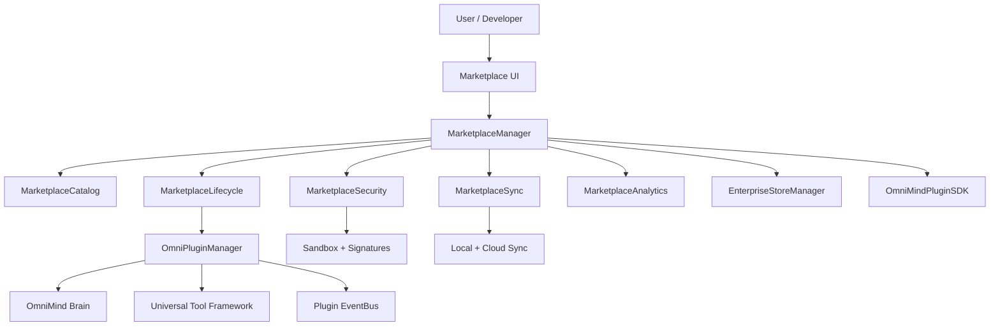

# OmniMind V12 — Enterprise Marketplace Architecture

The OmniMind Enterprise Marketplace is the central ecosystem where developers, companies, and AI creators publish tools, plugins, agents, templates, and workflows. It **extends** the existing plugin system, Brain, Memory Engine, Action Engine, and Universal Tool Framework — it does not replace them.

---

## 1. System Overview



### Module layout

```
frontend/core/marketplace/
  types.ts                 # Listings, SDK manifest, sync state
  catalog.ts               # Sovereign tools + workflows + themes + packs
  plugin-sdk.ts            # Third-party plugin contract + validation
  lifecycle.ts             # Install, enable, disable, update, rollback, repair
  security.ts              # Scanning, sandbox limits, permissions
  analytics.ts             # Downloads, revenue, ratings, trends
  monetization.ts          # Pricing models (architecture only)
  sync.ts                  # Installed plugins, licenses, bookmarks
  enterprise-store.ts      # Private org stores
  MarketplaceManager.ts    # Central coordinator
  index.ts

frontend/lib/omnimind-marketplace-context.tsx
frontend/components/marketplace/
  MarketplaceShell.tsx
  MarketplaceBrowse.tsx
  MarketplaceListingCard.tsx
  MarketplaceDeveloperPortal.tsx
  MarketplaceEnterprisePanel.tsx
  MarketplaceAnalyticsDashboard.tsx

frontend/app/(shell)/marketplace/page.tsx
```

---

## 2. Marketplace Catalog

`MarketplaceCatalog` aggregates:

| Kind | Examples |
|------|----------|
| AI Tools | All sovereign workbench tools (from `sovereign-plugins.ts`) |
| AI Agents | Brain 2.0 specialist agents (via plugin manifests) |
| Workflows | Business BI, medical triage, full-stack deploy |
| Themes | Slate Cyber Dark, Enterprise Light Pro |
| Prompt / Voice / Language Packs | Prompt Engineering Pro, Urdu Voice Pack |
| Enterprise Connectors | Salesforce Connector |
| Developer SDKs | OmniMind Plugin SDK |
| Model Providers | Multi-Model Gateway |

Browse surfaces: **Trending**, **Editor's Choice**, **Verified**, **Enterprise Ready**, **New Releases**, **Highest Rated**, **Collections**, **Search**, **Kind filters**.

---

## 3. Plugin SDK

Every third-party plugin declares a `PluginSDKManifest`:

| Field | Purpose |
|-------|---------|
| `pluginId` | Unique identifier |
| `version` | Semver |
| `author` | Publisher |
| `permissions` | filesystem, network, terminal, deployment, … |
| `dependencies` | Other plugins + version ranges |
| `requiredApis` | Brain, tool-framework, memory APIs |
| `uiComponents` | Registered React panels |
| `actions` | Executable actions with capabilities |
| `commands` | Command palette entries |
| `capabilities` | Brain routing tags |
| `lifecycleHooks` | install, enable, disable, update, remove |
| `securityRequirements` | sandbox, permission-gate |
| `compatibility` | Platform version (e.g. `12.x`) |
| `signature` | Digital signature (optional) |

`OmniMindPluginSDK.toPluginManifest()` converts SDK manifests into `OmniPluginManifest` for `OmniPluginManager.install()`.

Template: `PLUGIN_SDK_TEMPLATE` in `plugin-sdk.ts`.

---

## 4. Plugin Lifecycle

`MarketplaceLifecycle` extends `LifecycleManager` with marketplace operations:

| Operation | Behavior |
|-----------|----------|
| **Install** | Security scan → `PluginManager.install` → sync + analytics |
| **Enable** | Resume suspended plugin |
| **Disable** | Suspend without uninstall |
| **Update** | Version history push → reinstall |
| **Rollback** | Restore previous manifest from history |
| **Repair** | Uninstall + reinstall current manifest |
| **Remove** | Uninstall + sync cleanup |
| **Health Check** | Registry, disabled state, min version |
| **Version Migration** | Target specific historical version |

Events: `omnimind:marketplace-enabled`, `omnimind:marketplace-disabled`, `omnimind:marketplace-removed`.

---

## 5. Security Model

`MarketplaceSecurity` enforces:

- **Sandbox limits** — 128 MB memory, 25% CPU, network gated
- **Permission-based execution** — terminal/deployment flagged
- **Digital signatures** — OmniMind-signed or author-verified
- **Dependency scanning** — loose `*` ranges flagged
- **Vulnerability alerts** — medium/high severity gates install
- **Malicious pattern detection** — extensible hook

Permission prompts dispatch `omnimind:marketplace-permission`.

---

## 6. App Store UI

Route: `/marketplace`

Tabs:

1. **App Store** — search, kind filters, curated rows, collections
2. **Developer Center** — API keys, SDK template, publish tools
3. **Enterprise Store** — private org stores, restricted distribution
4. **Analytics** — downloads, revenue, trends, cloud sync

OmniForge Extensions panel (`OmniForgeExtensionsPanel`) links to marketplace and shows installed + featured listings.

OS sidebar category **Marketplace** → `/marketplace`.

---

## 7. Enterprise Store

`EnterpriseStoreManager` supports:

- Private organization stores (`orgId`, `name`)
- Private listing IDs (restricted catalog subset)
- Role-based visibility (`admin`, `developer`, `viewer`)
- Internal agents, workflows, themes, templates

Persisted in `localStorage` (`omnimind_enterprise_stores_v1`).

---

## 8. Monetization (Architecture)

`monetization.ts` defines models without payment processing:

| Model | Description |
|-------|-------------|
| Free | Community support |
| Paid / One-Time | Single purchase |
| Subscription | Recurring billing |
| Enterprise | Org-wide SLA license |
| Team | Per-seat license |

Helpers: `calculateRevenueShare()`, `applyCoupon()` (e.g. `OMNIMIND20`, `TRIAL`).

Purchases stored in `MarketplaceSyncState.licenses`.

---

## 9. Cloud Sync

`MarketplaceSync` persists:

- Installed plugins
- Licenses / purchases
- Bookmarks
- Settings
- Developer assets
- `lastSyncedAt`

`syncToCloud()` persists locally and emits `omnimind:marketplace-synced` for future backend integration.

---

## 10. Analytics

`MarketplaceAnalyticsEngine` tracks:

- Downloads, active users, revenue
- Average rating, crash reports
- Performance score, compatibility issues
- 30-day usage trend

`recordDownload()` called on every install.

---

## 11. Brain Integration

On install, `MarketplaceManager`:

1. Publishes `PluginInstalled` on the plugin event bus
2. Dispatches `omnimind:marketplace-brain` custom event
3. Context calls `brain.pinNote()` for memory trace

Brain capability routing unchanged — installed plugins register capabilities via existing `syncPluginToRegistries`.

---

## 12. Workflow & Theme Marketplaces

Workflow listings: business, medical, development pipelines.

Theme listings: complete UI themes, color systems, dashboard layouts.

Both appear in catalog with kind `workflow` and `theme`; filterable in App Store.

---

## 13. Scalability Strategy

| Concern | Approach |
|---------|----------|
| Catalog size | Lazy catalog singleton; search is in-memory filter |
| Install throughput | Async lifecycle; event-driven UI refresh |
| Multi-tenant | Enterprise stores per `orgId` |
| Backend | Sync/analytics keys ready for API migration |
| Security | Pre-install scan gate; sandbox limits configurable |
| Versioning | 10-version history per plugin in localStorage |

Future: backend catalog API, CDN asset delivery, signed package registry, webhook analytics.

---

## 14. Developer Quick Start

1. Copy `PLUGIN_SDK_TEMPLATE` from `plugin-sdk.ts`
2. Implement UI panel under `components/` or plugin package
3. Validate with `getPluginSDK().validate(manifest)`
4. Convert: `getPluginSDK().toPluginManifest(sdk)`
5. Install via Developer Portal or `getMarketplaceManager().installListing()`

---

## 15. Integration Points (unchanged core)

| System | Integration |
|--------|-------------|
| `core/plugins/PluginManager` | Install, suspend, resume, uninstall |
| `core/plugins/EventBus` | PluginInstalled, PluginActivated |
| `core/brain/OmniMindBrain` | pinNote, capability routing |
| `core/tool-framework/` | Universal shell for tool plugins |
| `lib/omnimind-os-categories.ts` | Sidebar marketplace link |
| `OmniForgeExtensionsPanel` | Embedded marketplace bridge |

---

*OmniMind V12 — extend every layer without modifying core architecture.*
