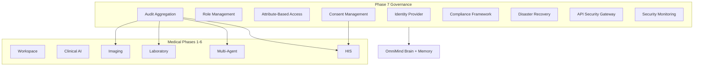

# Medical Security, Compliance & Governance — Phase 7

**Module:** `core/medical-enterprise/governance/`  
**UI:** `components/medical-enterprise/governance/` (standalone)  
**Backend:** `backend/routers/medical_enterprise_governance.py`

> Enterprise security architecture for hospitals and clinics. Configurable compliance frameworks — not legal certification claims.

---

## 1. Architecture



---

## 2. Identity & Access Management

**File:** `identity/IdentityProvider.ts`

| Capability | Support |
|------------|---------|
| SSO | Provider registry |
| OAuth 2.0 / OIDC | Token exchange stubs |
| MFA | TOTP/SMS/email/hardware hooks |
| Biometric | Pluggable verify hooks |
| Sessions | Create, revoke, expiry |

Maps `GovernanceRole` → Phase 1 `ClinicalRole`.

---

## 3. Role Management

**File:** `rbac/RoleManagement.ts`

11 granular roles: Doctor, Specialist, Nurse, Radiologist, Lab Technician, Pharmacist, Receptionist, Hospital Administrator, Auditor, Research User, System Administrator.

Bridges to `lib/medical-enterprise/permissions.ts` — does not replace it.

---

## 4. Data Security

**File:** `data-security/DataSecurityArchitecture.ts`

AES-256-GCM at rest, TLS 1.3 in transit, KMS/HSM-ready key management, secure storage policies for files, images, reports, EMR, backups.

---

## 5. Audit System

**File:** `audit/AuditAggregationService.ts`

Federates immutable audit logs from:
- Imaging (`ImagingAccessControl`)
- Laboratory (`LaboratoryAccessControl`)
- Multi-Agent (`MultiAgentAccessControl`)
- HIS (`HISAccessControl`)

Tracks: logins, patient access, AI view/accept/reject, prescriptions, imaging, labs, config, API usage.

---

## 6. Consent Management

**File:** `consent/ConsentManagement.ts`

Treatment, data sharing, research, telemedicine, imaging, laboratory consents. Withdrawal and versioned history.

---

## 7. Compliance Layer

**File:** `compliance/ComplianceFramework.ts`

Configurable plugins: HIPAA, GDPR, ISO 27001, SOC 2, regional/custom. Control status tracking — organizational legal review required.

---

## 8. Backup & Disaster Recovery

**File:** `backup/DisasterRecoveryArchitecture.ts`

Hourly incremental + daily full backups, geo-redundancy, version recovery, DR plans (RTO/RPO), high availability status.

---

## 9. Security Monitoring

**File:** `monitoring/SecurityMonitoring.ts`

Failed logins, permission violations, suspicious activity, API anomalies, data access alerts, device status, system integrity.

---

## 10. API Security

**File:** `api-security/APISecurityGateway.ts`

API keys, JWT validation stubs, rate limiting, request signing, audit headers, secure webhooks.

---

## 11. Permission Matrix

| Role | Key Permissions |
|------|-----------------|
| Doctor | EMR read/write, AI request, imaging read |
| Radiologist | Imaging upload, AI request |
| Lab Technician | Labs import, EMR read |
| Hospital Administrator | HIS admin, audit read, backup |
| Auditor | Audit read/export, compliance read |
| System Administrator | Security admin, API manage, sessions |

Full matrix via `getRoleManagement().getPermissionMatrix()`.

---

## 12. API

**Base:** `/api/v1/medical-enterprise/governance`

| Endpoint | Method |
|----------|--------|
| `/dashboard` | GET |
| `/audit` | GET |
| `/consent` | POST |
| `/consent/:id/withdraw` | POST |
| `/roles` | GET |
| `/sessions` | GET |
| `/compliance` | GET |
| `/backup/policies` | GET |
| `/sso/providers` | GET |

---

## 13. Usage

```typescript
import { medicalGovernancePlatform } from "@/core/medical-enterprise/governance";
import { GovernanceWorkspace } from "@/components/medical-enterprise/governance";
```

```tsx
<GovernanceWorkspace role="admin" />
```

---

## Related Docs

| Phase | Document |
|-------|----------|
| Phase 1–6 | `MEDICAL_*_PLATFORM.md` series |
