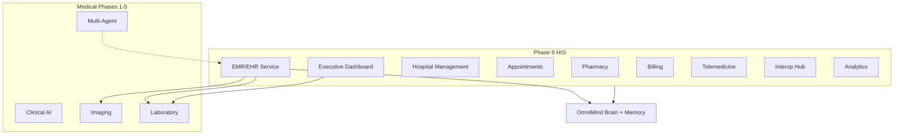

# Medical Hospital Information System — Phase 6

**Module:** `core/medical-enterprise/his/`  
**UI:** `components/medical-enterprise/his/` (standalone — does not modify Phase 1 workspace)  
**Backend:** `backend/routers/medical_enterprise_his.py`

> Enterprise HIS for hospitals, clinics, diagnostic centers, and telemedicine networks. Integrates with Medical Phases 1–5 and OmniMind Brain.

---

## 1. Architecture



---

## 2. Hospital Dashboard

**Engine:** `dashboard/HospitalDashboardEngine.ts`

Active patients, admissions/discharges, emergency, ICU, OR, appointments, staff, beds, AI alerts, system health.

---

## 3. EMR / EHR

**Service:** `emr/EMRService.ts`

Demographics, encounters, diagnoses, procedures, allergies, vaccinations, timeline, version history.

**Phase integration (read-only):**
- Phase 3 Imaging → timeline `imaging` entries
- Phase 4 Laboratory → timeline `lab`, `vital`, `ai-finding` entries
- Phase 5 Multi-Agent → via Brain memory enrichment

---

## 4. Hospital Management

**Service:** `hospital/HospitalManagementService.ts`

Departments (11 types), wards, rooms, beds, admissions, discharges, staff registration.

---

## 5. Appointments

**System:** `appointments/AppointmentSystem.ts`

Online booking, walk-in, queue management, telemedicine booking, reminders.

---

## 6. Pharmacy

**Service:** `pharmacy/PharmacyService.ts`

Inventory, expiry tracking, prescription queue, dispensing, suppliers.

---

## 7. Inventory

**Service:** `inventory/InventoryService.ts`

Equipment, consumables, surgical instruments, lab supplies, asset tracking, maintenance.

---

## 8. Staff Management

**Service:** `staff/StaffManagementService.ts`

Shifts, attendance, role/department filtering.

---

## 9. Billing

**Service:** `billing/BillingService.ts`

Invoices, insurance claims, payments, discounts, refunds, multi-currency.

---

## 10. Telemedicine

**Service:** `telemedicine/TelemedicineService.ts`

Video, chat, voice sessions; screen share, document share, remote monitoring flags.

---

## 11. Interoperability

**Hub:** `interoperability/InteropHub.ts`

FHIR, HL7, hospital APIs, lab, radiology, pharmacy, insurance, government health connectors.

---

## 12. Analytics

**Engine:** `analytics/HospitalAnalytics.ts`

Bed occupancy, ICU, appointments, admissions, revenue KPIs, patient flow.

---

## 13. Security

**File:** `security/HISAccessControl.ts`

Role + department-level permissions, audit logs, consent hooks via Brain bridge.

---

## 14. API

**Base:** `/api/v1/medical-enterprise/his`

| Endpoint | Method |
|----------|--------|
| `/dashboard/:hospitalId` | GET |
| `/emr/:patientId` | GET |
| `/appointments` | GET/POST |
| `/beds` | GET |
| `/staff` | GET |
| `/pharmacy` | GET |
| `/inventory` | GET |
| `/billing/invoices/:id` | GET |
| `/analytics/:hospitalId` | GET |
| `/interop/connectors` | GET |
| `/admissions` | POST |

---

## 15. Usage

```typescript
import { medicalHISPlatform } from "@/core/medical-enterprise/his";
import { HospitalHISWorkspace } from "@/components/medical-enterprise/his";
import { useMedicalHIS } from "@/lib/medical-enterprise/use-medical-his";
```

```tsx
<HospitalHISWorkspace patientId="patient-001" role="admin" />
```

---

## Related Docs

| Phase | Document |
|-------|----------|
| Phase 1 | `MEDICAL_ENTERPRISE_ARCHITECTURE.md` |
| Phase 2 | `MEDICAL_CLINICAL_INTELLIGENCE.md` |
| Phase 3 | `MEDICAL_IMAGING_PLATFORM.md` |
| Phase 4 | `MEDICAL_LABORATORY_PLATFORM.md` |
| Phase 5 | `MEDICAL_MULTI_AGENT_PLATFORM.md` |
