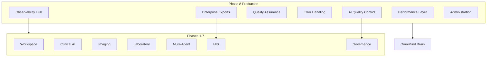

# Medical Production Readiness — Phase 8

**Module:** `core/medical-enterprise/production/`  
**UI:** `components/medical-enterprise/production/` (standalone)  
**Backend:** `backend/routers/medical_enterprise_production.py`

> Production deployment layer for OmniMind Medical Enterprise Suite (Phases 1–8). AI assists clinicians — does not replace them.

---

## 1. Architecture



---

## 2. Performance

**File:** `performance/PerformanceLayer.ts`

Render memoization, image tile TTL, AI cache, patient dataset pagination, GPU worker hooks, background worker concurrency config.

Reuses Phase 3 `TileCache`, Phase 4 `AnalysisCache`, Phase 5 `ConversationCache` — does not duplicate.

---

## 3. Scalability

**File:** `scalability/ScalabilityArchitecture.ts`

Profiles for clinic, hospital, network, multi-tenant, multi-region. Horizontal scaling, load balancing, distributed service registry.

---

## 4. Observability

**File:** `observability/ObservabilityHub.ts`

Health dashboard, latency p50/p95/p99, AI pipeline metrics, API metrics, DB pool, queue monitoring, background jobs.

---

## 5. Testing Framework

**File:** `testing/TestingFramework.ts`

| Category | Suites |
|----------|--------|
| Unit | Clinical AI, Imaging |
| Integration | HIS EMR |
| API | Governance |
| E2E | Medical Workspace |
| Performance | Imaging load |
| Security | RBAC |
| Accessibility | Workspace a11y |
| Regression | Full suite |

Manifest: `testing/suites/manifest.ts` — wire to CI (vitest/jest).

---

## 6. Quality Assurance

**File:** `qa/QualityAssurance.ts`

TypeScript validation, dependency health, phase service reachability, migration validation, API contract alignment.

---

## 7. Error Handling

**File:** `errors/ErrorHandlingArchitecture.ts`

Automatic retries with backoff, offline queue, structured logging, crash reporting hooks, graceful degradation.

---

## 8. Enterprise Exports

**File:** `exports/EnterpriseExportService.ts`

PDF, CSV, FHIR, HL7, JSON, XML, encrypted archives, digital signature flags. Delegates FHIR/HL7 to Phase 6 `InteropHub`.

---

## 9. AI Quality Control

**File:** `ai-quality/AIQualityControl.ts`

Clinician approve / reject / correct feedback loop. Metrics: approval rate, corrections. Federates to Phase 7 `AuditAggregationService`.

---

## 10. Localization

**File:** `i18n/LocalizationArchitecture.ts`

English, Urdu, Arabic, Chinese, French, German, Spanish + custom packs. RTL support for Urdu/Arabic.

---

## 11. Accessibility

**File:** `accessibility/AccessibilityArchitecture.ts`

High contrast, reduced motion, font scale, screen reader optimization, keyboard navigation preferences.

---

## 12. Administrator Workspace

**UI:** `ProductionAdminWorkspace.tsx`

System health, observability, QA status, AI quality metrics, locales, storage, licenses, integrations.

---

## 13. API

**Base:** `/api/v1/medical-enterprise/production`

| Endpoint | Method |
|----------|--------|
| `/health` | GET |
| `/observability` | GET |
| `/admin/dashboard` | GET |
| `/qa/validate` | GET |
| `/tests` | GET |
| `/export` | POST |
| `/ai/feedback` | POST |
| `/ai/quality` | GET |
| `/i18n/locales` | GET |

---

## 14. Operational Runbook (Summary)

1. Run `npx tsc --noEmit` in `frontend/`
2. Call `medicalProductionPlatform.qa(role)` — all checks must pass
3. Verify `/production/health` — all phase services healthy
4. Review governance audit logs
5. Confirm backup policies (Phase 7 DR)
6. Deploy backend routers 3–8
7. `markProductionReady(version, environment)` via ProductionService

---

## 15. Hospital Deployment Guide (Summary)

| Tier | Profile | Instances |
|------|---------|-----------|
| Clinic | `clinic` | 1–2 |
| Hospital | `hospital` | 2–8 |
| Network | `network` | 4–24 |
| Multi-tenant | `multi-tenant` | 4–48 |
| Multi-region | `multi-region` | 8–96 |

Enable Phase 7 governance before production. Configure SSO via `IdentityProvider`.

---

## 16. Usage

```typescript
import { medicalProductionPlatform } from "@/core/medical-enterprise/production";
import { ProductionAdminWorkspace } from "@/components/medical-enterprise/production";
```

```tsx
<ProductionAdminWorkspace role="admin" />
```

---

## Medical Enterprise Suite — Phase Index

| Phase | Module | Document |
|-------|--------|----------|
| 1 | Workspace | `MEDICAL_ENTERPRISE_ARCHITECTURE.md` |
| 2 | Clinical AI | `MEDICAL_CLINICAL_INTELLIGENCE.md` |
| 3 | Imaging | `MEDICAL_IMAGING_PLATFORM.md` |
| 4 | Laboratory | `MEDICAL_LABORATORY_PLATFORM.md` |
| 5 | Multi-Agent | `MEDICAL_MULTI_AGENT_PLATFORM.md` |
| 6 | HIS | `MEDICAL_HIS_PLATFORM.md` |
| 7 | Governance | `MEDICAL_GOVERNANCE_PLATFORM.md` |
| 8 | Production | This document |
