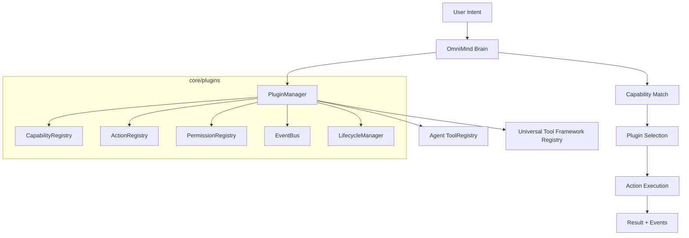

# OmniMind V12 — Universal Plugin & Capability Architecture

OmniMind V12 evolves from hardcoded tool pages into a **modular AI Operating System**. Every sovereign workbench tool is now a **plugin** registered through a single manifest. The OmniMind Brain discovers and routes work by **capability**, not by fixed tool names.

This document describes the extension layer added under `frontend/core/plugins/`. It **does not replace** existing routes, layouts, or the Operating System shell.

---

## 1. System Overview



### Layering (no duplication)

| Layer | Responsibility |
|-------|----------------|
| `lib/sovereign-tool-registry.ts` | Canonical routes, layouts, icons (unchanged) |
| `core/plugins/` | Plugin manifests, lifecycle, capabilities, actions |
| `core/agent/` | Intent resolution, workflows, prompt routing |
| `core/brain/` | Planning, orchestration, permission gate |
| `core/tool-framework/` | Shared UI execution pipeline, undo/export |
| `components/tool-framework/` | Universal shell chrome |

---

## 2. Plugin System

### Location

```
frontend/core/plugins/
  PluginManager.ts       # Single entry: install, discover, execute
  PluginRegistry.ts      # Installed plugin store
  LifecycleManager.ts    # Install → Load → Activate → … → Remove
  DependencyResolver.ts  # Dependency graph validation
  VersionManager.ts      # Semver compatibility
  EventBus.ts            # Global pub/sub
  CapabilityRegistry.ts  # Capability → plugin mapping
  ActionRegistry.ts      # Dynamic action execution
  PermissionRegistry.ts  # Scoped permission approvals
  FeatureFlags.ts        # Beta / developer / enterprise modes
  adapters.ts            # Bridge to Agent + Universal Tool registries
  manifests/
    sovereign-plugins.ts # All 15 sovereign tools as manifests
    plugin.template.ts     # Copy-paste for new tools
  register.ts              # Boot core plugins at app start
```

### Plugin manifest contract

Every tool exposes metadata via `OmniPluginManifest`:

| Field | Purpose |
|-------|---------|
| `id`, `name`, `version`, `author` | Identity |
| `route`, `workspace`, `toolId` | Navigation (existing Next.js routes preserved) |
| `capabilities` | Brain discovery |
| `actions` | Dynamic execution (`createProject`, `runAnalysis`, …) |
| `permissions` | filesystem, camera, deployment, … |
| `dependencies` | Plugin dependency graph |
| `featureFlags` | Experimental gating |
| `keyboardShortcuts` | Shared shortcuts |
| `supportedInputs` / `supportedOutputs` | AI + export contracts |
| `marketplace` | Future ratings, signatures, compatibility |

### Boot sequence

1. `ToolFrameworkPluginBoot` (in `app/providers.tsx`) calls `registerCorePlugins()`
2. All sovereign tools install as plugins (`sovereign-{slug}`)
3. OmniForge alias plugins install (`game-development`, `app-website-builder`, …)
4. Framework extensions load via `register-core.ts` (e.g. enterprise analytics metadata)

---

## 3. Capability System

Capabilities are **stable verbs** the Brain matches against user intent:

| Capability | Example tools |
|------------|---------------|
| `generate-code` | OmniForge |
| `analyze-data` | Business Analytics |
| `analyze-medical-image` | Medical Diagnostic |
| `edit-video` | VFX Master |
| `generate-music` | OmniMusic |
| `translate` | OmniTranslator |
| `financial-analysis` | Quantum Trading, Analytics |
| `scientific-simulation` | NASA Solver |
| `create-architecture` | Architectural / Interior Design |
| `deploy` | OmniForge |
| `marketing-campaign` | Digital Marketing Hub |

### Intent resolution pipeline

```
User text
  → IntentEngine regex rules (high confidence, preserved)
  → CapabilityRegistry.matchIntent() (no hardcoded tool names)
  → ToolRegistry keyword search (fallback)
  → Plugin + tool selected
```

`IntentEngine` now calls `getOmniPluginManager().bestCapabilityMatch()` when regex rules do not match.

---

## 4. Action Registry

Plugins declare actions in their manifest:

```typescript
{ id: "runAnalysis", label: "Run Analysis", capability: "analyze-data", permission: "database" }
```

Execution flow:

1. Brain / Tool Orchestrator calls `OmniPluginManager.executeAction()`
2. PermissionRegistry requests approval if needed
3. FeatureFlags checks capability mode
4. ActionRegistry runs handler or dispatches `omnimind:ecosystem-agent-prompt`
5. EventBus publishes `TaskStarted`, `TaskCompleted`, `ActionExecuted`

---

## 5. Event Bus

Global events (`PluginEventMap`):

- `ProjectCreated`, `TaskStarted`, `TaskCompleted`
- `ExportFinished`, `DeploymentSucceeded`, `AnalysisCompleted`
- `PluginInstalled`, `PluginActivated`, `PluginRemoved`
- `PermissionRequested`, `PermissionResolved`, `ActionExecuted`

Subscribe:

```typescript
import { getPluginEventBus } from "@/core/plugins";

getPluginEventBus().subscribe("TaskCompleted", (payload) => {
  console.log(payload.pluginId, payload.taskId);
});
```

DOM bridge: `omnimind:plugin:{EventName}` for legacy listeners.

---

## 6. Lifecycle

| State | Description |
|-------|-------------|
| `registered` | Manifest known |
| `installed` | Persisted in PluginRegistry |
| `loaded` | Capabilities, actions, permissions registered |
| `active` | Synced to Agent + Universal Tool registries |
| `suspended` | Temporarily inactive |
| `unloaded` | Subsystems torn down |

Operations: **Install**, **Load**, **Activate**, **Suspend**, **Resume**, **Unload**, **Upgrade**, **Remove**

`LifecycleManager` coordinates hooks and EventBus notifications.

---

## 7. Permission Model

### Plugin scopes

`filesystem` · `camera` · `microphone` · `network` · `terminal` · `database` · `browser` · `deployment`

Each action may declare `permission`. Before execution:

1. `PermissionRegistry.request(pluginId, scope, reason)`
2. UI: `PluginPermissionPrompt` (global chrome)
3. User approves or denies → `PermissionResolved` event

Brain destructive-action gate (`PermissionGate`) remains for delete/deploy/migration patterns in natural language.

---

## 8. Feature Flags

Per-plugin flags: `enabled` | `disabled` | `beta` | `developer` | `enterprise`

Runtime modes (`FeatureFlags.setRuntimeMode`):

- `standard` — production defaults
- `beta` — enables beta-flagged capabilities
- `developer` — developer-only actions
- `enterprise` — enterprise-gated features

---

## 9. Extension Model

### Add a new tool (future)

1. Copy `core/plugins/manifests/plugin.template.ts`
2. Implement business logic in workspace component (existing pattern)
3. Register: `await getOmniPluginManager().install(manifest)`
4. Optional: extend Universal Tool Framework via `installToolPlugin()` for UI metadata

No new layout shell or route duplication required when reusing sovereign workspace patterns.

### Refactored sovereign tools

All entries in `SOVEREIGN_TOOLS` are generated into `OmniPluginManifest` via `sovereignToolToPluginManifest()`. Existing pages, `ZoneContentRouter`, and OS shell behavior are **unchanged**.

---

## 10. Future Marketplace Compatibility

The manifest includes marketplace-ready fields:

| Field | Future use |
|-------|------------|
| `marketplace.signature` | Ed25519 / code signing verification |
| `marketplace.rating` | User ratings |
| `marketplace.compatibility` | Platform version range |
| `marketplace.downloadUrl` | Remote install |
| `dependencies` | Transitive plugin deps |
| `minOmniVersion` | Enforced by `VersionManager` |
| `LifecycleManager.upgrade()` | In-place updates |

`DependencyResolver` validates dependency graph before activation.

---

## 11. AI Integration Summary

```
User Intent
    ↓
Capability Match (CapabilityRegistry)
    ↓
Plugin Selection (PluginRegistry / Agent ToolRegistry)
    ↓
Action Execution (ActionRegistry + PermissionRegistry)
    ↓
Result (EventBus + Brain memory)
```

The Brain **never hardcodes tool routing** for capability-driven flows. Regex intent rules remain for high-confidence legacy paths; capability matching is the primary discovery path for new plugins.

---

## 12. Key files

| File | Role |
|------|------|
| `core/plugins/PluginManager.ts` | Central API |
| `core/plugins/register.ts` | Boot sovereign plugins |
| `core/agent/IntentEngine.ts` | Capability-aware intent |
| `core/brain/orchestrator/ToolOrchestrator.ts` | Plugin action execution |
| `core/brain/plugins/BrainPluginBridge.ts` | Brain ↔ plugins |
| `components/plugins/PluginPermissionPrompt.tsx` | Permission UI |
| `lib/universal-tool-framework-context.tsx` | Plugin boot on client |

---

## Platform version

`OMNI_MIND_PLATFORM_VERSION = "12.0.0"`

Plugins declare `minOmniVersion` for forward compatibility.
